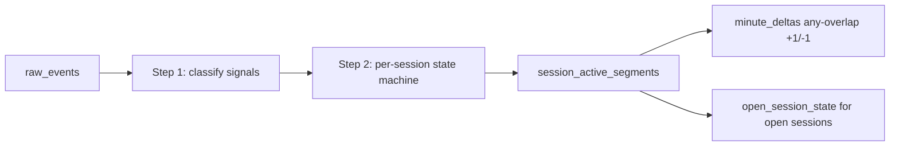
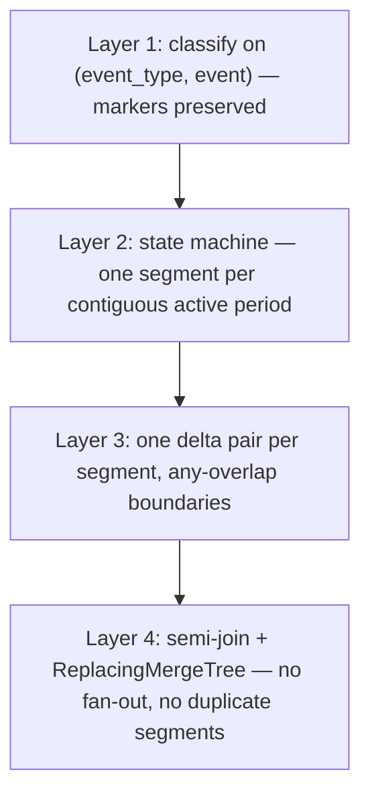

# Active Interval Logic — Building `session_active_segments`

How `sony_liv.session_active_segments` is populated from `sony_liv.raw_events`.

> **This document implements the frozen semantics, and they govern it.** Decisions and rationale: [SEMANTICS_SPEC.md](SEMANTICS_SPEC.md). Complete locked rule set: [FINAL_PLAN.md](FINAL_PLAN.md) §1. If anything here contradicts them, they win. In particular: paused playback is not active (D2), buffering is active (D3), and playback state is read from the `event` column, not from `event_type`.

---

## Pipeline overview



**Script:** `clickhouse/queries/build_segments.sql`
**Run:** after bulk load, or `reconcile_session(session_id)` for one session

---

## Step 0 — Ingest normalization

On load into `raw_events`:

```sql
event_timestamp = fromUnixTimestamp64Milli(event_timestamp_ms)  -- CSV is epoch ms
content_id = toUInt64(content_id)
```

---

## Step 1 — Classify signals (not "dedup")

Every event is mapped to a signal using the normative classifier in [SEMANTICS_SPEC.md §2](SEMANTICS_SPEC.md#2-event-classification--the-only-place-event-semantics-are-defined). Dispatch is on **`(event_type, event)`** — `pause` and `resume` are values in the `event` column inside `event_type='VideoHeartbeat'`, so an `event_type`-only state machine is blind to them.

### Dedup is not load-bearing for correctness

Earlier drafts described a burst pattern of "many `VideoHeartbeat` rows at the same timestamp" and built a three-layer dedup story around collapsing it. The measured data does not support that framing: the median gap between consecutive distinct heartbeat timestamps is **1 second, not 0**. The sub-event types are spread across nearby timestamps rather than stacked on one instant.

That would be harmless on its own — heartbeats only *extend* segments, so repeated heartbeats are idempotent by construction — except that the old dedup key actively broke correctness.

### The corrected dedup key

```sql
-- CORRECT: state markers survive
(video_session_id, event_timestamp, event_type, event)

-- WRONG (previous): any(event) discards pause/resume before the state machine runs
(video_session_id, event_timestamp, event_type)
```

**Why the old key was a defect, not just redundant.** Collapsing to one row per `(session, timestamp, event_type)` and keeping `any(event)` throws away the `pause` and `resume` markers — 27,340 and 31,780 of them — before the state machine can observe them. The dedup step silently destroyed the signal that D2 depends on.

If any dedup is applied at all, key it on all four columns. The genuinely useful protection is against **exact row re-ingest** (the same physical row loaded twice on a pipeline retry), which is handled by idempotent segment rebuilds in Step 5.

For heartbeat **gap detection**, use the last keepalive timestamp per session, not a row count.

---

## Step 2 — Per-session state machine

Process signals ordered by `(event_timestamp, event_type, event)` within each `video_session_id`. The tuple ordering matters: it makes the traversal deterministic when several events share a timestamp.

### State variables (per session)

| Variable | Meaning |
|----------|---------|
| `started` / `ended` | `open` sets started; `close` sets ended |
| `is_foreground` | false after `background`, true after `foreground` / `open` |
| `is_playing` | **false after `pause`, true after `play` / `resume`** |
| `in_active_segment` | currently counting toward concurrency |
| `segment_start` | start of current active interval |
| `last_keepalive_ts` | last `keepalive` / `play` timestamp |
| `dims` | snapshot **deterministically at segment start** via `argMin` — see Step 3a. Dimensions vary within sessions; `any()` is not acceptable |

**Active requires all four conditions** — started-and-not-ended, foreground, playing, and heartbeat-fresh. See [SEMANTICS_SPEC.md §2](SEMANTICS_SPEC.md#the-active-predicate--all-four-conditions-required).

### Signal transitions

| Signal | Action |
|--------|--------|
| `open` | `started = true`, `is_foreground = true`, `is_playing = false`; wait for `play` / `keepalive` to open a segment |
| `play` | `is_playing = true`; if foreground, open segment if not active; refresh `last_keepalive_ts` |
| `keepalive` | If foreground **and** playing: open segment if not active, else refresh `last_keepalive_ts`. **Includes `BufferStart` / `BufferEnd` per D3.** |
| **`pause`** | **Close active segment at `ts`; `is_playing = false`** |
| **`resume`** | **`is_playing = true`; if foreground, open a new segment at `ts`. No-op if already playing** |
| `background` | Close active segment at `ts`; `is_foreground = false` |
| `foreground` | `is_foreground = true`; open segment on next `play` / `keepalive` if playing |
| `close` | Close active segment at `ts`; `is_final = 1` |
| `ignore` | No state change |

**The keepalive gate is mandatory.** 3,799 heartbeats are emitted while backgrounded and 42,273 while paused. Applying `keepalive` without checking `is_foreground AND is_playing` resurrects sessions that are explicitly inactive — which is the single largest correctness risk in this pipeline.

**Unmatched signals are tolerated, never fatal.** There are 31,780 `resume` events against 27,340 `pause`, so `resume` while already playing must be a no-op. A session may also end while paused or backgrounded.

**Repeated lifecycle events.** 13 sessions have more than one `VideoSessionStart`, 14 more than one `VideoSessionEnd`, 16 more than one `VideoPlay`. Rule per **R5**: once `close` fires (`VideoSessionEnd`), the session is **terminal** — later events are ignored, not new segments. `VideoError` closes the **segment only**; a later `play` or `resume` may open a new one. See [FINAL_PLAN.md R5](FINAL_PLAN.md#15-the-rules-with-rationale).

### Segment close triggers

| Trigger | `segment_end` | `close_reason` |
|---------|---------------|----------------|
| **`pause`** | event timestamp | **`pause`** |
| `background` | event timestamp | `background` |
| Keepalive gap > `HEARTBEAT_GRACE_SEC` (90s) | `last_keepalive_ts + 90s` | `heartbeat_gap` |
| `close` (`VideoSessionEnd` / `VideoError`) | event timestamp | `session_end` |
| Still active at end of known data | **`least(last_keepalive_ts + 90s, watermark_ts)`** | `open_at_watermark` |

**`segment_end` is exclusive** — the first instant the viewer is not active.

**The watermark clamp is required.** An unclamped `last_keepalive_ts + 90s` projects the segment past the end of the known data whenever the last heartbeat falls within 90 seconds of it, producing a phantom tail on the right edge of every curve.

**The grace window is not the inactivity mechanism.** Only 0.87% of inter-heartbeat gaps exceed 90 seconds, so this trigger catches genuine client death, not ordinary pausing or backgrounding. Those are handled by their explicit markers above. See [SEMANTICS_SPEC.md §4](SEMANTICS_SPEC.md#4-the-heartbeat-grace-window-is-not-the-exclusion-mechanism).

---

## Step 3 — SQL implementation strategy (ClickHouse)

Full state machines are hard in pure SQL. Use a **multi-CTE pipeline**.

### 3a — Deterministic dimension snapshot

Dimensions vary within sessions (`subtitle_language` in 99.96% of them), and `any()` is non-deterministic in ClickHouse, so an `any()`-based snapshot can return **different benchmark answers on re-run**. Snapshot at segment start with a total-ordered tiebreaker, scoped to the segment's own event window:

```sql
segment_dims AS (
    SELECT
        segment_id,
        argMin(user_id,           (event_timestamp, event_type, event)) AS user_id,
        argMin(content_id,        (event_timestamp, event_type, event)) AS content_id,
        argMin(platform,          (event_timestamp, event_type, event)) AS platform,
        argMin(country,           (event_timestamp, event_type, event)) AS country,
        argMin(app_version,       (event_timestamp, event_type, event)) AS app_version,
        argMin(audio_language,    (event_timestamp, event_type, event)) AS audio_language,
        argMin(subtitle_language, (event_timestamp, event_type, event)) AS subtitle_language,
        argMin(player_version,    (event_timestamp, event_type, event)) AS player_version
    FROM classified_events_with_segment_id
    GROUP BY segment_id
)
```

Semantics: a segment carries the dimension values in force **when it started**. See [SEMANTICS_SPEC.md §6](SEMANTICS_SPEC.md#6-dimension-attribution--deterministic-snapshot-at-segment-start) for the trade-off against segment splitting.

### 3b — Ordered signals with flags

```sql
classified AS (
    SELECT
        e.*,
        /* normative classifier from SEMANTICS_SPEC.md §2 */
        multiIf(
            event_type = 'VideoSessionStart',                     'open',
            event_type = 'VideoPlay',                             'play',
            event_type IN ('VideoSessionEnd', 'VideoError'),      'close',
            event_type = 'AppBackgrounded',                       'background',
            event_type = 'AppForegrounded',                       'foreground',
            event_type = 'VideoHeartbeat'
                AND event IN ('pause', 'speed-pause', 'AdPause'), 'pause',
            event_type = 'VideoHeartbeat'
                AND event IN ('resume', 'speed-resume', 'AdResume'), 'resume',
            event_type = 'VideoHeartbeat',                        'keepalive',
            'ignore'
        ) AS signal,
        lagInFrame(event_timestamp) OVER w AS prev_ts
    FROM sony_liv.raw_events e
    WINDOW w AS (PARTITION BY video_session_id ORDER BY event_timestamp, event_type, event)
)
```

### 3c — Mark segment boundaries

For each row, compute `starts_segment` / `ends_segment` using running `is_foreground`, `is_playing`, and keepalive freshness.

**Pragmatic path:**

1. **Python/Go segment builder** reading sessions in order → INSERT into `session_active_segments`. Fastest route to correct, and it doubles as the independent reference in [VALIDATION.md](VALIDATION.md) Layer 3.
2. **Pure SQL** using `arraySort` + `arrayMap` over grouped per-session event arrays.

At 10,866 sessions either runs in seconds. Judges score correctness and evidence, not SQL purity.

### 3d — Emit segment rows

```sql
INSERT INTO sony_liv.session_active_segments
SELECT
    cityHash64(video_session_id, toUnixTimestamp64Milli(segment_start)) AS segment_id,
    video_session_id,
    user_id,
    content_id,
    platform,
    country,
    app_version,
    audio_language,
    subtitle_language,
    player_version,
    segment_start,
    segment_end,          -- already clamped to the watermark
    is_final,
    close_reason,
    now64(3) AS computed_at,
    {run_version:UInt64} AS version
FROM computed_segments;
```

`segment_id` is deterministic so a rebuild produces the same IDs; `version` plus `ReplacingMergeTree` is what makes the rebuild actually replace rather than append. See Step 5.

---

## Step 4 — Worked example

A session that plays, pauses, resumes, backgrounds, and ends:

| Time | Signal | Segment action |
|------|--------|----------------|
| 10:00:00 | `open` + `play` | Open segment A at 10:00:00 |
| 10:00:01–10:04:59 | `keepalive` (incl. `BufferStart`/`BufferEnd`) | Extend A — buffering stays active (D3) |
| 10:05:00 | **`pause`** | **Close A at 10:05:00**, `close_reason='pause'` |
| 10:05:01–10:05:20 | `keepalive` (42K of these exist during pauses) | **Ignored** — not playing |
| 10:05:21 | **`resume`** | **Open segment B at 10:05:21** |
| 10:08:00 | `background` | Close B at 10:08:00, `close_reason='background'` |
| 10:09:30 | `foreground` + `keepalive` | Open segment C at 10:09:30 |
| 10:12:00 | `close` | Close C, `is_final=1` |

**Output: three segments**, not one. The 21-second pause and the 90-second background window are both excluded. Under the previous `event_type`-only machine this session produced **one** segment spanning 10:00–10:12 and over-counted by roughly 111 seconds.

Each segment emits exactly one `+1` / `−1` pair under any-overlap attribution (Step 6).

---

## Step 5 — Idempotent rebuilds and incremental updates

### Rebuilds are made idempotent by the engine, not by the ID

**Correcting an earlier claim:** deterministic `segment_id` does **not** make rebuilds idempotent. It makes duplicates *detectable*, not *absent*. On a plain `MergeTree`, re-running `build_segments.sql` inserts a second copy of every row with the same `segment_id`, and any query that joins deltas to segments then multiplies every delta by the duplicate factor — silently, with no error and no change in `minute_deltas` row count.

Two mechanisms, both applied:

| Mechanism | What it guarantees |
|---|---|
| `ReplacingMergeTree(version) ORDER BY (segment_id)` on `session_active_segments` | A rebuild replaces rows rather than appending them |
| **Semi-join** `segment_id IN (SELECT …)` in every query, never `INNER JOIN` | Set-valued, so it cannot fan out even if duplicates are present pre-merge |

The semi-join is the load-bearing one: it converts a silent-wrong-answer failure mode into a no-op. The engine change removes the duplicates; the semi-join means their transient presence is harmless.

For a full reload, `build_segments.sql` may also drop the affected partitions before inserting. Partition drop is atomic, unlike `ALTER … DELETE` mutations, which are asynchronous and not ordered against delta writes.

### Incremental path for late events

1. Load new rows into `raw_events`
2. Identify affected `video_session_id`(s)
3. Run `reconcile_session(session_id)`:
   - Re-run the state machine over **all** events for that session
   - Insert replacement segment rows (same `segment_id` where boundaries are unchanged, higher `version`)
   - Emit delta corrections against the **published** edges — see below

### Delta corrections must target the published edge

The correction scheme is "cancel the previously published `−1`, then emit a new `−1` at the updated end". That requires knowing **which minute was previously published**. `open_session_state` cannot answer it: it is a `ReplacingMergeTree` keyed on `video_session_id`, so by the time the correction is computed it already holds the *new* value. Running `reconcile_session` twice, or concurrently with an MV firing on the same insert, would emit the cancellation twice and permanently corrupt the curve.

Read the published edge from `minute_deltas` itself. This needs no extra state and is merge-independent:

```sql
SELECT minute, sum(delta) AS d
FROM sony_liv.minute_deltas
WHERE segment_id = {segment_id:UInt64}
GROUP BY minute
HAVING d <> 0;
```

Then emit corrections only where the edge actually moved:

```sql
INSERT INTO sony_liv.minute_deltas
SELECT published_minus_minute AS minute, segment_id,  1 AS delta FROM edges_changed
UNION ALL
SELECT new_minus_minute       AS minute, segment_id, -1 AS delta FROM edges_changed;
```

Guard `reconcile_session` so it cannot run concurrently with the MV path for the same session; two writers are what make an unguarded scheme unsafe.

**Simpler alternative worth preferring if time is short:** keep open segments **out** of `minute_deltas` entirely and overlay them at query time from `open_session_state`. There is nothing to cancel, so there is no correction to double-apply — trivially idempotent and race-free by construction, at the cost of one small union in the query.

### There are no open sessions in the training data

**Zero sessions lack `VideoSessionEnd`.** The incremental path has nothing to exercise on the training CSV, so it must be demonstrated with a **truncate-and-replay harness**: pick a watermark `T`, load only events before `T`, run the pipeline, then replay the tail and show the curve absorbing it without a rebuild. See [VALIDATION.md](VALIDATION.md) Layer 8. This is also a better judge demo than waiting for the unseen day.

---

## Step 6 — Segments → narrow deltas

`minute_deltas` is **dimension-agnostic**: `(minute, segment_id, delta)`. Dimensions stay on segments and are applied by semi-join at query time, which is what keeps the delta write shape permanent across dimension changes.

```sql
INSERT INTO sony_liv.minute_deltas
SELECT toStartOfMinute(segment_start) AS minute, segment_id, toInt64(1) AS delta
FROM sony_liv.session_active_segments
UNION ALL
SELECT
    toStartOfMinute(segment_end - toIntervalMillisecond(1)) + toIntervalMinute(1) AS minute,
    segment_id,
    toInt64(-1) AS delta
FROM sony_liv.session_active_segments;
```

### Why the `−1` boundary is not `toStartOfMinute(segment_end)`

Under the naive convention a segment starting at 10:00:10 and ending at 10:00:50 emits `+1` and `−1` **both at minute 10:00**. `SummingMergeTree` sums them to zero and drops the row: the viewer never existed. With background windows at a 35-second median and pauses at 21 seconds, sub-minute segments are one of the most common shapes here, so the loss is systematic and always downward.

Any-overlap attribution — a segment counts in every minute it touches — guarantees `minus_minute > plus_minute` always. See [SEMANTICS_SPEC.md §5](SEMANTICS_SPEC.md#5-minute-attribution--any-overlap). An invariant asserts no segment violates this.

---

## Why concurrency cannot be over-counted

**Concurrency counts active segments, not events.** Each segment emits exactly one `+1` and one `−1` regardless of how many heartbeat rows it contained.



| Layer | What it prevents |
|-------|------------------|
| **1 — Classify** | Losing `pause`/`resume`, and counting backgrounded or paused heartbeats as activity |
| **2 — State machine** | Heartbeats creating new segments; many heartbeats still yield one segment |
| **3 — Deltas** | One session occupying more than one concurrent slot; sub-minute segments vanishing |
| **4 — Read path** | Duplicate segment rows multiplying every delta |

### Walkthrough: one session, many heartbeats in a minute

| ts | signal |
|----|--------|
| 10:00 | `play` |
| 10:05:00.0 | `keepalive` (buffer-health) |
| 10:05:00.4 | `keepalive` (network-activity) |
| 10:05:01.2 | `keepalive` (video-resize) |
| 10:10 | `close` |

One segment `[10:00, 10:10)` → `+1` at 10:00, `−1` at 10:10. The three keepalives only move `last_keepalive_ts`; they emit nothing. Cumulative sum gives concurrency 1 from 10:00 through 10:09 and 0 from 10:10.

### Walkthrough: three different sessions, same minute

Three sessions each opening a segment at 10:05 produce three `+1` rows at minute 10:05 with distinct `segment_id` values. Concurrency is 3 — correct, and not a duplicate. `SummingMergeTree` does not collapse them because `segment_id` differs; the sum happens in the query.

### What we never do

```sql
-- WRONG: counts events
SELECT toStartOfMinute(event_timestamp), count(*)
FROM raw_events WHERE event_type = 'VideoHeartbeat' …

-- WRONG: counts sessions with any heartbeat in the minute, ignoring pause/background state
SELECT toStartOfMinute(event_timestamp), uniqExact(video_session_id)
FROM raw_events …
```

The second is worth naming explicitly: it looks defensible and is the most likely wrong answer a competing implementation produces, because it counts the 42,273 paused heartbeats and 3,799 backgrounded ones as active.

---

## Hour / day grain

Do **not** sum minute deltas into hour buckets — it breaks the sweep-line whenever a segment crosses an hour boundary. Build the minute cumulative curve first (with opening balance and dense grid), then bucket with `toStartOfHour` / `toStartOfDay`. Range-level averages come from the minute curve directly, never from `avg(avg_in_hour)`. See [SCHEMA_AND_DDL.md §009](SCHEMA_AND_DDL.md).

---

## Constants

| Constant | Value | Source |
|----------|-------|--------|
| `HEARTBEAT_GRACE_SEC` | 90 | Near-inert; 0.87% of gaps exceed it |
| `PAUSE_COUNTS_AS_ACTIVE` | false (D2) | [SEMANTICS_SPEC.md](SEMANTICS_SPEC.md) |
| `BUFFERING_COUNTS_AS_ACTIVE` | true (D3) | [SEMANTICS_SPEC.md](SEMANTICS_SPEC.md) |
| `MINUTE_ATTRIBUTION` | any-overlap | [SEMANTICS_SPEC.md §5](SEMANTICS_SPEC.md#5-minute-attribution--any-overlap) |
| Dedup key | `(video_session_id, event_timestamp, event_type, event)` | Must include `event` |
| Session grain | `video_session_id` | — |
| Watermark | `max(event_timestamp)` of loaded data | Clamps open segment ends |

All live in `clickhouse/scripts/config.env`.

---

## Validation

1. Pick sessions from the CSV covering pause, background, and buffering; hand-compute expected active minutes **before** running the builder
2. `SELECT count() FROM session_active_segments WHERE video_session_id = '…'` — a session with pauses must yield more than one segment
3. Segment count far below heartbeat count (proves no per-heartbeat segments)
4. No overlapping segments per session: each `segment_end <= next segment_start`
5. `plus_minute < minus_minute` for every segment (no collapsing segments)
6. No segment extends past the watermark

---

## Implementation todos

- [ ] Freeze [SEMANTICS_SPEC.md](SEMANTICS_SPEC.md) and write micro-fixtures **before** building serving tables
- [ ] `build_segments.sql` or `cmd/build_segments` implementing the `(event_type, event)` classifier
- [ ] Deterministic `argMin` dimension snapshot
- [ ] Watermark clamp on open segment ends
- [ ] Any-overlap delta emission
- [ ] `ReplacingMergeTree(version)` segments + semi-join read path
- [ ] Micro-session tests in `docs/validation/session_examples.md`, including pause and buffering cases
- [ ] `reconcile_session.sql` driving corrections from published edges
- [ ] Truncate-and-replay harness to create open sessions
