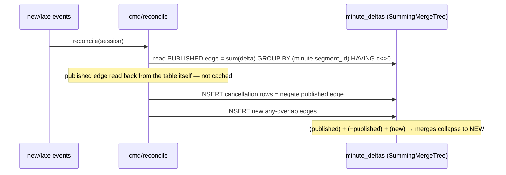

# Pulse — Architecture (HLD)

High-level design of the foreground-only concurrency system: how events become
a correct, filterable, incrementally-updatable concurrency curve, and how every
consumer reads the *same* serving layer.

## 1. System HLD

```mermaid
flowchart TB
  subgraph src [Sources]
    RAW[/raw events CSV<br/>~905K rows/]
    CON[/content CSV<br/>~33K titles/]
    TAIL[/late / unseen-day events/]
  end

  subgraph ingest [Ingestion · Go, native protocol → ClickHouse Cloud]
    LOADR[cmd/loadraw<br/>CSV → raw_events]
    BUILD[cmd/build_segments<br/>state machine]
    RECON[cmd/reconcile<br/>published-edge correction]
  end

  subgraph ch [ClickHouse core]
    RE[(raw_events<br/>MergeTree)]
    CM[(content_metadata)]
    CD{{content_dict<br/>HASHED}}
    SEG[(session_active_segments<br/>ReplacingMergeTree ver<br/>+ all typed dimensions)]
    MD[(minute_deltas<br/>SummingMergeTree<br/>minute, segment_id, delta)]
  end

  subgraph serve [Serving · one primitive: the minute curve]
    Q[[normative query:<br/>sel semi-join → opening balance →<br/>dense grid → cumsum]]
  end

  subgraph consumers [Consumers · all read the same serving layer]
    API[Go API<br/>/concurrency/chart]
    DASH[React dashboard]
    REPLAY[Live-replay view]
    BENCH[cmd/bench → answers.json<br/>+ query_log / parts evidence]
    LC[LibreChat + ClickHouse MCP<br/>read-only]
  end

  RAW --> LOADR --> RE
  TAIL --> LOADR
  CON --> CM --> CD
  RAW --> BUILD
  RE --> RECON
  BUILD -->|stage + REPLACE PARTITION| SEG
  BUILD -->|stage + REPLACE PARTITION| MD
  RECON -->|correction rows| MD
  RECON -->|higher version| SEG

  SEG -->|segment_id IN (…) semi-join<br/>+ dictGet| Q
  MD --> Q
  CD --> Q

  Q --> API --> DASH
  API --> REPLAY
  MD --> BENCH
  SEG --> BENCH
  API -. proxy .-> LC
  MD -. read-only .-> LC
```

## 2. Why this shape

- **Interval → delta (sweep-line), not per-minute explosion.** Each foreground-active
  interval emits exactly one `+1` and one `−1` (any-overlap boundaries). Concurrency
  at minute *t* = cumulative sum of deltas up to *t*. ~10⁵ delta rows instead of a
  per-minute-per-session cube.
- **Narrow deltas + dimension semi-join.** `minute_deltas` is `(minute, segment_id, delta)`
  — no dimensions. Dimensions live on `session_active_segments`; filters resolve to a
  `segment_id` set and are applied with `segment_id IN (…)`, never `INNER JOIN`. Adding
  a dimension never changes the delta write shape.
- **One primitive.** Minute, hour, and day all bucket the *same* minute curve, so the
  three grains can never disagree.

## 3. The SummingMergeTree write path — the optimisation you asked about

`minute_deltas` is a `SummingMergeTree`. Its whole job is: rows sharing
`(minute, segment_id)` are summed by background merges, and `sum(delta)` at query
time is correct whether or not a merge has run yet. That property is powerful but
has one trap and one opportunity.

### The trap: additive writes double-count on re-run

A `SummingMergeTree` *adds up* whatever you insert. If you re-run a load — a
pipeline retry, an unseen-day re-ingest, a partial reprocess — the second set of
`+1/−1` rows is indistinguishable from a second real viewer, and `sum(delta)`
silently **doubles the curve**. No error, no row-count change. `ReplacingMergeTree`
on the segments table does *not* help, because those delta rows were already
derived and inserted.

### Batch ingestion — stage table + atomic `REPLACE PARTITION` (idempotent, zero read-gap)

Instead of appending (double-counts) or `DROP PARTITION` + `INSERT` (leaves the
day **empty** to any concurrent dashboard/benchmark query mid-load), the loader:

```mermaid
sequenceDiagram
  participant B as cmd/build_segments
  participant S as minute_deltas._stg_minute_deltas
  participant T as minute_deltas (served)
  participant R as reader (dashboard / bench)
  B->>S: CREATE ... AS minute_deltas; TRUNCATE
  B->>S: INSERT new (minute, segment_id, ±1) rows
  Note over T,R: T still serving OLD data — reads uninterrupted
  B->>T: ALTER TABLE T REPLACE PARTITION '<day>' FROM S
  Note over T,R: atomic metadata swap — reader sees OLD or NEW, never empty
  B->>S: DROP staging
```

`REPLACE PARTITION ... FROM <staging>` is a single atomic metadata operation per
day. Properties gained:

| Property | How |
|---|---|
| **Idempotent** | Re-running rebuilds staging and re-swaps the same day → same result, never doubled. |
| **No read gap** | Readers see the old partition or the new one, never the empty window a DROP+INSERT exposes. |
| **Merge-independent reads** | Consumers still use `sum(delta) GROUP BY minute` — correct even on unmerged parts, so no `OPTIMIZE FINAL` is ever load-bearing. |

`session_active_segments` is swapped the same way (and is additionally a
`ReplacingMergeTree(version)` so a higher-version row wins on merge).

### Real-time ingestion — dedupe by *correction collapse*, not by rebuild

For late events / open sessions we cannot rebuild a whole day; we correct
individual segments (`cmd/reconcile`). This leans on the SummingMergeTree's
collapsing behaviour rather than fighting it:



Why this is the right "dedupe in realtime":

- **The dedupe key is the merge key.** A cancellation row shares `(minute, segment_id)`
  with the edge it cancels, so the SummingMergeTree merges the pair to zero — the
  stale edge disappears with no delete, no mutation, no lock.
- **Idempotent by reading the published edge back.** The edge to cancel is read from
  `minute_deltas` itself (`sum(delta) … HAVING d<>0`), not from cached state that a
  second run would have already overwritten. Run reconcile twice and the second run
  reads the *new* edge as published, cancels it, and rewrites the same new edge →
  net unchanged.
- **Correct before merges finish.** Because every read is `sum(delta) GROUP BY`,
  the curve is right the instant the correction rows land, even while the
  cancel/rewrite pair is still two physical rows in separate parts.

### One-line summary

> Batch writes are made idempotent and gap-free by an **atomic staging swap**
> (`REPLACE PARTITION FROM staging`); real-time writes are made idempotent by
> **published-edge correction rows that the SummingMergeTree collapses to the net**.
> Both keep the read path a plain `sum(delta) GROUP BY minute`, which is correct on
> unmerged parts — so nothing ever waits on a merge.

## 3b. ClickHouse best-practices alignment

| Practice | What we do | Why |
|---|---|---|
| **Engine (Cloud)** | Plain `MergeTree`/`ReplacingMergeTree`/`SummingMergeTree` in DDL | Cloud transparently substitutes `Shared*` (verified: `SharedReplacingMergeTree(...)`), which *is* the replicated, shared-storage engine. Explicit `ReplicatedMergeTree` is unnecessary and discouraged on Cloud. |
| **ORDER BY** | `minute_deltas (minute, segment_id)` — time first | Matches the `WHERE minute` range filter → partition + primary-index pruning (best practice: order by filter columns, moderate cardinality first). |
| **ORDER BY (segments)** | `session_active_segments (segment_id)` | Forced by the engine: the ReplacingMergeTree dedup key **must** be `segment_id`. Ordering by dims instead would dedup wrongly. At ~32k rows a dim filter is a fast linear scan; skip indexes below cover it. |
| **PARTITION BY** | `toYYYYMMDD(...)` on all fact tables | Used as a **data-management** tool (atomic `REPLACE PARTITION` idempotency), not as a query accelerator — exactly CH's stated purpose. Low partition count (days). At 100× with a long horizon, switch to monthly to avoid part proliferation. |
| **LowCardinality** | All dimension columns | Best practice for low-distinct string dims. |
| **Skip indexes** | `bloom_filter` on `video_session_id`, `minmax` on `(segment_start, segment_end)` | Speeds the reconcile/point lookups and the R9 overlap prune on the segment scan. |
| **Codecs** | `minute` → `DoubleDelta,ZSTD`; deltas/ids → `ZSTD`; timestamps → `Delta,ZSTD` | Monotonic time + narrow ±1 deltas compress hard; standard CH time-series codecs. |
| **FINAL** | `do_not_merge_across_partitions_select_final = 1` | Safe because a `segment_id`'s versions always share `segment_start` → one partition (verified: 0 spanning). Per-partition FINAL is then exact and cheaper. |
| **Avoid `OPTIMIZE … FINAL`** | Never load-bearing | Reads use `sum(delta) GROUP BY` (merge-independent) and segment `FINAL` (cheap at this size); correctness never waits on a merge. |

## 4. Consumers

| Consumer | Reads | Notes |
|---|---|---|
| Go API `/concurrency/chart` | serving query | compiles the one normative template; peak / avg / timeseries at minute/hour/day |
| React dashboard | API | grain toggle, dimension filters, peak/avg KPIs, area chart |
| Live-replay view | API (minute curve) | client-side animation — the "curve builds in real time" demo |
| `cmd/bench` | serving query | benchmark answers + `system.query_log` / `system.parts` evidence |
| LibreChat + ClickHouse MCP | serving layer (read-only) | conversational NL questions; never `raw_events` |
