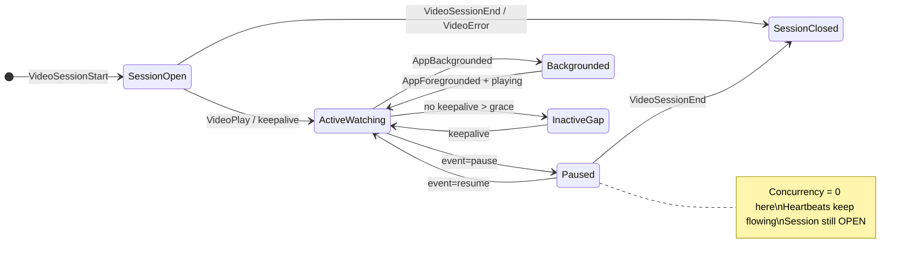

# Data & Problem Understanding — SonyLIV Click-a-thon 2026

Canonical primer for events, datasets, and what we are building. Problem source: [PROBLEM_STATEMENT.md](https://github.com/sidagarwal04/click-a-thon-2026/blob/main/SonyLiv/PROBLEM_STATEMENT.md).

---

## 1. What SonyLIV is asking

SonyLIV needs **foreground-only concurrency**: how many viewers are *actively watching right now*, not how many sessions are merely open. A session left backgrounded, paused, or silent (no heartbeat) must **not** count.

The hard part is not interval overlap — it is **identifying truly active ranges inside each session** and serving minute-wise peak/average concurrency at scale, with filters (platform, country, content, video type), while **open sessions keep updating** as heartbeats arrive.

---

## 2. Why naive approaches fail

| Approach | Problem |
|----------|---------|
| Count sessions where `start <= minute <= end` | Overcounts backgrounded / idle time |
| Explode every session to one row per minute | Storage explodes at petabyte scale |
| Recompute overlap from raw events on every dashboard query | Too slow for minute-grain dashboards |
| Static batch model only | Breaks on open sessions and late heartbeats |

---

## 3. Datasets provided

### Raw events — `ch-hackathon-raw-data.csv` (~905K rows)

Used to build aggregated tables for concurrency computation.

**Time range (confirmed from cloned dataset):**

| Metric | Value |
|--------|-------|
| Rows | **905,558** events |
| Start (`event_timestamp`) | **2026-07-14 15:43:58 UTC** (epoch ms in CSV) |
| End | **2026-07-26 11:30:04 UTC** |
| Span | **~12 days** (~284 hours) — not a single calendar day |
| Content metadata rows | ~33K titles (`ch-hackathon-content-data.csv`, ~1.1 MB) |
| Raw CSV size | ~222 MB |

> Problem statement frames a *"live-event day"* conceptually; the training CSV spans **multiple days**. Benchmark windows will be subsets of this range. Normalize `event_timestamp` from **epoch milliseconds** on ingest.

Dataset location (cloned):

```
/Users/prathmesh/Projects/click-a-thon-2026/SonyLiv/data/
```

Symlink from this repo: `hackathon-data/` → cloned SonyLiv folder.

After loading into ClickHouse:

```sql
SELECT min(event_timestamp), max(event_timestamp) FROM sony_liv.raw_events;
```

| Column | Role in concurrency |
|--------|---------------------|
| `video_session_id` | Primary grain for session-aware active segments |
| `user_id` | User-level analysis; **not** summable across overlapping sessions |
| `content_id` | Join key to content metadata; filter dimension |
| `event_type` | Coarse signal class (see §4) |
| `event` | **Playback state channel — carries `pause`, `resume`, `BufferStart`, `BufferEnd`. Load-bearing for correctness, not decoration** |
| `event_timestamp` | All time logic uses this (event time) |
| `platform`, `country` | Filter dimensions (raw CSV) |
| `app_version`, `audio_language`, `subtitle_language`, `player_version` | Filter dimensions (raw CSV) — snapshotted onto segments |
| `session_start_epoch` | Session boundary hint |

### Measured data profile

A read-only profile of the full CSV. Several of these contradict assumptions the earlier drafts of this plan were built on.

| Measurement | Value | Consequence |
|---|---|---|
| Distinct `video_session_id` | **10,866** | ~52,000 active segments, ~10^5 delta rows — two orders of magnitude below the earlier estimate |
| `VideoHeartbeat` rows | 843,600 (93%) | — |
| Distinct `event` values under `VideoHeartbeat` | **41** | `event` is a state channel |
| `event='pause'` / `'resume'` | **27,340 / 31,780** | Explicit pause markers exist; **20,922** pause→resume windows, median 21s, p90 293s |
| Heartbeats emitted **inside** a pause window | **42,273** across 10,530 windows | The heartbeat-gap rule provably cannot exclude paused time |
| `BufferStart` / `BufferEnd` | 66,641 / 66,289 | Largest single semantic swing after pause |
| `AppBackgrounded` / `AppForegrounded` | 14,700 / 14,321 | Present in every session — not the "may be missing" case earlier drafts hedged against |
| Background windows | **14,247**, median 35s, p90 512s | Sub-minute segments are the norm |
| Heartbeats emitted **inside** a background window | **3,799** across 2,526 windows | An ungated keepalive rule resurrects backgrounded sessions |
| Inter-heartbeat gap | p50 **1s**, p90 40s, p99 80s; only **0.87%** exceed 90s | Cadence is far denser than "every ~1 minute" |
| Gaps > 120s | 0.72% | The grace parameter moves ~0.15% of gaps |
| Sessions with **no** `VideoSessionEnd` | **0** | The training set contains **no open sessions** |
| Sessions where `subtitle_language` varies | **99.96%** | Dimensions are **not** constant per session |
| Sessions where `audio_language` varies | 81% | Same |
| Sessions with >1 `VideoSessionStart` / `End` / `VideoPlay` | 13 / 14 / 16 | Lifecycle events repeat |
| Max session span | **157,101s (43.6 hours)** | Every benchmark window opens mid-flight |
| `VideoError` | 293 | Low impact, but needs a written rule |

**Full filter dimension list (`dataset_details.md`):** raw → `content_id`, `platform`, `app_version`, `country`, `audio_language`, `subtitle_language`, `player_version`; content → `title`, `video_type`, `category` (via dictionary on `content_id`). Problem statement examples are a subset. See [SCHEMA_AND_DDL.md](SCHEMA_AND_DDL.md).

### Content metadata — `ch-hackathon-content-data.csv` (~33K titles)

Joined with raw events to fetch metadata at query or ingest time.

| Column | Role |
|--------|------|
| `content_id` | Maps to raw events |
| `title` | Human-readable filter |
| `video_type` | Key benchmark dimension (Live vs VOD etc.) |
| `category` | Content grouping filter |

**Integration:** enrich events with content attributes via **ClickHouse dictionary** (`content_dict`) — avoid JOIN at query time (same pattern as a production analytics backend lookup dictionaries).

**Storage approach:** **typed columns for every field — no JSON.** The dataset has a fixed 13-column schema with no sparse or unknown dimensions, and extensibility is provided by the narrow-delta model instead. A multi-tenant analytics platform uses JSON because it carries arbitrary per-customer event properties; that flexibility is not needed here. This is a scope decision, not a performance one — see [SCHEMA_AND_DDL.md — Considered and rejected](SCHEMA_AND_DDL.md#considered-and-rejected-properties-json-on-segments).

---

## 4. Event types and state machine

> **Normative definition: [SEMANTICS_SPEC.md](SEMANTICS_SPEC.md) §2.** This section is orientation.

**`event_type` alone is not enough.** Playback state rides in the **`event` column inside `event_type='VideoHeartbeat'`** — 41 distinct values, including the pause and resume markers. Classification is on the pair `(event_type, event)`.

| event_type | Meaning | Concurrency impact |
|------------|---------|-------------------|
| `VideoSessionStart` | Playback session begins | Start tracking; wait for playback evidence |
| `VideoPlay` | Playback started or resumed | Enter active if foreground |
| `VideoHeartbeat` | Periodic signal — **but see the `event` column** | Depends entirely on `event`, below |
| `AppBackgrounded` | App sent to background | **Exit active immediately.** Present in every session |
| `AppForegrounded` | App returned to foreground | Re-enter active if playback continues |
| `VideoSessionEnd` | Session closed | Finalize segments; stop counting |
| `VideoError` | Playback error | Close the active segment (session only if `VideoSessionEnd` follows) |

### The `event` column inside `VideoHeartbeat`

| `event` value | Count | Concurrency impact |
|---|---|---|
| `pause`, `speed-pause`, `AdPause` | 27,340 (`pause`) | **Close the active segment — paused playback is not active** |
| `resume`, `speed-resume`, `AdResume` | 31,780 (`resume`) | **Open a new segment. No-op if already playing** |
| `BufferStart` / `BufferEnd` | 66,641 / 66,289 | **Keepalive — buffering counts as active** |
| Everything else (`buffer-health`, `network-activity`, `video-resize`, …) | — | Keepalive |

**Why buffering and pause differ.** Both mean playback is not advancing, but they differ in intent: a pause is the *viewer choosing* to stop, a buffer is the *player failing* to continue. Concurrency measures viewers watching, so viewer intent is the discriminator.

### Active interval rules

A session is active at instant `t` only when **all four** hold: started and not ended, foreground, playing, and heartbeat-fresh.

1. **Backgrounded** → inactive until foregrounded again
2. **Paused** → inactive until resumed
3. **Keepalives extend the segment only when foreground and playing.** 42,273 heartbeats are emitted while paused and 3,799 while backgrounded; treating `VideoHeartbeat` as unconditionally "extend active" resurrects explicitly inactive sessions
4. **Keepalive gap > 90s** → close the active segment. This is **not** the mechanism that excludes inactive time; it catches client death, which is 0.87% of gaps
5. **Open at the end of known data** → segment ends at `least(last_keepalive + grace, watermark)`, never projected past the watermark

See [ACTIVE_INTERVAL_LOGIC.md](ACTIVE_INTERVAL_LOGIC.md) for the state machine and [SEMANTICS_SPEC.md](SEMANTICS_SPEC.md) for the frozen definitions.

---

## 4c. Multiple heartbeats per minute — how uniqueness works

**We do not count heartbeats.** Concurrency counts **overlapping active segments**, not events. Multiple heartbeats for the same session in one minute still contribute **at most 1** to concurrency for that session.

### Wrong vs right mental model

| Wrong (event counting) | Right (interval-to-delta) |
|------------------------|---------------------------|
| Each heartbeat = +1 viewer | Heartbeat **extends** existing active segment |
| 3 heartbeats/min = 3 concurrent | 3 heartbeats/min = **1** concurrent (same session) |
| `count(*)` or `uniq(session_id)` on raw events | +1 at segment start, −1 at segment end only |

### Session-aware uniqueness grain

Primary key for "one concurrent viewer" = **`video_session_id`** (not `user_id`).

```
Session A: VideoPlay ── HB ── HB ── HB ── HB ── SessionEnd
           |________ ONE active segment ________|
           +1 at segment_start          −1 at segment_end
           (one delta pair per segment, NOT one pair per heartbeat)
```

**Per heartbeat:** update `segment_end` → `last_keepalive + 90s grace`, but **only if foreground and playing**. No new +1 delta.

**New segment (+1 again)** only when active was broken and resumed:
- **`pause` then `resume`** — the most common case, 20,922 windows
- `AppBackgrounded` then later `AppForegrounded` with playback continuing — 14,247 windows
- Keepalive gap > grace — rare, 0.87% of gaps
- New `video_session_id` after `VideoSessionEnd`

### user_id vs video_session_id

| ID | Role |
|----|------|
| `video_session_id` | **One playback session** → at most 1 concurrent count at any instant |
| `user_id` | Same user, **multiple sessions** (tabs/devices) → each session emits its own +1/−1 |

Concurrency answers "how many active playbacks", not "how many unique users".

**User-level concurrency is a separate computation, not a `GROUP BY`.** `dataset_details.md` says user concurrency *"will be derived"* from `user_id`, and summing session deltas would double-count a user watching on two devices. It requires merging overlapping segments per user into islands first, then running the identical sweep-line over those islands. Whether the benchmark set includes it is [open question Q7](SEMANTICS_SPEC.md#7-still-open); the working assumption is yes.

### Duplicate / repeated events

| Case | Handling |
|------|----------|
| Same physical row ingested twice | Idempotent segment rebuild (`ReplacingMergeTree` on `segment_id`) — **not** an ingest dedup key |
| Two heartbeats in one minute at different seconds | Both extend the same segment; one +1/−1 pair |
| Late heartbeat extends an open segment | Adjust `segment_end`; emit a **delta correction** against the *published* edge, not a second +1 |

**A dedup key must include `event`.** Collapsing on `(video_session_id, event_timestamp, event_type)` and keeping `any(event)` discards the pause and resume markers before the state machine sees them. Dedup is not load-bearing for correctness anyway — heartbeats only extend segments — so the safest choice is not to dedup and to make the rebuild idempotent instead.

### How the serving layer reflects uniqueness

`minute_deltas` stores `(minute, segment_id, delta)` — no dimensions, no session IDs. Dimensions come from `session_active_segments` by semi-join at read time.

At minute `t`, concurrency is the cumulative `sum(delta)` **seeded with an opening balance** for segments already active before the window:

```sql
-- NOT this (counts paused and backgrounded heartbeats as active):
-- SELECT minute, uniqExact(video_session_id) FROM raw_events WHERE event_type = 'VideoHeartbeat' …

-- This, over a dense minute grid with an opening balance:
-- see SCHEMA_AND_DDL.md — Benchmark query template
```

### Example: 3 sessions, heartbeats every minute

| Minute | Session A | Session B | Session C | Concurrency |
|--------|-----------|-----------|-----------|-------------|
| 10:00 | +1 start | | | 1 |
| 10:01 | HB (extend) | +1 start | | 2 |
| 10:02 | HB | HB | +1 start | 3 |
| 10:03 | HB | HB | HB | **3** (not 9) |

Heartbeats in 10:03 do not add rows to serving — segment ends move forward; deltas were emitted at segment boundaries only.

---

**This is not explicitly defined in the problem statement.** Judges ask you to *define* it and defend the trade-off.

### What the problem *does* say

| Source | Wording |
|--------|---------|
| Problem statement | Define an **active interval** when heartbeat is missing — not when session ends |
| Problem statement | Sessions can be **still open** when the day ends; heartbeats keep arriving |
| Problem statement | Concurrency must **exclude heartbeat-missing periods** (foreground-only) |
| Problem statement | Possible direction: "**heartbeat gaps** … to cut inactive segments" |
| Dataset | `VideoHeartbeat` fires **every ~1 minute** |
| Dataset | Session closes explicitly via **`VideoSessionEnd`** (or `VideoError`) |
| README | Lists **session timeout** as a design decision **to confirm** — not a fixed value |

### The distinction that matters



| Concept | When it happens | Effect on concurrency |
|---------|-----------------|----------------------|
| **Active segment ends — paused** | `event='pause'` inside a heartbeat | **Stop counting.** 20,922 windows, median 21s |
| **Active segment ends — backgrounded** | `AppBackgrounded` | **Stop counting.** 14,247 windows, median 35s |
| **Active segment ends — client gone** | No keepalive within 90s | **Stop counting.** Rare: 0.87% of gaps |
| **Buffering** | `BufferStart` → `BufferEnd` | **Keeps counting** — viewer intends to watch |
| **Session ends** | `VideoSessionEnd` (or `VideoError`) | Finalize segments; session done |
| **Session still open, inactive** | Paused, backgrounded, or silent with no `VideoSessionEnd` | **Do not count** those minutes; the session can become active again |
| **Data ends** | No more events | Session is **open**; segment ends at `least(last_keepalive + grace, watermark)` |

**Bottom line:** inactivity means **"not actively watching"**, not **"session is over"**. Only `VideoSessionEnd` / `VideoError` end the session.

### The heartbeat grace window is not the exclusion mechanism

The problem statement suggests heartbeat gaps as a possible direction, and earlier drafts of this plan took that as *the* mechanism for cutting inactive time. **The data says it cannot be.**

| Measurement | Value | Implication |
|---|---|---|
| Inter-heartbeat gap p50 | **1 second** | Cadence is far denser than the "~60s" the data dictionary implies |
| Gaps > 90s | **0.87%** | The rule almost never fires |
| Gaps > 120s | 0.72% | Moving grace 90s→120s changes ~0.15% of gaps |
| Heartbeats emitted during a pause | **42,273** | No gap ever forms while paused |
| Median pause duration | 21 seconds | Even total silence would not exceed a 90s grace |

So inactivity is excluded by **explicit `pause` and `AppBackgrounded` markers**. The grace window catches genuine client death or network loss, and it is a near-inert parameter that should not be treated as the primary tuning knob.

| Parameter | Value | Rationale |
|-----------|-------|-----------|
| Keepalive grace | **90s** | Reasonable for client death; moves ~0.15% of gaps across its plausible range |
| Session timeout | **None** | Only `VideoSessionEnd` closes a session; never force-close |
| Open segment end | `least(last_keepalive + grace, watermark)` | Unclamped ends project a phantom tail past the end of known data |

### What to document for judges

1. Pause and background exclude time; **buffering does not** — and why the asymmetry is intentional
2. Missing heartbeat ends the *segment*, not the session, and is a rare event in this data
3. Grace window choice and its measured near-irrelevance, against the parameters that do move the answer
4. Average concurrency is over all clock minutes in the window, with empty minutes gap-filled
5. `VideoSessionEnd` is the authoritative session close signal
6. The training set has **no open sessions**, so the update path is demonstrated by truncate-and-replay

---

## 5. Benchmark questions (what we must answer fast)

- **Peak concurrency** at minute / hour / day grain
- **Average concurrency** over a range — **over all clock minutes in the range**, with minutes containing no delta gap-filled at the carried-forward value
- **Filtered** by platform, country, content, video_type (and combinations)
- **Critical nuance:** the peak minute for `platform=Android` may differ from the peak minute for `platform=Android AND country=IN AND video_type=Live`
- **Opening balance is mandatory:** sessions run up to 43.6 hours, so every window opens with sessions already in flight. Seeding the cumulative sum at zero understates every answer and can drive the curve negative

**All bucketing is UTC**, enforced by declaring every timestamp column `DateTime64(3, 'UTC')` so the `toStartOf*` functions cannot pick up a server timezone. The accepted consequence is that a UTC day cuts at 05:30 IST, so a reported daily peak will not match an Indian business day; switching is a query-layer bucketing change, not a migration.

One interpretation remains open, tracked in [FINAL_PLAN.md §16 Q2](FINAL_PLAN.md#16-open-questions): whether "peak at hour grain" means the max of the minute curve within each hour or concurrency recomputed on hour buckets. We assume the former.

All answers come from the delta and segment layer, never from raw event rescans.

---

## 6. Evaluation criteria (what judges score)

| Criterion | What it means for us |
|-----------|---------------------|
| Correctness | Foreground-only, with pause and background excluded and buffering included; match private ground truth |
| Query performance | What the queries *read*, plus the 100x reasoning — **not** raw latency, since at 10,866 sessions every team's queries return in milliseconds |
| Update handling | Open sessions and late heartbeats absorbed incrementally, demonstrated via truncate-and-replay |
| Design quality | Defensible semantics with published sensitivities, narrow-delta model, dictionary strategy |
| Unseen day | Same pipeline, logged evidence — no hand-computed answers |

### The unseen day

A fresh day of session data is released in the final hours. Our submission must include benchmark answers, query latencies, and pipeline evidence (query logs/traces). **Build for the unseen day, not the data you tuned on.**

---

## 7. How our product maps to the problem

| Problem need | Our component |
|--------------|---------------|
| Correct active intervals | Segment builder over the `(event_type, event)` classifier |
| Fast filtered queries | Narrow `minute_deltas` semi-joined to `session_active_segments` + `content_dict` |
| Incremental updates | `open_session_state` + corrections against published delta edges; truncate-and-replay demo |
| Semantic defensibility | Frozen [SEMANTICS_SPEC.md](SEMANTICS_SPEC.md) + published parameter sensitivities |
| Pipeline observability | ClickStack on ingestion lag, query latency, part counts |
| Hackathon evidence | Benchmark runner emitting `answers.json`, latencies, `evidence/` |
| Exploratory / conversational analytics | Minimal chart; minimal UI and LibreChat only if time remains (Q10) |

---

## 8. Session-aware vs session-independent

- **Session-aware (primary):** build active segments inside `video_session_id` — matches streaming semantics
- **Independent reference (validation):** a standalone Python implementation of the *same written spec*, reading the raw CSV directly, to cross-check the SQL

A word of caution learned the hard way: a "session-independent" reference that counts sessions with heartbeat evidence per minute is **not** an independent check. It shares the assumption most likely to be wrong — it would count the 42,273 paused and 3,799 backgrounded heartbeats as active, exactly as the original state machine did. Independence has to come from re-implementing the spec, not from re-expressing the same shortcut.

---

## 9. Requirements from problem statement

- **ClickHouse** is the primary datastore and analytical engine
- Meaningfully integrate **at least one** of ClickStack, Langfuse, or LibreChat. **ClickStack is our primary choice** — it instruments the real pipeline and doubles as query-performance evidence; LibreChat + ClickHouse MCP is secondary, and Langfuse is rejected since no LLM sits in the correctness path
- No AI required for core correctness — design and data modeling win
- Minimal visualization is enough; judges reward the model and serving layer, and **polished frontends are explicitly out of scope**
