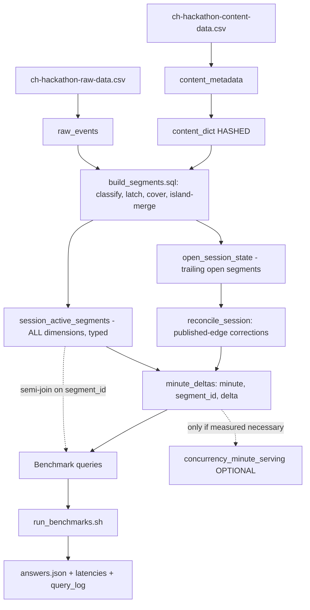

# Final Plan — Foreground-Only Concurrency at Streaming Scale

**Click-a-thon 2026 · SonyLIV · ClickHouse**

This is the authoritative implementation plan. It supersedes earlier drafts and is written to be built from directly. Where earlier documents offered options, this one picks and justifies.

All data referenced is synthetic. No real viewer, subscriber, or content-partner data.

---

## 0. Positioning — where the marks actually are

The training dataset holds **905,558 events across 10,866 sessions**, which collapse to roughly **50,000 active segments** and about **10⁵ rows in `minute_deltas`**. That is a table that fits comfortably in memory. Every benchmark query, on every team's design, will return in single-digit to low-double-digit milliseconds.

State this plainly to ourselves and to the judges: **at the provided data volume we cannot win on measured latency, because nobody can lose on it.** Query performance is still scored, but at this size it will be scored on *what the queries read* and on the 100× reasoning, not on the stopwatch.

**This is a statement about the training dataset, not about the design.** At 100× it is false: §15 derives the figures and shows that a broad filtered query grows from roughly 10⁵ to 10⁷ delta rows, that the semi-join set stops being free, and that latency becomes a genuine constraint with concrete thresholds. The two claims are consistent, and holding both is the point — we are not claiming the design is fast because the data is small, we are claiming that *today's* measurements cannot discriminate between designs, so the scored differentiator today is semantics, and the scored differentiator at 100× is knowing exactly where the design bends. §15 is the second half of that answer and carries as much weight as §1.

The differentiator at this scale is **defensible semantics**. Foreground-only means foreground-only, and the training data contains 20,922 explicit pause windows totalling a material fraction of watch time. A team that counts paused playback loses correctness points no amount of tuning recovers. So the effort budget is:

| Where effort goes | Share | Why |
|---|---|---|
| Locked semantics + segment builder correctness | ~40% | The only place large correctness swings live |
| Query math (opening balance, dense grid, grain derivation) | ~15% | Silent wrong-answer generators |
| Validation, sensitivity, evidence | ~20% | "No pipeline evidence, no credit" |
| Incremental / open-session path | ~15% | Separately scored criterion |
| Product surface (chart, API, integration) | ~10% | Explicitly out of scope beyond "minimal" |
| Latency tuning | ~0% | Already fast; see above |

Anything that does not serve one of those rows is flagged **Do not build** in §12.

---

## 1. Locked semantics specification

**This section is frozen before any building starts.** Everything downstream inherits it. Changing a rule here means rebuilding segments and deltas, so changes are made here first, deliberately, and recorded in the sensitivity table (§9.4).

### 1.1 Grain and identifiers

| Concept | Key | Rule |
|---|---|---|
| One concurrent viewer | `video_session_id` | A session contributes **at most 1** to concurrency at any instant, regardless of how many events it emits |
| Active segment | `segment_id` | One row per contiguous foreground-active interval; a session may produce many |
| User concurrency (secondary) | `user_id` | Requires merging overlapping segments per user first — **not** a sum of session deltas (§7.4) |
| Time | `event_timestamp` | Event time, epoch milliseconds in the CSV, normalised to `DateTime64(3, 'UTC')` on ingest |

### 1.2 Timezone — UTC only

**All time bucketing is UTC.** Minute, hour, and day boundaries are UTC boundaries. There is no local-timezone handling, no configuration option, and no IST code path.

The mechanism is the column type, not convention: every timestamp column is declared `DateTime64(3, 'UTC')` or `DateTime('UTC')`, so `toStartOfMinute`, `toStartOfHour`, and `toStartOfDay` inherit UTC from the column and cannot silently pick up a server or session timezone. There is no ambiguity to get wrong at query time.

**Known consequence, accepted deliberately.** For an India-facing service, a UTC day boundary cuts at **05:30 IST**. So "peak concurrency per day" as this system reports it will not line up with a business day as an Indian stakeholder would describe it — a UTC day splits the previous evening's prime-time tail from the following evening's. We accept this for the hackathon because UTC is unambiguous, matches the raw epoch timestamps with no conversion step, and removes an entire class of off-by-5.5-hours bug from a system judged on correctness.

Note for the design write-up: switching to IST later is a **bucketing-function change confined to the query layer** (`toStartOfDay(minute, 'Asia/Kolkata')`), not a schema migration. Stored deltas are timezone-agnostic instants; only the grouping expression changes. That is a property of the model worth pointing out, not a limitation.

### 1.3 Event classification

The dataset carries playback state in **two columns**. `event_type` gives the coarse category, and `event` carries the actual state marker — there are **41 distinct `event` values** under `event_type='VideoHeartbeat'`, including the pause and resume markers. Any state machine that dispatches on `event_type` alone is blind to pause.

This classifier is the single normative definition of event semantics. The segment builder, the fixtures, and the reference implementation all use it and nothing else:

```sql
-- The ONLY place event semantics are defined.
multiIf(
    event_type = 'VideoSessionStart',                                    'open',
    event_type = 'VideoSessionEnd',                                      'close',
    event_type = 'VideoPlay',                                            'play',
    event_type = 'AppBackgrounded',                                      'background',
    event_type = 'AppForegrounded',                                      'foreground',
    event_type = 'VideoError',                                           'error',

    -- Playback-state markers ride INSIDE VideoHeartbeat via the `event` column.
    event_type = 'VideoHeartbeat'
        AND event IN ('pause', 'speed-pause', 'AdPause'),                'pause',
    event_type = 'VideoHeartbeat'
        AND event IN ('resume', 'speed-resume', 'AdResume'),             'resume',

    -- Everything else that is a heartbeat is liveness evidence, including
    -- BufferStart / BufferEnd / Seek / quality shifts. See 1.4 rule R2.
    event_type = 'VideoHeartbeat',                                       'keepalive',

    'ignore'
) AS signal
```

### 1.4 The active predicate

A session is **foreground-active** at instant `t` when **all four** conditions hold. Each is a latched state driven by the last relevant preceding signal.

| # | Condition | Set false by | Set true by | Default |
|---|---|---|---|---|
| 1 | `session_open` | `close` | `open` | true from first event |
| 2 | `foreground` | `background` | `foreground`, `open` | **true** |
| 3 | `playing` | `pause`, `error` | `play`, `resume` | **false** |
| 4 | `heartbeat_fresh` | `t > last_keepalive + GRACE` | any `keepalive`, `play`, `resume` | n/a |

Concurrency at minute `m` is the number of sessions whose active intervals overlap `m`.

### 1.5 The rules, with rationale

**R1 — Pause ends the active segment. Resume opens a new one.** *(Locked decision)*

A `pause` marker closes the active segment at its timestamp. A subsequent `resume` (or `play`) opens a new segment. A paused session contributes zero concurrency for the duration of the pause.

*Rationale.* The problem statement names paused playback as a failure mode in its opening paragraph. The data makes this unavoidable: there are **20,922 pause→resume windows** (median 21s, p90 293s). Critically, the heartbeat-gap rule **cannot** substitute for this — **42,273 heartbeats are emitted while paused**, across 10,530 of those windows, so no gap ever forms; and the median pause of 21s would not exceed any sane grace window even in silence. Explicit pause parsing is the only mechanism that works.

*Asymmetry to expect.* There are 31,780 `resume` events against 27,340 `pause`. A `resume` while already playing is a **no-op**, not an error. A session may also end or background while paused. The state machine must tolerate all three.

**R2 — Buffering and stalls count as active.** *(Locked decision)*

`BufferStart`, `BufferEnd`, `Seek`, `video_forward`, `video_rewind`, quality shifts, and the network/telemetry heartbeats are all `keepalive`. A buffering session stays active.

*Rationale, and why this is deliberately asymmetric with R1.* The metric is "how many viewers are actively watching", which is a statement about **viewer intent and attention**, not about whether pixels are currently moving. A paused viewer has withdrawn attention — they pressed a button to stop. A buffering viewer is sitting in front of a foregrounded player waiting for it to recover; they are watching, and the platform is failing them. Excluding buffering would also produce a perverse metric where a CDN incident *improves* reported concurrency, which is exactly backwards for a dashboard the business uses for capacity and incident decisions.

This is a 66,641-window decision (`BufferStart` count), so it is second only to pause in impact. It is documented here precisely because a judge may reasonably ask why the two are treated differently.

**R3 — `AppBackgrounded` ends the active segment immediately; `AppForegrounded` alone does not restart it.**

Backgrounding closes the segment at its timestamp. Returning to foreground restores condition 2 but a new segment only opens once condition 3 and 4 are also satisfied — that is, on the next `play`, `resume`, or `keepalive`.

*Rationale.* This is the literal reading of "foreground-only". The gate matters more than it looks: **3,799 heartbeats are emitted while backgrounded**, across 2,526 of the 14,247 background windows. A rule that says "a heartbeat extends the active segment" without checking the foreground latch resurrects backgrounded sessions on those heartbeats. Condition 2 is checked on every signal, including keepalives.

Background windows have a **median duration of 35 seconds**, which is why R6 (same-minute segments) is load-bearing rather than a tail case.

**R4 — A heartbeat gap beyond the grace window ends the active segment retroactively, at `last_keepalive + GRACE`.**

`GRACE = 90 seconds`. The segment does not extend to the next event; it is cut at the moment liveness evidence expired.

*Rationale, and a deliberate de-prioritisation.* This is the backstop for silent death — a process killed, a network drop, a device sleeping without emitting `AppBackgrounded`. It must exist. But it is **not** the primary correctness lever, contrary to earlier drafts: the measured inter-heartbeat gap is **p50 1s, p90 40s, p99 80s**, and only **0.87%** of gaps exceed 90s while **0.72%** exceed 120s. Moving the grace from 90s to 120s therefore changes roughly 0.15% of gaps. The parameter is nearly inert on this data, and effort spent tuning it is effort not spent on R1.

We keep 90s (1.5× the nominal 60s cadence) because it is the conventional choice and cheap to defend. It stays in the sensitivity table (§9.4) for honesty, not because we expect it to move the answer.

**R5 — `VideoSessionEnd` closes the session; `VideoError` closes only the segment.**

`close` is terminal: it ends the active segment at its timestamp and the session emits nothing further. Events arriving after a `close` are ignored. `error` clears the `playing` latch, ending the segment, but a later `play` or `resume` legitimately opens a new one.

*Rationale.* Errors are recoverable — a player that errors and then resumes is genuinely being watched again, and there are only 293 `VideoError` events so the blast radius is negligible either way. Treating `close` as terminal costs us correctness on the 14 sessions with a duplicate `VideoSessionEnd` and the 13 with a duplicate `VideoSessionStart`, which is about 0.1% of sessions; the simpler rule is worth that.

**R6 — Minute attribution is "any overlap": a segment counts in every minute it touches.** *(Locked, flagged for verification)*

A segment emits `+1` at the minute containing its start, and `−1` at the minute **after** the minute containing its last active instant:

```sql
toStartOfMinute(segment_start)                                                AS plus_minute
toStartOfMinute(segment_end - toIntervalMillisecond(1)) + toIntervalMinute(1) AS minus_minute
```

This guarantees `minus_minute > plus_minute` for every segment, including one entirely inside a single minute.

*Rationale.* The naive convention (`−1` at `toStartOfMinute(segment_end)`) makes any segment that starts and ends within the same minute emit `+1` and `−1` into the same row group; `SummingMergeTree` sums them to zero and drops the row, and **the viewer silently never existed**. That is not a tail case here — background windows median 35 seconds and pause windows median 21 seconds, so once R1 and R3 split segments properly, sub-minute segments are one of the most common shapes in the dataset, and the bias is systematically downward.

Any-overlap slightly *inflates* relative to a "present for the whole minute" reading. That is the safer direction to be wrong in, and it is the convention most naturally described by "concurrency at minute *m*". It is nonetheless the highest-risk locked choice in this section, because it cannot be verified without the answer key — see §16.

**R7 — Zero-length segments are discarded.** A segment where `segment_end <= segment_start` represents no watch time (for example, a `pause` in the same millisecond as a `play`) and is dropped before delta emission.

**R8 — Open segments are clamped to the watermark. They never extend past the end of known data.**

```sql
segment_end = least(last_keepalive_ts + INTERVAL 90 SECOND, watermark_ts)
```

where `watermark_ts = max(event_timestamp)` over the data loaded so far.

*Rationale.* Without the clamp, every session whose last heartbeat falls within 90s of the end of the file projects an active tail into the future, producing a phantom bump on the right-hand edge of every curve. Since the clamp uses the same watermark that defines "now" for the pipeline, it also makes the incremental and batch paths agree — see §8.3.

**R9 — Sessions and segments cross day boundaries freely. No day-based truncation anywhere. Segments may be filtered by *overlap* with the query window, never by *start time alone*.**

The longest session spans **43.6 hours** and the longest single heartbeat gap is 39.6 hours. Segments are never split at midnight, and a query for day *N* must still see segments that started on day *N−1*.

The distinction between start time and overlap is the whole rule, and stating it loosely is what previously caused a scaling defect. Both halves matter:

**Forbidden — filtering by start time alone.** A predicate like `segment_start >= range_start` silently drops every session that was already in flight when the window opened. Since p90 session span is around 33 minutes and the longest is 43.6 hours, that discards exactly the sessions the opening balance exists to count. This is the natural-looking "help partition pruning" optimisation that must never be applied.

**Required at scale, and permitted always — filtering by overlap.** A segment that does not overlap `[range_start, range_end)` cannot affect the answer, and this is provable rather than approximate. Under R6 a segment contributes `+1` at `plus_minute` and `−1` at `minus_minute`, so exactly four cases exist:

| Case | Contribution |
|---|---|
| `minus_minute < range_start` — entirely before the window | `+1` and `−1` both land in the opening balance and cancel: **exactly zero** |
| `plus_minute < range_start <= minus_minute` — straddles the start | **`+1`** to the opening balance, nothing in-window |
| `plus_minute >= range_end` — entirely after | **Nothing** |
| Otherwise | Overlaps; contributes normally |

Only the middle two cases are non-zero, and both overlap the window. So `segment_start < range_end AND segment_end > range_start` is **answer-preserving by construction**, with no assumption about segment duration and no schema change. It is part of the shipped template in §6.1, not a scaling-only rewrite, because a bound that changes no answer costs nothing to apply from day one and removes the temptation to reach for the forbidden start-time filter later.

A second, weaker bound — `segment_start >= range_start - MAX_SEGMENT_SPAN` — is what actually enables partition pruning and the `idx_seg_span` index. That one **is** an assumption: it holds only while no segment exceeds `MAX_SEGMENT_SPAN_HOURS`, so it is paired with a hard assertion in the invariant suite (§9.3). Keep the two bounds mentally separate. The overlap predicate is a theorem; the lookback predicate is an asserted precondition.

Only `minute_deltas` is filtered by absolute time without qualification, because a delta row is an instant rather than an interval. See §15.4 for the cost analysis this rule enables.

**R10 — Dimensions are snapshotted deterministically at segment start.**

Dimensions are **not** constant within a session in this data: `subtitle_language` varies within **99.96%** of sessions, `audio_language` within **81%**, `player_version` within 1,600 sessions, `platform` within 95, `user_id` within 120. The snapshot uses `argMin(col, (event_timestamp, event_type, event))` over the segment's own events.

*Rationale.* `any()` in ClickHouse is explicitly non-deterministic — it returns whatever the first-processed block held, and can differ between runs of an identical query. With dimensions genuinely varying, `any()` means a benchmark filtered on `audio_language='hin'` can return **different answers on re-run**, and the unseen-day run may not reproduce the training run. That directly breaks the "same pipeline, reproducible evidence" requirement. `argMin` over a fully-ordered tuple is deterministic and gives the value in force when the viewer started watching, which is the defensible reading of "this segment's platform".

*The tuple is not decoration.* `argMin` on `event_timestamp` alone is still non-deterministic, because timestamps tie routinely in this data — several heartbeats can share a millisecond. The tuple must extend to the raw `(event_type, event)` pair, which is unique per event within a timestamp because it is the tail of `raw_events`' sort key. In particular it must **not** be the classified `signal`, which is many-to-one and therefore still admits ties. See §5.5, where using `signal` here was a real defect.

*Direction matters too.* `argMin` gives the value at segment **start**. `argMax` would give the value at segment end, which is a different semantic and contradicts this rule's own wording; the two are easy to transpose when reading quickly.

### 1.6 Constants

Stored in `clickhouse/scripts/config.env`, referenced by every script. Changing one requires a full segment rebuild.

| Constant | Value | Rule |
|---|---|---|
| `HEARTBEAT_GRACE_SEC` | `90` | R4 |
| `TIMEZONE` | `UTC` | §1.2 — fixed, not configurable |
| `MINUTE_ATTRIBUTION` | `any_overlap` | R6 |
| `AVG_DENOMINATOR` | `all_clock_minutes` | §2.3 |
| `SESSION_GRAIN` | `video_session_id` | §1.1 |
| `MAX_SEGMENT_SPAN_HOURS` | `72` | R9. Asserted upper bound on segment duration (longest measured session is 43.6h). **Used by the shipped query template** (§6.1) as the lookback bound on `sel` and on the opening balance, and it governs the build batching window at scale (§15.6). Because a query answer depends on it, §9.3 asserts it on every pipeline run |
| `DATABASE` | `sony_liv` | — |

---

## 2. Metric definitions

### 2.1 The minute curve is the only primitive

Everything is derived from one object: the **filtered minute concurrency curve** over the query window. Peak and average at every grain are aggregations of that curve. There is no second definition of concurrency anywhere in the system.

```
concurrency(m) = (number of active segments overlapping minute m, after dimension filtering)
               = opening_balance + Σ delta(m') for all m' ≤ m
```

### 2.2 Opening balance is mandatory

Concurrency at the first minute of a query window is **not zero**. It is the number of segments already in flight, which is the sum of all deltas for the filtered segment set strictly **before** the window:

```
opening_balance = Σ delta WHERE minute < range_start AND segment_id ∈ filtered_set
```

That is the **definition**. The shipped implementation restricts the scan to a bounded lookback, which R9 proves computes the same number — a definition and an equivalent evaluation strategy, not two different metrics.

*Why this is not optional.* Sessions run up to 43.6 hours, and p90 session span is around 33 minutes, so essentially every benchmark window opens mid-flight. Omitting the opening balance understates every filtered peak and average, and produces a curve that goes **negative** whenever a session that started before the window ends inside it — at which point `max()` is taken over a curve offset by an arbitrary negative constant. This is the single largest source of wrong answers in a sweep-line design and it is invisible in testing unless you check for negative concurrency.

*Cost, and why the bound ships from day one.* Computed naively, the opening balance reads **all** deltas before the window, which defeats the partition pruning the rest of the query depends on and makes query cost a function of total history rather than of query scope. At 10⁵ rows that is free, so it would be tempting to ship the naive form and fix it later.

We ship the bounded form instead, because the fix is **not** a checkpoint table and carries no complexity worth deferring. Only segments straddling `range_start` can contribute a non-zero opening balance (proof in R9's case analysis), so the required scan is bounded by a fixed lookback of `MAX_SEGMENT_SPAN_HOURS`. That is a query-layer predicate with no new table, no schema change, and no effect on any answer — see §6.1 for the shipped form and §15.4 for the cost analysis. A checkpoint table was considered and rejected: it would add a second source of truth for concurrency, which is precisely what §2.1 exists to prevent.

### 2.3 Average is over all clock minutes, gap-filled

**Average concurrency over a window is the mean of `concurrency(m)` over every clock minute in the window**, including minutes where concurrency is zero and minutes where no event occurred.

The implementation must therefore generate a **dense minute grid** and carry the concurrency value forward across minutes that have no deltas.

*Why this needs saying.* `sum(delta) GROUP BY minute` produces rows only for minutes that contain a delta. A minute where the curve sits flat at 50 with nothing starting or ending produces no row at all. Taking `avg()` over that result averages over *event-minutes* rather than *clock-minutes* — a different quantity, biased toward busy minutes, and wrong. With ~50,000 segments spread across ~17,000 minutes, and much sparser after dimension filtering, long stretches of any filtered curve have no deltas whatsoever.

**Corollary:** the range average must be computed from the minute curve directly. It is **never** `avg(avg_in_hour)`, which is an unweighted mean of means and equals the true average only when every hour contributes an equal number of minute samples. With a filtered curve it never does.

### 2.4 Peak and average at each grain

All three grains consume the same dense minute curve. Hour and day are **bucketings of the minute curve**, never re-derivations from deltas.

| Grain | Peak | Average |
|---|---|---|
| **Minute** | `max(concurrency)` over the window | `avg(concurrency)` over all clock minutes in the window |
| **Hour** | Per UTC hour: `max(concurrency)` over its minutes. Range peak: `max` over hours, which equals the minute peak | Per UTC hour: `avg(concurrency)` over its 60 minutes |
| **Day** | Per UTC day: `max(concurrency)` over its minutes | Per UTC day: `avg(concurrency)` over its 1,440 minutes |

**Never sum deltas into hour or day buckets.** A session starting 10:50 and ending 11:10 gives hour 10 a net delta of +1 and hour 11 a net of −1; cumulative-summing those yields a curve that is simply wrong, because concurrency at 10:55 depends on deltas from before 10:00 as well. The minute cumulative sum must happen first, always.

**Peak is grain-sensitive in exactly one way:** the peak *value* is identical at all three grains for a fixed window (the maximum of a function does not change when you group its domain), but the *reported bucket* differs. What genuinely differs across grains is the **average**. This is worth stating in the submission because it is a common place to produce plausible-looking nonsense.

**Filtered peaks are independent.** The peak minute for `platform='ANDROID'` and the peak minute for `platform='ANDROID' AND country='india' AND video_type='Live'` can fall at entirely different minutes. This falls out for free because filtering happens *before* the cumulative sum, on the segment set — the model never pre-aggregates a peak.

---

## 3. Architecture



**The one structural bet:** interval-to-delta sweep-line with **narrow, dimension-agnostic deltas**. `minute_deltas` holds three columns forever. Dimensions live exclusively on `session_active_segments` and are applied by resolving a filter to a **segment set** and semi-joining. Storage is O(active segments), never O(sessions × minutes).

**Why narrow rather than denormalised.** A wide delta table means every new dimension widens the sort key, which on a `SummingMergeTree` cannot be done in place and forces a shadow table, a full backfill, and a materialized-view recreation. The narrow model makes a new dimension an `ALTER TABLE … ADD COLUMN` on a ~52,000-row table plus a rebuild, with the delta table and its write statement untouched. That is the direct answer to "the solution should work even if the number of dimensions increases", and it costs one semi-join at this scale.

---

## 4. Schema and DDL

Database `sony_liv`. Every timestamp column pins `'UTC'`.

### 4.1 `raw_events`

```sql
CREATE DATABASE IF NOT EXISTS sony_liv;

CREATE TABLE IF NOT EXISTS sony_liv.raw_events
(
    video_session_id    String,
    user_id             String,
    content_id          UInt64,
    event_type          LowCardinality(String),
    event               LowCardinality(String),   -- carries pause/resume; 41 distinct values
    event_timestamp     DateTime64(3, 'UTC'),
    platform            LowCardinality(String),
    app_version         LowCardinality(String),
    country             LowCardinality(String),
    audio_language      LowCardinality(String),
    subtitle_language   LowCardinality(String),
    player_version      LowCardinality(String),
    session_start_epoch DateTime64(3, 'UTC'),

    ingest_batch_id     UUID     DEFAULT generateUUIDv4(),
    ingested_at         DateTime64(3, 'UTC') DEFAULT now64(3)
)
ENGINE = MergeTree
PARTITION BY toYYYYMMDD(event_timestamp)
ORDER BY (video_session_id, event_timestamp, event_type, event)
SETTINGS index_granularity = 8192;
```

`event` is `LowCardinality` — 41 distinct values, and it is now a **state channel read by the state machine**, not decoration. The sort key ends with `event` so the per-session event stream has a total, deterministic order, which is what makes `argMin` in R10 reproducible.

CSV loads epoch milliseconds; normalise on insert with `fromUnixTimestamp64Milli(...)`.

### 4.2 `content_metadata` and `content_dict`

```sql
CREATE TABLE IF NOT EXISTS sony_liv.content_metadata
(
    content_id UInt64,
    title      String,
    video_type LowCardinality(String),
    category   LowCardinality(String),
    loaded_at  DateTime('UTC') DEFAULT now()
)
ENGINE = MergeTree
ORDER BY content_id;

CREATE DICTIONARY IF NOT EXISTS sony_liv.content_dict
(
    content_id UInt64,
    title      String,
    video_type String,
    category   String
)
PRIMARY KEY content_id
SOURCE(CLICKHOUSE(DB 'sony_liv' TABLE 'content_metadata'))
LAYOUT(HASHED())
LIFETIME(MIN 300 MAX 600);
```

~33K rows, so `HASHED` is a few megabytes resident and `dictGet` is a hash probe with no join.

**Content dimensions are handled two ways, deliberately.** `video_type` and `category` are **denormalised onto `session_active_segments` at build time** via `dictGet`, because they are the hot content filters and turning them into plain `LowCardinality` predicates on a 50,000-row table costs two columns and removes a function call from the hottest path. `title` and any future content attribute stay dictionary-only: `title` is high-cardinality and rarely filtered, and leaving it in the dictionary means a new content attribute needs only a column plus `SYSTEM RELOAD DICTIONARY`, with no pipeline change at all.

### 4.3 `session_active_segments`

The correctness object and the dimension table. One row per contiguous foreground-active interval.

```sql
CREATE TABLE IF NOT EXISTS sony_liv.session_active_segments
(
    segment_id        UInt64,                 -- cityHash64(video_session_id, segment_start_ms)
    video_session_id  String,
    user_id           String,

    -- Event dimensions, snapshotted deterministically at segment start (R10)
    content_id        UInt64,
    platform          LowCardinality(String),
    country           LowCardinality(String),
    app_version       LowCardinality(String),
    audio_language    LowCardinality(String),
    subtitle_language LowCardinality(String),
    player_version    LowCardinality(String),

    -- Hot content dimensions, denormalised from content_dict at build time
    video_type        LowCardinality(String),
    category          LowCardinality(String),

    segment_start     DateTime64(3, 'UTC'),
    segment_end       DateTime64(3, 'UTC'),   -- exclusive; clamped to watermark (R8)

    is_final          UInt8 DEFAULT 0,        -- 1 once the session is closed
    close_reason      LowCardinality(String), -- pause | background | heartbeat_gap | session_end | error | watermark

    version           UInt64,                 -- pipeline run sequence; drives replacement
    computed_at       DateTime64(3, 'UTC') DEFAULT now64(3)
)
ENGINE = ReplacingMergeTree(version)
PARTITION BY toYYYYMMDD(segment_start)
ORDER BY (segment_id)
SETTINGS index_granularity = 8192;

ALTER TABLE sony_liv.session_active_segments
    ADD INDEX idx_session video_session_id TYPE bloom_filter(0.01) GRANULARITY 4;
```

**Idempotency — and why the deterministic-ID argument alone is false.** Earlier drafts claimed that a deterministic `segment_id` makes rebuilds idempotent. It does not. On a plain `MergeTree`, re-running the builder **appends a second copy of every row** with the same `segment_id`; deterministic IDs make duplicates *detectable*, not *absent*. The consequence in a join model is severe and silent: if the segments table holds two rows per `segment_id`, an `INNER JOIN` matches every delta twice and **all concurrency doubles**, with no error and no change in `minute_deltas` row count.

Idempotency comes from four mechanisms together, and they protect **two different tables**. That split is the part that is easy to miss, because the first three do nothing whatsoever for `minute_deltas`:

1. **`ReplacingMergeTree(version)` keyed on `segment_id`** — a rebuild replaces rather than appends. Note that replacement is *within a partition*; since `segment_id` is derived from `segment_start`, a given segment always lands in the same partition, so this holds.
2. **Read the segments side with `FINAL`** in the filter subquery. At ~50,000 rows `FINAL` costs approximately nothing, and it does something the semi-join cannot: it guarantees the filter is evaluated against the *current* version of each row. A surviving pre-replacement row carrying stale dimension values would otherwise match a dimension predicate and admit a segment that should have been excluded — a wrong answer rather than a doubled one. (`FINAL` is rejected on `minute_deltas` for the opposite reason — it is larger, and `sum(delta) GROUP BY` is already merge-independent, so `FINAL` there would be pure cost.) At 100× this table reaches ~5M rows and `FINAL` needs `do_not_merge_across_partitions_select_final = 1`, which is safe here because `segment_id` is partition-stable; beyond that, `ALTER TABLE … REPLACE PARTITION` removes the need for `FINAL` entirely. See §15.6.
3. **Queries semi-join, never join** (§6). `segment_id IN (subquery)` is set-valued and cannot fan out even if duplicates survive. This is defence in depth against the *doubling* failure specifically: mechanisms 1 and 2 make duplicates absent, and mechanism 3 makes them harmless.
4. **`DROP PARTITION` on `minute_deltas` before every delta write** (§5.6). **Mechanisms 1 through 3 protect `session_active_segments` and do nothing for `minute_deltas`.** Re-running the delta emission in §5.6 appends a second `+1`/`−1` pair per segment into a `SummingMergeTree` whose rows are *supposed* to add up, so the second pair is arithmetically indistinguishable from a genuine second viewer and `sum(delta)` doubles the entire curve. `ReplacingMergeTree` cannot help: it deduplicates segment rows, and has no mechanism for retracting delta rows already derived from them. Because `minute_deltas` is partitioned by `toYYYYMMDD(minute)` and the builder runs a day at a time, dropping the partition before inserting makes each day's write replaceable instead of additive. Partition drop is atomic and synchronous, unlike `ALTER … DELETE` mutations.

**The drift detector in §8.2 catches this after the fact** — a doubled write yields `plus_rows = 2` and `minus_rows = 2` — but detection is not prevention, and a corrupted curve that passes `sum(delta) = 0` is exactly the kind of failure that survives a casual check. Mechanism 4 is the prevention; the detector is the backstop. The invariant in §9.3 comparing `sum(abs(delta))` across a repeated run localises the failure to the write path rather than leaving someone to bisect the pipeline.

The incremental path cannot use mechanism 4, because it corrects individual segments rather than rebuilding whole days. Its idempotency comes from published-edge derivation instead (§8.2), which is self-healing and makes a repeated `reconcile_session` a genuine no-op.

**Sort key rationale.** `ORDER BY (segment_id)` rather than by dimensions. At 50,000 rows a dimension filter is a linear scan taking single-digit milliseconds, so a dimension-leading sort key buys nothing measurable — while a `segment_id` key makes reconciliation and delta correction **point lookups**, which is the operation that actually needs to be fast on the incremental path. The bloom-filter index covers the rarer `video_session_id` lookup.

At 100× (~5M rows) that linear scan is no longer free, and the mitigation is a time bound on the segment set rather than a different sort key — see §15.4. The `minmax` index below exists to make that bound prune effectively; it costs almost nothing today and is the one piece of 100× preparation worth carrying now, because retrofitting a skip index later requires materialising it across every part.

```sql
ALTER TABLE sony_liv.session_active_segments
    ADD INDEX idx_seg_span (segment_start, segment_end) TYPE minmax GRANULARITY 4;
```

**One assumption stated explicitly.** A segment's `segment_start` is immutable once emitted, so its `segment_id` is stable and replacement works. This holds because late-arriving events in a streaming heartbeat system append at the tail — they extend the trailing segment's end, never move an earlier segment's start. If a genuinely out-of-order event *does* alter an earlier segment's start, the old row becomes an orphan; the escape hatch is `DELETE FROM session_active_segments WHERE video_session_id = …` followed by a session rebuild. Rare path, documented, not automated.

### 4.4 `minute_deltas`

```sql
CREATE TABLE IF NOT EXISTS sony_liv.minute_deltas
(
    minute     DateTime('UTC'),
    segment_id UInt64,
    delta      Int64
)
ENGINE = SummingMergeTree
PARTITION BY toYYYYMMDD(minute)
ORDER BY (minute, segment_id)
SETTINGS index_granularity = 8192;
```

Three columns, permanently. This is the "limited-dimension, concurrency-optimised table" the problem statement suggests, taken to its narrowest form: dimensionality is supplied by the semi-join rather than by widening the fact table.

**Why `SummingMergeTree` when `(minute, segment_id)` is nearly unique** — it is not for compaction, it is for **correction collapse**. When an open segment's end moves, we write a `+1` at the stale end minute to cancel the previous `−1`; those two rows share the sort key and merge to zero, and `SummingMergeTree` then drops the zero row entirely. The engine is doing garbage collection on obsolete corrections, which is exactly what we want and is a different justification from the usual one.

**Why `segment_id UInt64` and not `video_session_id String`** — an 8-byte integer in the sort key of the largest table instead of a 64-character hex string. It also gives the right grain: a session with several active intervals needs each represented distinctly, which a session-keyed delta table cannot do.

### 4.5 `open_session_state`

Trailing context for sessions with no `VideoSessionEnd` yet. Small by construction.

```sql
CREATE TABLE IF NOT EXISTS sony_liv.open_session_state
(
    video_session_id  String,
    segment_id        UInt64,                 -- id of the trailing open segment
    segment_start     DateTime64(3, 'UTC'),
    segment_end       DateTime64(3, 'UTC'),   -- current computed end (last_kp + grace, clamped)
    last_keepalive_ts DateTime64(3, 'UTC'),
    last_signal       LowCardinality(String),
    is_session_closed UInt8 DEFAULT 0,
    version           UInt64,
    computed_at       DateTime64(3, 'UTC') DEFAULT now64(3)
)
ENGINE = ReplacingMergeTree(version)
ORDER BY (video_session_id);
```

Read with `FINAL` — this table holds at most a few thousand rows, so `FINAL` is the clear choice over `argMax` gymnastics.

**Deliberately absent: cached `published_minute` columns.** See §8.2 — published edges are derived from `minute_deltas` itself, which is self-healing, rather than cached here, which would drift.

### 4.6 Optional rollups — do not build yet

```sql
-- BUILD ONLY IF system.query_log shows the semi-join missing the latency budget.
-- At ~10^5 delta rows this is not expected to be needed. Trigger is in §15.5.
-- LOW-CARDINALITY DIMENSIONS ONLY -- content_id is deliberately excluded.
CREATE TABLE IF NOT EXISTS sony_liv.concurrency_minute_serving
(
    minute     DateTime('UTC'),
    platform   LowCardinality(String),
    country    LowCardinality(String),
    video_type LowCardinality(String),
    delta      Int64
)
ENGINE = SummingMergeTree
PARTITION BY toYYYYMMDD(minute)
ORDER BY (minute, platform, country, video_type);
```

**Why `content_id` is excluded, and this is not an oversight.** A `SummingMergeTree` rollup only pays for itself to the extent that many segments collapse into one row per `(minute, dims…)`. With ~33K distinct content IDs in the sort key, almost nothing collapses: the rollup would carry roughly as many rows as the delta table it is meant to accelerate, while additionally being coupled to the dimension set. Restricted to `platform × country × video_type` the combination space is on the order of a thousand, so a minute collapses from hundreds of delta rows to a few dozen rollup rows and the acceleration is real. Queries filtering on `content_id`, `title`, or any language dimension fall back to the semi-join path, which is the correct division of labour: the rollup serves the small set of high-traffic dashboard shapes, and the general model serves everything else.

It is **derived, not primary**, and it reintroduces precisely the coupling the narrow model removes — a new hot dimension means widening this sort key via a shadow table and `EXCHANGE TABLES`. That trade is acceptable for a small stable hot set and unacceptable as the source of truth, which is why it is optional and why the decision is gated on measurement rather than taken upfront.

`concurrency_hour_stats` and `concurrency_day_stats` from earlier drafts are **cut entirely** (§12): they cannot be precomputed across arbitrary dimension combinations without becoming the cube this design explicitly rejects.

---

## 5. Segment build

`clickhouse/queries/build_segments.sql`. Pure ClickHouse SQL — the problem statement requires that modelling and computation live in ClickHouse, so no external state machine.

The approach avoids a hand-rolled row-by-row state machine (hard to express and harder to debug in SQL) by decomposing into four passes: **latch the state** with windowed `argMax`, **emit per-event coverage**, **merge touching coverage into islands**, **aggregate each island into a segment**.

### 5.1 Pass 0 — dedup, corrected

```sql
WITH
    {watermark:DateTime64(3,'UTC')} AS watermark_ts,
    {run_version:UInt64}            AS run_version,
    90                              AS grace_sec,

logical_events AS (
    SELECT
        video_session_id, user_id, content_id, platform, country, app_version,
        audio_language, subtitle_language, player_version,
        event_type, event, event_timestamp
    FROM sony_liv.raw_events
    -- Exact-duplicate row collapse ONLY. The dedup key MUST include `event`.
    GROUP BY
        video_session_id, user_id, content_id, platform, country, app_version,
        audio_language, subtitle_language, player_version,
        event_type, event, event_timestamp
)
```

**The dedup key includes `event`, and this is the whole point.** Earlier drafts keyed on `(video_session_id, event_timestamp, event_type)` with `any(event)`, which **destroys the pause and resume markers** — a `pause` and a `buffer-health` sharing a timestamp collapse to one row and the survivor is chosen non-deterministically. That single line would have silently disabled R1.

Note also that the premise behind the old key was wrong: heartbeat subtypes are *not* stacked on identical timestamps. The measured median gap between consecutive distinct heartbeat timestamps is **1 second**. So this dedup is a defence against exact re-ingest, nothing more — and it is not load-bearing for correctness, because heartbeats only extend segments and are therefore idempotent by construction.

### 5.2 Pass 1 — classify and latch state

```sql
classified AS (
    SELECT
        *,
        multiIf(
            event_type = 'VideoSessionStart',                             'open',
            event_type = 'VideoSessionEnd',                               'close',
            event_type = 'VideoPlay',                                     'play',
            event_type = 'AppBackgrounded',                               'background',
            event_type = 'AppForegrounded',                               'foreground',
            event_type = 'VideoError',                                    'error',
            event_type = 'VideoHeartbeat'
                AND event IN ('pause','speed-pause','AdPause'),           'pause',
            event_type = 'VideoHeartbeat'
                AND event IN ('resume','speed-resume','AdResume'),        'resume',
            event_type = 'VideoHeartbeat',                                'keepalive',
            'ignore'
        ) AS signal,
        row_number() OVER (
            PARTITION BY video_session_id
            ORDER BY event_timestamp, event_type, event
        ) AS seq
    FROM logical_events
),

latched AS (
    SELECT
        *,
        -- Condition 2: foreground. Default true; argMax over the last visibility signal.
        argMax(
            multiIf(signal = 'background', toUInt8(0), toUInt8(1)),
            if(signal IN ('background','foreground','open'), toInt64(seq), toInt64(-1))
        ) OVER w AS is_foreground,

        -- Condition 3: playing. Default false; pause and error clear it, play and resume set it.
        argMax(
            multiIf(signal IN ('pause','error'), toUInt8(0), toUInt8(1)),
            if(signal IN ('pause','error','play','resume'), toInt64(seq), toInt64(-1))
        ) OVER w AS is_playing,

        -- Condition 1: session open. Inclusive, so the close row itself is inactive.
        max(if(signal = 'close', toUInt8(1), toUInt8(0))) OVER w AS is_closed,

        -- Condition 4 input: liveness clock.
        max(if(signal IN ('keepalive','play','resume'),
               event_timestamp,
               toDateTime64(0, 3, 'UTC'))) OVER w AS last_keepalive_ts,

        leadInFrame(event_timestamp) OVER w_full AS next_ts
    FROM classified
    WHERE signal != 'ignore'
    WINDOW
        w      AS (PARTITION BY video_session_id ORDER BY seq
                   ROWS BETWEEN UNBOUNDED PRECEDING AND CURRENT ROW),
        w_full AS (PARTITION BY video_session_id ORDER BY seq
                   ROWS BETWEEN UNBOUNDED PRECEDING AND UNBOUNDED FOLLOWING)
)
```

The `argMax` trick is the key to expressing a latch in pure SQL: non-latching rows are given a sort value of `−1` so they never win, and the default value they carry becomes the pre-first-signal default. `is_foreground` defaults to 1 (foreground assumed until told otherwise, per R3) and `is_playing` defaults to 0 (nothing counts until `VideoPlay`, per R5's condition 3).

### 5.3 Pass 2 — per-event coverage, with the gap cut and the watermark clamp

```sql
covers AS (
    SELECT
        video_session_id, user_id, content_id, platform, country, app_version,
        audio_language, subtitle_language, player_version,
        event_timestamp AS cover_start,
        least(
            ifNull(next_ts, watermark_ts),                        -- next event, or end of known data
            last_keepalive_ts + toIntervalSecond(grace_sec)       -- R4 gap cut
        )                AS cover_end,
        signal,
        -- Carried through unclassified because R10's ordering tuple needs the raw
        -- pair: `signal` is many-to-one and does not give a total order (see §5.5).
        event_type, event
    FROM latched
    WHERE is_foreground = 1
      AND is_playing    = 1
      AND is_closed     = 0
)
```

Three rules fall out of this single expression, which is why it is worth reading carefully. `least(...)` against `last_keepalive_ts + grace` implements **R4** — coverage stops when liveness evidence expires rather than stretching to the next event. `ifNull(next_ts, watermark_ts)` implements **R8** — the final event of a session cannot project past the end of known data. And the `WHERE` clause implements **R1**, **R3**, and **R5** together, because a `pause`, `background`, `error`, or `close` row has already flipped its latch by the time it is evaluated, so coverage simply stops at the previous event's `cover_end`, which equals that row's timestamp.

### 5.4 Pass 3 — merge touching coverage into segments

```sql
islanded AS (
    SELECT
        *,
        if(cover_start > max(cover_end) OVER (
               PARTITION BY video_session_id ORDER BY cover_start
               ROWS BETWEEN UNBOUNDED PRECEDING AND 1 PRECEDING
           ), 1, 0) AS is_new_segment
    FROM covers
),
grouped AS (
    SELECT
        *,
        sum(is_new_segment) OVER (
            PARTITION BY video_session_id ORDER BY cover_start
            ROWS BETWEEN UNBOUNDED PRECEDING AND CURRENT ROW
        ) AS seg_no
    FROM islanded
)
```

On the first row of each session the preceding frame is empty and `max(cover_end)` returns the `DateTime64` zero value, so `cover_start > 1970-01-01` is true and the first row correctly starts a segment. No null handling needed.

### 5.5 Pass 4 — emit segments

```sql
INSERT INTO sony_liv.session_active_segments
SELECT
    cityHash64(video_session_id, toUnixTimestamp64Milli(min(cover_start))) AS segment_id,
    video_session_id,
    argMin(user_id,           (cover_start, event_type, event)) AS user_id,

    -- R10: deterministic snapshot at segment start.
    argMin(content_id,        (cover_start, event_type, event)) AS content_id,
    argMin(platform,          (cover_start, event_type, event)) AS platform,
    argMin(country,           (cover_start, event_type, event)) AS country,
    argMin(app_version,       (cover_start, event_type, event)) AS app_version,
    argMin(audio_language,    (cover_start, event_type, event)) AS audio_language,
    argMin(subtitle_language, (cover_start, event_type, event)) AS subtitle_language,
    argMin(player_version,    (cover_start, event_type, event)) AS player_version,

    -- Hot content dims denormalised once, here, instead of per query
    dictGet('sony_liv.content_dict', 'video_type',
            argMin(content_id, (cover_start, event_type, event)))  AS video_type,
    dictGet('sony_liv.content_dict', 'category',
            argMin(content_id, (cover_start, event_type, event)))  AS category,

    min(cover_start) AS segment_start,
    max(cover_end)   AS segment_end,

    max(if(signal = 'close', 1, 0))                 AS is_final,
    argMax(signal, (cover_start, event_type, event)) AS close_reason,
    run_version                                     AS version,
    now64(3)                                        AS computed_at
FROM grouped
GROUP BY video_session_id, seg_no
HAVING max(cover_end) > min(cover_start);      -- R7: drop zero-length segments
```

**The ordering tuple must be `(cover_start, event_type, event)`, not `(cover_start, signal)`.** This is subtle enough to be worth stating, because an earlier draft used the latter and it does not satisfy R10. `signal` is a *classification* of `(event_type, event)`, so it is many-to-one: every network, telemetry, and buffer-health heartbeat collapses to `keepalive`. Two such events sharing a millisecond therefore tie on `(cover_start, signal)`, and `argMin` resolves ties arbitrarily — reintroducing exactly the run-to-run non-determinism R10 exists to eliminate. Ordering on the raw `(event_type, event)` pair restores a total order, because that pair is the tail of `raw_events`' own sort key and is unique per event within a timestamp. Passes 1 through 3 must therefore carry `event_type` and `event` through to `grouped` alongside `signal`.

The same correction applies to `close_reason`, which is an `argMax` over the same events and had the same tie exposure. A segment's recorded close reason is part of the evidence artifact, so it needs to be stable across runs for the same reason the dimensions do.

### 5.6 Delta emission

**Drop the target partitions first.** This write is additive into a `SummingMergeTree`, so running it twice doubles the curve with no error and no detectable change in row *semantics* — see §4.3 mechanism 4. The drop makes the write replaceable:

```sql
-- Idempotency for the delta write. Atomic and synchronous, unlike ALTER ... DELETE.
-- Run for each partition the rebuild covers, before the INSERT below.
ALTER TABLE sony_liv.minute_deltas DROP PARTITION {day:String};
```

**This is also why the delta write is a batch `INSERT … SELECT` rather than a materialized view on `session_active_segments`.** A materialized view fires on the *inserted block*, which is the pre-replacement data — it cannot observe `ReplacingMergeTree`'s deduplication, so a rebuild would push a second set of deltas downstream no matter how well the segments table deduplicates itself. Reading with explicit `FINAL` in a batch statement is the only form that sees replaced state.

```sql
INSERT INTO sony_liv.minute_deltas
-- R6 "any overlap": +1 at the first minute touched
SELECT
    toDateTime(toStartOfMinute(segment_start), 'UTC') AS minute,
    segment_id,
    toInt64(1) AS delta
FROM sony_liv.session_active_segments FINAL

UNION ALL

-- R6: -1 at the minute AFTER the last minute touched, so a segment that starts
-- and ends inside one minute still occupies that minute rather than vanishing.
SELECT
    toDateTime(
        toStartOfMinute(segment_end - toIntervalMillisecond(1)) + toIntervalMinute(1),
        'UTC'
    ) AS minute,
    segment_id,
    toInt64(-1) AS delta
FROM sony_liv.session_active_segments FINAL;
```

---

## 6. Benchmark query templates

`clickhouse/queries/benchmark/`. One template, parameterised. Every benchmark answer comes from this shape.

### 6.1 Minute grain — peak and average

```sql
WITH
    {start:DateTime}  AS range_start,          -- UTC
    {end:DateTime}    AS range_end,            -- UTC, exclusive

    -- 1. Resolve dimension filters to a SEGMENT SET.
    --    FINAL is correct and cheap here (~50K rows): it guarantees one row per
    --    segment_id, which matters because a stale pre-replacement row carrying
    --    OLD dimension values would otherwise match the filter and admit a
    --    segment that should have been excluded.
    --    Semi-join via IN, never INNER JOIN: a set cannot fan out.
    sel AS (
        SELECT segment_id
        FROM sony_liv.session_active_segments FINAL
        WHERE platform   = {platform:String}
          AND country    = {country:String}
          AND video_type = {video_type:String}
          -- Overlap bound (R9). A theorem, not an optimisation: segments that do
          -- not overlap the window contribute exactly zero. Changes no answer.
          AND segment_start <  range_end
          AND segment_end   >  range_start
          -- Lookback bound (R9). An ASSERTED precondition, not a theorem: valid
          -- only while no segment exceeds MAX_SEGMENT_SPAN_HOURS, which §9.3
          -- asserts. This is the predicate that prunes partitions and drives
          -- idx_seg_span.
          AND segment_start >= range_start - INTERVAL {max_segment_span_hours:UInt32} HOUR
    ),

    -- 2. Opening balance: who was already watching at range_start (§2.2).
    --    Omitting this understates every answer and can make the curve negative.
    --    The lower bound is sound for the same reason as the lookback above: a
    --    straddling segment's +1 must lie within MAX_SEGMENT_SPAN before
    --    range_start, so scanning further back is provably pointless.
    opening AS (
        SELECT sum(delta) AS c0
        FROM sony_liv.minute_deltas
        WHERE minute >= range_start - INTERVAL {max_segment_span_hours:UInt32} HOUR
          AND minute <  range_start
          AND segment_id IN (SELECT segment_id FROM sel)
    ),

    -- 3. Net change per minute, in range. Sparse by nature.
    net AS (
        SELECT minute, sum(delta) AS net
        FROM sony_liv.minute_deltas
        WHERE minute >= range_start AND minute < range_end
          AND segment_id IN (SELECT segment_id FROM sel)
        GROUP BY minute
    ),

    -- 4. Dense UTC clock-minute grid (§2.3). Without this, avg() averages over
    --    event-minutes instead of clock-minutes.
    grid AS (
        SELECT range_start + toIntervalMinute(number) AS minute
        FROM numbers(toUInt64(dateDiff('minute', range_start, range_end)))
    ),

    -- 5. The curve. Gap-filled by construction: minutes with no delta contribute
    --    0 to the running sum, so the previous concurrency carries forward.
    curve AS (
        SELECT
            g.minute AS minute,
            (SELECT c0 FROM opening) + sum(ifNull(n.net, 0)) OVER (ORDER BY g.minute)
                AS concurrency
        FROM grid AS g
        LEFT JOIN net AS n ON g.minute = n.minute
    )

SELECT
    max(concurrency) AS peak_concurrency,
    avg(concurrency) AS avg_concurrency
FROM curve;
```

**Two properties of this template worth noticing, because they are what makes it scale.** First, both `sel` and `opening` are **bounded in time**, so their cost is a function of the query window plus a fixed lookback rather than of total history. An earlier draft left both unbounded, which made a one-day question at 100× build a 5M-element set to filter 833K delta rows — a filter six times larger than the data it filtered. The bounds above fix that while provably changing no answer; §15.4 carries the full cost analysis. Second, the output of `curve` has exactly one row per clock minute in the window, so **the size of the final aggregation is invariant to data volume** — it depends only on how long a window was asked for. A day is always 1,440 rows whether the service holds ten thousand sessions or ten million.

**One case where the query builder should omit `sel` entirely.** When a request carries no dimension predicate, `sel` degenerates into a set that matches every row it filters, which is pure overhead. Drop the CTE and both `IN` clauses and aggregate `minute_deltas` directly, keeping the opening balance. See §15.4.

### 6.2 Hour and day grain

Identical `curve`, bucketed at the end. `minute` is `DateTime('UTC')`, so these bucket in UTC with no timezone argument and no ambiguity.

```sql
-- Hour grain
SELECT
    toStartOfHour(minute) AS bucket_utc,
    max(concurrency)      AS peak_concurrency,
    avg(concurrency)      AS avg_concurrency
FROM curve
GROUP BY bucket_utc
ORDER BY bucket_utc;

-- Day grain: identical, with toStartOfDay(minute)
```

Range-level average always comes from `curve` directly, **never** as `avg(avg_in_hour)` (§2.3).

### 6.3 Filtering on cold or future dimensions

Dimensions not denormalised onto segments still work with no schema change, because the filter applies to the segment set rather than to the fact table:

```sql
sel AS (
    SELECT segment_id
    FROM sony_liv.session_active_segments FINAL
    WHERE audio_language = {audio_language:String}
      AND dictGet('sony_liv.content_dict', 'title', content_id) = {title:String}
      -- The R9 bounds are part of the template, not of any particular filter,
      -- so they carry over unchanged to dimensions we never anticipated.
      AND segment_start <  range_end
      AND segment_end   >  range_start
      AND segment_start >= range_start - INTERVAL {max_segment_span_hours:UInt32} HOUR
)
```

Everything downstream is unchanged. This is the extensibility claim, and it is demonstrable rather than asserted — see the Phase D drill in §9.5.

### 6.4 A note on `PREWHERE`

Earlier drafts applied `PREWHERE` on the deltas side. It is dropped here. `minute` is both the partition key and the leading `ORDER BY` column of a three-column table, so a plain `WHERE` already gets full partition and primary-index pruning; `PREWHERE` exists to avoid reading *other* columns and there are only two. Keeping it would read as cargo-cult to a ClickHouse-literate judge.

---

## 7. Derived queries

### 7.1 Timeseries for the chart

The `curve` CTE itself, selected directly rather than aggregated. One query serves the chart, the peak, and the average.

### 7.2 Unfiltered baseline

Omit the `sel` CTE and the `segment_id IN` predicates. Used by the invariant that unfiltered peak dominates every filtered peak (§9.3).

### 7.3 Peak-minute identification

```sql
SELECT minute AS peak_minute_utc, concurrency
FROM curve
ORDER BY concurrency DESC, minute ASC
LIMIT 1;
```

The tiebreak on `minute ASC` is deliberate: ties are common on a small dataset, and an unstable answer is not reproducible evidence.

### 7.4 User-level concurrency

The data dictionary states that user-level concurrency "will be derived" from `user_id`, so we build the path. It is **not** a sum of session deltas — a user watching on two devices would be counted twice. Overlapping segments must be merged per user first, then the identical sweep-line applies.

```sql
WITH ordered AS (
    SELECT
        user_id, segment_start, segment_end,
        max(segment_end) OVER (
            PARTITION BY user_id ORDER BY segment_start
            ROWS BETWEEN UNBOUNDED PRECEDING AND 1 PRECEDING
        ) AS prev_max_end
    FROM sony_liv.session_active_segments FINAL
),
islanded AS (
    SELECT *, if(segment_start > prev_max_end, 1, 0) AS is_new_island FROM ordered
),
grouped AS (
    SELECT *, sum(is_new_island) OVER (
        PARTITION BY user_id ORDER BY segment_start
        ROWS BETWEEN UNBOUNDED PRECEDING AND CURRENT ROW
    ) AS island
    FROM islanded
)
SELECT
    cityHash64(user_id, toUnixTimestamp64Milli(min(segment_start))) AS user_segment_id,
    user_id,
    min(segment_start) AS active_start,
    max(segment_end)   AS active_end
FROM grouped
GROUP BY user_id, island;
```

Materialise into `user_active_segments` + `user_minute_deltas` only if the benchmark set asks for it (§16). The SQL exists now so that becomes a twenty-minute job rather than a redesign.

---

## 8. Incremental and open-session handling

### 8.1 The problem the training data hides

**The training dataset contains zero sessions without `VideoSessionEnd`.** Every one of the 10,866 sessions closes. So the update path has nothing to exercise, and a sanity check asserting "open sessions exist" would fail on real data and send someone chasing a non-bug.

This means the incremental path must be **demonstrated by construction** (§8.3), not discovered. It also means the unseen day is the first time the code meets a genuinely open session — which is an argument for building the harness early, not late.

### 8.2 Correction protocol — published edges derived, not cached

When new heartbeats extend an open segment, its `−1` edge moves. The correction is a compensating pair:

```
write +1 at the OLD minus-minute   (cancels the stale -1; SummingMergeTree collapses them to zero)
write -1 at the NEW minus-minute
```

**The published edge is derived from `minute_deltas` itself**, not cached in `open_session_state`:

```sql
-- What is currently published for this segment? Merge-independent, no FINAL.
SELECT minute AS published_minus_minute
FROM sony_liv.minute_deltas
WHERE segment_id = {segment_id:UInt64}
GROUP BY minute
HAVING sum(delta) = -1;
```

*Why derived rather than cached, and why this is the part that makes it idempotent.* A cached `published_minus_minute` column can drift from reality — if the correction insert succeeds and the state update fails, or the two are applied out of order, the cache lies and every subsequent correction compounds the error. Deriving from the delta table makes the protocol **self-healing**: after a correction has been applied, re-deriving returns the *new* minute, the guard `new != published` evaluates false, and a repeated run emits nothing. **Re-running `reconcile_session` is a genuine no-op.** That is the property earlier drafts asserted without a mechanism to provide it.

```sql
-- reconcile_session.sql, guarded. Emits rows only when the edge actually moved.
INSERT INTO sony_liv.minute_deltas
WITH
    (SELECT minute FROM sony_liv.minute_deltas
      WHERE segment_id = {segment_id:UInt64}
      GROUP BY minute HAVING sum(delta) = -1) AS published_minus,
    {new_minus_minute:DateTime} AS new_minus
SELECT published_minus AS minute, {segment_id:UInt64} AS segment_id, toInt64(1)  AS delta
WHERE published_minus != new_minus
UNION ALL
SELECT new_minus       AS minute, {segment_id:UInt64} AS segment_id, toInt64(-1) AS delta
WHERE published_minus != new_minus;
```

A brand-new segment (nothing published) takes the ordinary emission path in §5.6 instead.

**Race handling.** ClickHouse has no cross-table transactions, so two concurrent reconciles for the same session could both read the stale edge and both emit. The mechanism is **serialisation per session**: the runner batches affected sessions and processes each session's reconcile once per batch, single-threaded. Do not run the reconcile script and an incremental materialized view against the same session simultaneously — pick one writer. This constraint is cheap to honour and expensive to debug if violated, so it is stated as a rule rather than left implicit.

**Drift detector.** Any breakage is caught by a cheap invariant, since a correctly-published closed segment nets to zero and has exactly one `+1` and one `−1`:

```sql
SELECT segment_id, sum(delta) AS net, sum(delta = 1) AS plus_rows, sum(delta = -1) AS minus_rows
FROM sony_liv.minute_deltas
GROUP BY segment_id
HAVING net != 0 OR plus_rows != 1 OR minus_rows != 1;
-- Expected: only currently-open segments, and those only for net != 0.
```

**Cheaper fallback if Phase 3 runs short on time:** keep open segments out of `minute_deltas` entirely and overlay their contribution at query time from `open_session_state` (a few thousand rows). It is trivially idempotent because there is nothing to cancel. It is the weaker demo — it shows correctness rather than incremental absorption — so it is the fallback, not the plan.

### 8.3 Truncate-and-replay harness

`clickhouse/scripts/replay_incremental.sh`. This creates the open sessions the training data lacks, and produces the single strongest piece of evidence in the submission.

1. Choose a watermark `T` inside the data range (the median event timestamp works).
2. **Batch A:** load only `event_timestamp < T`. Build segments with `watermark_ts = T`. Sessions with events after `T` are now genuinely open, clamped to `T` by R8.
3. Record the full minute curve and the peak for a fixed filter.
4. **Batch B:** load the remainder in time-ordered micro-batches. After each, run `reconcile_session` for the affected sessions and advance the watermark.
5. Record the curve again.
6. **Independently**, build the whole dataset in one pass from scratch into a scratch database.
7. **Assert the two curves are identical, minute for minute.**

Step 7 is the assertion worth building the harness for. "Incremental result equals batch result, exactly, on the full dataset" is a far stronger claim than "the number changed when we inserted heartbeats", it is fully automated, and it directly answers the judging question of whether the serving layer absorbs updates or recomputes. Run it twice in a row to prove the no-op property from §8.2.

---

## 9. Validation

### 9.1 The honest position

**We cannot verify against ground truth during the build.** The answer key is private. Every validation layer we control tests our own semantics against themselves, so a single wrong rule in §1 propagates through all of them undetected. Two earlier layers deserve to be retired for exactly this reason: a "dual model cross-check" that re-expresses the same state machine, and a "naive reference" that explodes the *same segments* into minutes, both validate plumbing and neither validates semantics.

So the strategy is: **hand-computed fixtures are the only real ground truth**, an independent reimplementation catches SQL bugs, invariants catch structural breakage, and a sensitivity table converts the residual uncertainty into a quantified, defensible statement rather than a hope.

### 9.2 Layer 1 — micro-session fixtures (the primary artifact)

A synthetic event table with a **hand-computed expected minute-by-minute curve**, written before the builder and used as its acceptance test. This is Phase 0's deliverable and nothing else starts until it passes.

Required cases, each chosen because it exercises a rule that would otherwise fail silently:

| # | Fixture | Proves |
|---|---|---|
| 1 | Play, heartbeats, `VideoSessionEnd` | Baseline; one segment, one delta pair |
| 2 | Play, **pause**, heartbeats during pause, resume | R1 — the paused minutes are excluded despite continuing heartbeats |
| 3 | Play, `BufferStart`, `BufferEnd`, end | R2 — buffering does **not** split the segment |
| 4 | Play, `AppBackgrounded`, heartbeat while backgrounded, `AppForegrounded`, heartbeat | R3 — the backgrounded heartbeat does not resurrect the segment |
| 5 | Play, heartbeats stop for 5 minutes, heartbeats resume | R4 — cut at `last_kp + 90s`, two segments, gap excluded |
| 6 | Segment starting and ending inside one minute | R6/R7 — counts in exactly one minute, does not vanish |
| 7 | Segment spanning a UTC hour and a UTC day boundary | R9 and §2.4 — no truncation, correct bucketing |
| 8 | Session ending while paused; session ending while backgrounded | R1/R3/R5 interaction |
| 9 | `resume` with no preceding `pause` | The 31,780-vs-27,340 asymmetry is a no-op, not a crash |
| 10 | `VideoError` followed by `play` | R5 — error ends the segment, play opens a new one |
| 11 | Events after `VideoSessionEnd`; duplicate `VideoSessionStart` | R5 terminality |
| 12 | Two sessions for one user, overlapping | §7.4 — user concurrency is 1, session concurrency is 2 |
| 13 | Session open at the watermark | R8 — clamped, no phantom tail |
| 14 | Three distinct sessions active in the same minute | Concurrency is 3, not 1 and not 9 |

### 9.3 Layer 2 — invariants, automated in the runner

| Invariant | Expectation | Catches |
|---|---|---|
| `sum(delta)` over all of `minute_deltas` | 0 (or exactly the count of open segments) | Unpaired edges |
| Per-segment `sum(delta)`, `plus_rows`, `minus_rows` | 0, 1, 1 for closed segments | Correction drift (§8.2) |
| `min(concurrency)` over any curve | `>= 0` | **Missing opening balance** — this is the check that catches §2.2 |
| Every segment | `segment_start < segment_end` | R7 |
| Every segment | `minus_minute > plus_minute` | R6 collapse |
| `max(segment_end - segment_start)` | `< MAX_SEGMENT_SPAN_HOURS` | Violation of the lookback precondition the **shipped** query template depends on (§6.1, R9). A violation silently shortens answers, so this assertion must fail the pipeline loudly |
| Bounded vs unbounded `sel`, same window and filter | Byte-identical peak and average | Empirical check on R9's overlap theorem. Cheap at this scale, and it converts a proof into a test |
| Re-run the pipeline: `count()` and `sum(abs(delta))` on `minute_deltas` | Unchanged | **Doubled delta write** — the one failure `ReplacingMergeTree` on segments cannot prevent (§4.3 mechanism 4) |
| Per session, segments ordered by start | Non-overlapping | Island merge bug |
| Peak vs average, same window | `peak >= avg` | Aggregation error |
| Unfiltered peak vs any filtered peak | `unfiltered >= filtered` | Filter leakage |
| Segment count vs heartbeat count | Vastly smaller | Per-heartbeat segment explosion |
| `system.query_log.tables` for benchmark queries | Excludes `raw_events` | Serving-layer discipline |

### 9.4 Layer 3 — sensitivity table

Published in the submission. This turns "we cannot verify" into a defensible engineering statement, and it doubles as the tuning menu on first contact with the released benchmark answers.

For a fixed window and filter, report peak and average under each variant:

| Parameter | Variants to report | Expected impact |
|---|---|---|
| Pause handling | excluded **(locked)** / counted | **Large** — 20,922 windows |
| Buffering | counted **(locked)** / excluded | **Large** — 66,641 windows |
| Minute attribution | any-overlap **(locked)** / whole-minute / sampled at minute start | **Moderate**, concentrated in sub-minute segments |
| `HEARTBEAT_GRACE_SEC` | 60 / **90** / 120 / 180 | **Negligible** — 0.87% of gaps exceed 90s, 0.72% exceed 120s |
| Average denominator | all clock minutes **(locked)** / non-zero minutes only | **Moderate**, grows with filter narrowness |

The grace row is included precisely to show it is inert. Demonstrating that we measured a parameter and found it does not matter is a stronger design signal than tuning it.

### 9.5 Layer 4 — independent reference and the extensibility drill

**Independent reference.** A short Python script that reads the raw CSV and computes the minute curve directly from the §1 spec, sharing no code with the SQL. At 10,866 sessions it runs in seconds. Because it is a different implementation of the same written spec, disagreement means a **SQL bug**; agreement does not prove the spec is right, and the doc should say so rather than overclaim.

**Extensibility drill.** Add a synthetic dimension (`network_type`) to `session_active_segments`, rebuild segments, and answer a filtered benchmark **without touching `minute_deltas` or its write statement**. This demonstrates the "should work even if the number of dimensions increases" requirement instead of asserting it, and takes about fifteen minutes.

---

## 10. Unseen-day runner and evidence

`./run_unseen_day.sh <raw.csv> <content.csv>` — one command, no manual steps, no hand-computed anything.

1. Load raw + content CSVs (`load_data.sh`).
2. `SYSTEM RELOAD DICTIONARY sony_liv.content_dict`.
3. Compute `watermark_ts = max(event_timestamp)`; derive `run_version`.
4. `build_segments.sql` → `session_active_segments`.
5. Emit deltas → `minute_deltas`.
6. Run invariants (§9.3). **Abort loudly on failure** rather than emitting numbers we cannot defend.
7. Run the benchmark pack, capturing a distinct `query_id` per query.
8. Emit the evidence bundle.

Evidence bundle in `evidence/<run_id>/`:

| Artifact | Contents |
|---|---|
| `answers.json` | One record per benchmark query: parameters, peak, average, grain, `query_id` |
| `latencies.json` | `query_duration_ms`, `read_rows`, `read_bytes`, `memory_usage`, `tables` per `query_id` |
| `query_log.jsonl` | Raw `system.query_log` rows for every benchmark `query_id` |
| `invariants.json` | Every check from §9.3 with pass/fail |
| `pipeline_state.json` | Row counts and `system.parts` per table |
| `config.env` | The exact frozen constants used for the run |

```sql
-- latencies.json source
SELECT query_id, query_duration_ms, read_rows, read_bytes, memory_usage, tables
FROM system.query_log
WHERE type = 'QueryFinish' AND query_id IN ({benchmark_query_ids:Array(String)});
```

Including `pipeline_state.json` is deliberate: reporting `system.parts` shows the queries ran against real, possibly-unmerged pipeline state rather than a hand-optimised snapshot, which is the concrete evidence behind the eventual-consistency argument in §11.

---

## 11. Eventual consistency

Background merges are asynchronous. Benchmarks must be correct on unmerged parts without leaning on `FINAL` at scale.

| Table | Engine | Query rule | Why |
|---|---|---|---|
| `raw_events` | MergeTree | plain | Append-only |
| `session_active_segments` | ReplacingMergeTree | **`FINAL`** | ~50K rows; `FINAL` is cheap and guarantees one row per `segment_id` |
| `open_session_state` | ReplacingMergeTree | **`FINAL`** | A few thousand rows |
| `minute_deltas` | SummingMergeTree | **never `FINAL`** | `sum(delta) GROUP BY` is merge-independent by construction |

The distinction is the point, and it is worth making explicitly to judges because it looks inconsistent until explained. On `minute_deltas`, unmerged parts may hold several rows for one `(minute, segment_id)`; `SELECT *` would look duplicated, but `sum(delta) GROUP BY minute` aggregates across all parts and returns the correct net regardless of merge state, so `FINAL` would be pure cost for zero benefit. On the two `ReplacingMergeTree` tables the semantics are genuinely "latest row wins", which aggregation cannot reproduce — so `FINAL` is required, and it is affordable only because both tables are small. **We use `FINAL` where it is semantically necessary and cheap, and avoid it where it is neither.**

---

## 12. What we are deliberately not building

Flagged so the omissions read as decisions rather than gaps.

| Not building | Why |
|---|---|
| **`properties JSON` column** *(locked decision)* | A fixed 13-column CSV has no sparse or unknown dimension surface. The column would carry real caveats — `max_dynamic_paths` overflow, type hints requiring a full-part `MODIFY COLUMN` mutation, a JSON path in a primary key blocking `ALTER` on that column — to solve a problem this dataset does not have. The extensibility question is already answered better by narrow deltas plus the dictionary. Keep as a one-paragraph "considered and rejected" note in the design write-up: a good answer to "what if dimensions grow" does not have to be shipped. |
| `concurrency_hour_stats`, `concurrency_day_stats` | Cannot be precomputed across arbitrary dimension combinations without becoming the cube this design rejects. Hour and day come from the minute curve. |
| `concurrency_minute_serving` | Built only if `system.query_log` shows the semi-join missing budget. At 10⁵ delta rows it will not. It becomes mandatory at the numeric trigger in §15.5, not at a feeling. |
| `logical_events` table, three-layer dedup framework | Heartbeats only extend segments, so duplicates are idempotent by construction and dedup is not load-bearing. One corrected `GROUP BY` (§5.1) replaces the framework. |
| Kafka, Flink, any external stream processor | No correctness benefit for CSV-based ingest; the problem requires computation in ClickHouse, not a streaming stack. |
| `session_dim_kv` / EAV long-tail dimensions | Worse than typed columns on every axis, for dimensions that do not exist. |
| A full analytics-UI fork, multi-tile dashboards, cohorts, funnels | The problem statement puts polished frontends explicitly out of scope. |
| Langfuse | No LLM in the correctness path, so there is nothing meaningful to observe. |
| Latency micro-tuning | §0 — everything is already fast; effort has better homes. |

---

## 14. Phasing

Spec first, then build. Each phase has a binary done condition; do not start the next until it is met.

| Phase | Work | Done means |
|---|---|---|
| **0 — Spec freeze** | §1 finalised; the 14 fixtures in §9.2 written with hand-computed expected curves; constants in `config.env` | Fixtures exist with expected outputs, reviewed by a second person. **No table is created before this.** |
| **1 — Correct core** | DDL (§4); `build_segments.sql` (§5); delta emission | All 14 fixtures pass exactly; full dataset builds; every invariant in §9.3 passes |
| **2 — Query layer** | Benchmark templates (§6); minute, hour, day; peak, average, timeseries, peak-minute | Templates return answers on the full dataset; `min(concurrency) >= 0` on every filtered window; `query_log` shows no `raw_events` reads |
| **3 — Independent verification** | Python reference (§9.5); sensitivity table (§9.4); extensibility drill | Reference agrees with SQL to the minute on a sample window; sensitivity table published |
| **4 — Incremental** | `reconcile_session.sql` (§8.2); truncate-and-replay harness (§8.3) | Incremental curve equals batch curve exactly; a repeated reconcile emits zero rows |
| **5 — Unseen-day runner** | `run_unseen_day.sh` (§10); evidence bundle | Full runner tested end-to-end on a mock second CSV, producing a complete bundle |
| **6 — Integration** | ClickStack on the pipeline: ingestion lag, benchmark latency, part counts, delta-table merge pressure | A dashboard showing this pipeline's freshness and query latency |
| **7 — Product surface** | Minimal concurrency chart; thin Go read API | Chart renders the filtered minute curve from the serving layer |
| **8 — Optional** | LibreChat + ClickHouse MCP over the §6 templates only | Answers "peak concurrency on Android in the last hour" via the templates, inventing no SQL |
| **9 — Write-up** | Trade-offs, sensitivity, JSON-considered-and-rejected note, and the §15 scaling analysis with its measured triggers | Design doc complete; every trigger in §15.3 has a measured current value from `system.query_log` next to it, so the thresholds are demonstrably not yet crossed |

Phases 0 through 5 are the submission. Phases 6 through 9 are ordered by marginal value: 6 satisfies the mandatory integration requirement and doubles as performance evidence, so it outranks the UI.

### Product layer, kept proportionate

The problem statement puts polished frontends explicitly out of scope and says a minimal visualisation is enough. So:

- **ClickStack (Phase 6)** is the primary integration. It observes *this* pipeline — ingestion lag as `max(event_timestamp)` in `raw_events` versus `max(minute)` in `minute_deltas`, benchmark query latency, part counts and merge pressure on `minute_deltas`. Superficial installation does not count; observing our own serving layer does, and it produces performance evidence for free.
- **Thin Go backend (Phase 7)**: one read endpoint, `POST /api/v1/concurrency/chart`, taking `{start, end, grain, filters, metric}` and compiling to the §6 template with bound parameters. Never string-concatenated SQL, never reads `raw_events`. Plus `GET /api/v1/schema/dimensions` driven from `system.columns` so the extensibility story reaches the UI.
- **Minimal chart (Phase 7)**: one line chart of the filtered minute curve with a time picker and filter chips. Not a dashboard product.
- **LibreChat (Phase 8)**: only if Phases 0–7 are complete, and constrained to the §6 templates.

---

## 15. Scaling to 100×

The problem statement says the provided dataset is a scaled-down proxy for a petabyte-class production problem and that judges will ask how the design behaves at 100×. This section answers that quantitatively rather than qualitatively: it derives the 100× figures, stress-tests each load-bearing decision against them, and for every decision that bends gives the mitigation and the **numeric trigger** that fires it.

The five locked decisions in §1 and §2 are not reopened here. Every mitigation below is confined to the **query layer or the rollup layer**, with three exceptions that are explicitly called out as pipeline changes (§15.6 build batching, §15.6 partition replacement, §15.7 correction batching) and one that is a physical representation change proven to leave the computed curve bit-identical (§15.4 segment splitting). Nothing here requires a schema rewrite, and that property is the argument that the design scales.

### 15.1 What 100× means, and which interpretation is the demanding one

"100×" is ambiguous, and the interpretations stress completely different parts of the system, so the choice has to be argued rather than assumed.

| Interpretation | Description | Sessions | Time span | Delta rows | Concurrency |
|---|---|---|---|---|---|
| **A — density** | 100× sessions in the same 12-day window | 1.09M | 12 days | ~10⁷ | ~100× |
| **B — duration** | Same arrival rate over 100× longer history | 1.09M | 1,200 days | ~10⁷ | unchanged |
| **C — both** | 100× arrival rate over 100× history | 109M | 1,200 days | ~10⁹ | ~100× |

**We design for A, and here is why.** Interpretation B is largely solved by partitioning: the data grows, but any given query window still touches the same small number of partitions, so per-query work is flat and only retention hygiene changes. B's one real pressure — an opening balance that scans 1,200 days of history — is fixed by §15.4's bounded rewrite, which is needed for A anyway.

Interpretation A is harder precisely because **partition pruning cannot help.** The extra data is genuinely inside the query window: a one-day question at 100× density must actually touch 100× more segments and 100× more delta rows than the same question today. Nothing can be pruned away, so every constant-factor cost becomes real. A is also the interpretation that matches the business framing — a live cricket final is a density event, not a longer month.

C is the true production shape and is addressed separately in §15.11; it requires sharding, which A alone does not.

### 15.2 The 100× numbers

Derived from measurements of the training dataset (§0), scaled under interpretation A.

| Quantity | Measured today | At 100× (A) | Derivation |
|---|---|---|---|
| Sessions | 10,866 | **1.087M** | ×100 |
| Raw events | 905,558 | **90.6M** | 83.3 events/session |
| Raw CSV | 222 MB | **22.2 GB** | ×100 |
| Active segments | ~50,000 | **~5.0M** | 4.6 segments/session |
| `minute_deltas` rows | ~10⁵ | **~10⁷** | 2 per segment |
| Time span | 12 days | 12 days | unchanged by A |
| Minutes in span | 17,280 | **17,280** | unchanged |
| Sessions per day | ~906 | **~90,600** | span ÷ 12 |
| Segments overlapping one day | ~4,200 | **~420,000** | segments ÷ 12, plus straddlers |
| Delta rows per day | ~8,300 | **~833,000** | 2 per segment |
| Delta rows per minute | ~6 | **~580** | 10⁷ ÷ 17,280 |
| Average concurrency | ~10 | **~960** | active-seconds ÷ span |
| Peak concurrency | ~30–50 | **~3,000–5,000** | peak-to-mean ratio held constant |

**Physical sizes at 100×**, which are the numbers that decide whether anything actually hurts:

| Table | Rows | Uncompressed | Compressed (est.) | Notes |
|---|---|---|---|---|
| `minute_deltas` | 10M | 200 MB | **~90–110 MB** | 20 B/row raw. `minute` compresses to near-nothing with Delta+ZSTD; `delta` likewise; `segment_id` is a hash and is the incompressible floor at 8 B/row |
| `session_active_segments` | 5M | ~1.2 GB | **~550 MB** | ~110 B/row; eight `LowCardinality` dims cost ~12 B, the two 64-char hex IDs dominate |
| `raw_events` | 90.6M | ~15 GB | **~3–5 GB** | Sorted by session, so `video_session_id` compresses well; `user_id` less so |
| `open_session_state` | ~5,000 | trivial | trivial | Bounded by peak concurrency, not by history |
| `content_dict` | 33K–300K | ~30 MB | resident | Catalogues do not scale with viewership (§15.7) |

**The headline: at 100× the entire serving layer is still under a gigabyte.** The delta table fits in page cache on any reasonable service. This is the structural payoff of storing interval edges rather than per-minute rows — the naive per-minute explosion would be 1.09M sessions × ~15 active minutes ≈ 16M rows *before* dimension expansion, and would grow with the *product* of sessions and window length rather than with segments.

Two invariants worth stating because they are what make the model survive:

1. **Delta rows scale with segments, never with minutes.** Doubling the retention window does not add a single row for existing sessions.
2. **Query output size is invariant to data volume.** `curve` returns one row per clock minute in the window — 1,440 for a day, 17,280 for the full span — regardless of whether the service holds ten thousand sessions or ten million. Only the *input* to that aggregation grows.

### 15.3 Decision-by-decision behaviour at 100×

The requested artifact: one row per load-bearing decision, what happens at 100×, the mitigation, and the numeric trigger that fires it.

| # | Decision | Behaviour at 100× | Holds? | Mitigation | Numeric trigger | Layer |
|---|---|---|---|---|---|---|
| 1 | **Semi-join `segment_id IN (…)`** | Set is unbounded in time, so it grows with total segments (5M, ~134 MB) regardless of window. A one-day query builds a 5M set to filter 833K rows | **No, as written** | Bound `sel` to segments overlapping the window (§15.4); skip the semi-join entirely when no dimension predicate is present | Bound always at 100×. Skip rule when no dimension filter, or filter matches >50% of segments | **Query** |
| 2 | **Semi-join, after bounding** | Set is ~420K for a day (~8 MB), probe over 833K rows | **Yes** | — | Revisit when bounded \|sel\| > 5M | **Query** |
| 3 | **Opening balance** (§2.2) | Unbounded pre-range scan; cost grows with total history, not query scope | **No, as written** | Bounded-lookback rewrite, provably equivalent (§15.4) | Bound always at 100× | **Query** |
| 4 | **Narrow deltas, no rollup** | 833K rows scanned for a filtered day; ~50–150 ms | **Yes** | Build `concurrency_minute_serving` for low-cardinality hot dims | p95 benchmark latency > 200 ms, **or** bounded \|sel\| > 5M, **or** set memory > 256 MB with query concurrency > 10 | **Rollup** |
| 5 | **Four-pass windowed builder** | Full-table window over 90.6M rows; ~9 GB working set; single-shot build is the tightest resource point in the system | **Degrades** | Batch the build by `toYYYYMMDD(session_start_epoch)` with a lookback (§15.6) | Raw events > 20M per build, **or** build memory > 50% of service RAM | **Pipeline** |
| 6 | **`ReplacingMergeTree` on segments** | 5M rows per full rebuild (~550 MB rewritten); version dedup still correct because `segment_id` is partition-stable | **Yes, with a setting** | `do_not_merge_across_partitions_select_final = 1`; then `ALTER TABLE … REPLACE PARTITION` from a staging table | `FINAL` cost > 20% of query time, **or** segments > 20M | **Pipeline** |
| 7 | **`SummingMergeTree` on deltas** | 10M rows, mostly unique keys; engine earns its place on correction collapse, not compaction | **Yes** | — | — | — |
| 8 | **`open_session_state` + `FINAL`** | Bounded by peak concurrency (~5,000 rows), not by history | **Yes** | Add `WHERE video_session_id IN (…)` so the sort key prunes before `FINAL` | Open sessions > 100K | **Query** |
| 9 | **`content_dict` HASHED** | Catalogue grows far slower than viewership; ~300K rows ≈ 30 MB resident | **Yes** | `SPARSE_HASHED`; move `title` out of the dictionary | Dictionary > 1 GB resident, or > 10M content rows | **Schema (dictionary only)** |
| 10 | **Day partitioning** | 12 partitions under A; 1,200 under B | **Yes under A** | Monthly partitions for long retention | Partition count > 1,000, or active parts > 10,000 | **Schema (new table + backfill)** |
| 11 | **Sort key `(minute, segment_id)`** | ~580 delta rows/minute, so one granule spans ~14 minutes; minute pruning stays effective | **Yes** | — | — | — |
| 12 | **Correction protocol** (§8.2) | ~16–67 reconciles/sec, each a small insert — part-count pressure, not compute pressure | **No, if per-session** | Batch reconciles on a 15–30 s tick into one insert | Reconcile rate > 1/sec | **Pipeline** |
| 13 | **Bulk CSV ingest** | 22.2 GB single-stream load, ~3–7 minutes | **Marginal** | Stage to object storage, `INSERT … SELECT FROM s3(…)` with parallel readers | Input > 5 GB, or load time > 5 minutes | **Pipeline** |
| 14 | **Continuous arrival** | ~87 events/s average, ~900/s peak | **Yes, with async inserts** | `async_insert = 1`; Kafka engine or ClickPipes only for genuine 24/7 streams | Sustained > 10K events/s | **Pipeline** |
| 15 | **Single node** | Everything above fits one service under A | **Yes** | Co-shard segments and deltas by `cityHash64(segment_id)` (§15.9) | Serving layer > 1 TB, or single-node scan > 1 s | **Deployment** |

### 15.4 The semi-join under pressure — the biggest risk

This is the decision most likely to break, so it gets the most rigour.

**What ClickHouse actually does.** `segment_id IN (SELECT …)` executes the subquery, materialises a `Set` of `UInt64` in memory on the initiator, and probes it per row. The set is an open-addressing hash table with power-of-two capacity that grows at roughly 50% load, so worst-case memory is `next_pow2(2N) × 8 bytes` — about **27 bytes per element** at the worst point of the growth cycle.

| Set size | Capacity | Memory | Verdict |
|---|---|---|---|
| 420K (one day, bounded) | 2²⁰ | **8.4 MB** | Free |
| 5M (all segments, unbounded) | 2²⁴ | **134 MB** | Workable but wasteful |
| 10M | 2²⁵ | **268 MB** | Uncomfortable under query concurrency |
| 50M | 2²⁷ | **1.07 GB** | Not viable per query |

`segment_id` is the *second* column of the delta sort key, so in principle the set could prune granules — but because `segment_id` is a `cityHash64` value, the matching IDs are scattered uniformly across every granule and pruning yields nothing. **Assume a full scan of the minute range plus a hash probe per row.** That is fine; the probe is not the problem.

**The pathology this section originally uncovered was that the set was not time-bounded.** An earlier draft read R9 as forbidding *any* time predicate on segments, which meant `sel` scanned the whole segment table on every query. A one-day question at 100× built a **5M-element set to filter 833K delta rows** — a filter six times larger than the data it filtered, with query cost a function of total history rather than query scope.

**That defect is now fixed in the shipped template** (§6.1), and R9 was reworded to make the distinction explicit, because the loose phrasing was the root cause. The reasoning is restated here because this is where its cost consequences are quantified.

R9 forbids filtering segments by *start time alone*. It does not forbid filtering by *overlap*, and overlap is provably sufficient: under R6, a segment outside `[range_start, range_end)` contributes either a cancelling `+1`/`−1` pair to the opening balance or nothing at all, so restricting `sel` to overlapping segments changes no result. The full case analysis lives with the rule in §1.5. The template therefore carries two predicates with different epistemic status — an exact overlap bound and an asserted lookback bound — and the distinction matters when reasoning about failure:

| Predicate | Status | If it were wrong |
|---|---|---|
| `segment_start < range_end AND segment_end > range_start` | **Theorem.** No assumption about the data | Cannot be wrong |
| `segment_start >= range_start - MAX_SEGMENT_SPAN` | **Asserted precondition** | A segment longer than the bound is dropped, silently shortening answers — hence the hard assertion below |

Together these turn both `sel` and `opening` from **O(total history)** into **O(query window + fixed lookback)**. For a one-day query at 100× the set drops from 5M to ~420K, memory from 134 MB to 8.4 MB, and the opening-balance scan from 10M rows to ~900K. At today's scale the bounds change nothing measurable, which is exactly why they are cheap to adopt now rather than retrofit under pressure.

**The lookback is an assumption, and §15.10 treats that honestly.** It is correct only while no segment exceeds `MAX_SEGMENT_SPAN`. Today the longest session spans 43.6 hours, so 72 hours is a safe setting. Because the shipped template depends on it, the assertion is not optional and runs on every pipeline execution:

```sql
-- Runs in the invariant suite (9.3). Fails the pipeline loudly rather than
-- silently returning short answers.
SELECT max(segment_end - segment_start) AS longest_segment_sec
FROM sony_liv.session_active_segments FINAL
HAVING longest_segment_sec >= {max_segment_span_hours:UInt32} * 3600;
```

**Turning the assumption into a guarantee.** At 100× the assertion can be replaced by construction: force-split any segment at UTC day boundaries in the builder, so no segment can exceed 24 hours by definition and the lookback becomes one day.

This is a **physical representation change that provably leaves the computed curve bit-identical**, so it does not reopen R9. Splitting `[a, c)` at a minute-aligned `b` yields `+1` at `M(a)`, `−1` at `b`, `+1` at `b`, `−1` at `M(c−1ms)+1min`. The two edges at `b` cancel exactly; `SummingMergeTree` collapses them to a zero row and drops it; the cumulative sum at every minute is unchanged. R9's semantic guarantee — that an active interval is never *truncated* for counting purposes — is preserved exactly, because the pair remains contiguous. What changes is only how many rows represent the same interval, at a cost of well under 1% more segments.

**The unselective case, which the bound does not fix.** A whole-day query with *no* dimension filter still builds a ~420K set that matches every row it filters. The set is pure overhead. The mitigation is a query-builder rule, not a SQL change: **when the request carries no dimension predicate, omit the `sel` CTE and both `IN` clauses entirely** and aggregate `minute_deltas` directly. The same rule applies when a filter is known to be trivially unselective. On the worst-case unfiltered full-range query at 100× this is a 3–8× improvement, and it is roughly ten lines in the Go query builder.

**Guardrail.** Set `max_bytes_in_set = 1000000000` with the default `set_overflow_mode = 'throw'`, so an unexpectedly enormous set fails loudly and lands in `system.query_log` rather than driving the service into memory pressure. Discovering the limit through an error is much cheaper than discovering it through an outage.

**Viability ceiling.** The bounded semi-join stops being the right tool at roughly **5M elements per query**, and stops being viable at all around **50M** (≈1.07 GB per concurrent query). Between those figures it works but should be backed by the rollup for hot shapes.

### 15.5 Narrow versus wide — where the crossover actually is

The narrow model was chosen for schema stability, and that reasoning is unchanged. The question here is when the optional rollup stops being optional.

At 100×, a filtered one-day query on the bounded semi-join path reads ~833K delta rows and builds a ~420K set: roughly **50–150 ms**, which is inside a dashboard budget. The same query against a low-cardinality rollup reads a few thousand rows with no set at all: roughly **5–15 ms**.

So the crossover is not about correctness or memory, it is about **how many times per second the same small set of dashboard shapes is asked.** The narrow path is fine for benchmark evaluation and for exploratory filtering; it is the wrong tool for a wall-mounted dashboard refreshing every ten seconds across many concurrent viewers.

**Trigger — build `concurrency_minute_serving` when any of these is measured true, not before:**

1. p95 latency of the benchmark pack exceeds **200 ms**, or
2. bounded `|sel|` for typical queries routinely exceeds **5M**, or
3. per-query set memory exceeds **256 MB** with query concurrency above **10**.

**And build it only over low-cardinality dimensions.** As §4.6 explains, including `content_id` gives a rollup with roughly as many rows as the delta table, because 33K distinct values prevent the `SummingMergeTree` collapse the rollup exists for. Restricted to `platform × country × video_type` the combination space is on the order of a thousand, a minute collapses from ~580 delta rows to a few dozen, and the acceleration is real. Content-filtered and language-filtered queries stay on the semi-join path — which is the correct division of labour, not a gap.

The rollup is a **pure addition**: `minute_deltas`, its write statement, the segment builder, and the semantics are all untouched. It is fed from the same segments by a batch `INSERT … SELECT`, and the query builder routes to it only when the requested filter is a subset of its sort key. That routing decision lives entirely in the Go backend.

### 15.6 The segment builder at 90.6 million rows

The four-pass builder (§5) runs `argMax`, `max`, and `leadInFrame` window functions with `PARTITION BY video_session_id`. Over 90.6M rows the working set for the needed columns is roughly **9 GB**, plus several window-function states. This is the tightest resource point in the entire system, and it is the one place a single-shot approach genuinely stops being viable.

**One thing works in our favour.** `raw_events` is already `ORDER BY (video_session_id, event_timestamp, event_type, event)`, which is exactly the window's `PARTITION BY` plus `ORDER BY`. ClickHouse can therefore satisfy the window in sorted order (`optimize_read_in_window_order`) by merging already-sorted parts rather than performing a full 90M-row sort. Day partitioning splits each session's events across parts, but merging sorted streams is dramatically cheaper than sorting from scratch. The sort key was chosen for the state machine, and this is the payoff.

**Even so, batch the build at 100×.** The natural batch key is the session, and the anchor is `session_start_epoch`, which is measured to be **constant within every one of the 10,866 sessions** — making it a reliable partition key for build work in a way `event_timestamp` is not.

```sql
-- Build one cohort at a time: sessions that STARTED on day D.
-- Read raw events from D through D + MAX_SEGMENT_SPAN so every cohort session
-- is complete within its batch, including the ones that run past midnight.
WHERE toYYYYMMDD(session_start_epoch) = {build_day:UInt32}
  AND event_timestamp >= toDateTime({build_day_start:UInt32})
  AND event_timestamp <  toDateTime({build_day_start:UInt32})
                         + INTERVAL {max_segment_span_hours:UInt32} HOUR
```

**How this interacts with sessions that span partition boundaries** — the question that makes naive day-batching wrong. Batching by `event_timestamp` day would cut sessions in half and produce fragmented segments at every midnight. Batching by *session start* day does not: a session belongs to exactly one cohort no matter how long it runs, and the lookahead window guarantees all of its events are visible to that cohort's build. The measured maximum session span of 43.6 hours sits inside a 72-hour window, and the same `MAX_SEGMENT_SPAN` assertion from §15.4 protects this too. **One constant governs both the query lookback and the build lookahead, and one invariant covers both** — if it ever fires, both places are wrong for the same reason and are fixed together.

Each cohort at 100× is ~90,600 sessions and ~7.5M events, reading roughly three day-partitions (~22.6M rows, ~2.3 GB working set). That is comfortable, parallelisable across cohorts, and restartable per cohort.

**Trigger:** batch when a single-shot build exceeds **20M raw events** or **50% of service RAM**.

**Idempotency at cohort scale.** Cohort builds and `ReplacingMergeTree` compose correctly today. Beyond ~20M segments, replace the mechanism with an atomic swap that removes both the merge load and the `FINAL` cost:

```sql
INSERT INTO sony_liv.session_active_segments_staging SELECT … ;
ALTER TABLE sony_liv.session_active_segments
    REPLACE PARTITION {build_day:UInt32} FROM sony_liv.session_active_segments_staging;
```

`REPLACE PARTITION` is atomic and makes duplicates structurally impossible, so `FINAL` becomes unnecessary rather than merely cheap. This is a **pipeline change** — the table definition is unchanged, and `REPLACE PARTITION` works on any MergeTree-family table, so nothing downstream notices.

### 15.7 Engines, dictionaries, and the incremental path

**`ReplacingMergeTree` on segments.** 5M rows per full rebuild is ~550 MB rewritten — a background merge cost measured in tens of seconds, not a problem. Version-based dedup remains *correct* because `segment_id` derives from `segment_start`, so a given segment always lands in the same partition and never needs cross-partition deduplication. The one required setting is `do_not_merge_across_partitions_select_final = 1`, which is safe here for exactly that reason and makes `FINAL` a per-partition operation.

**`SummingMergeTree` on deltas.** At 10M rows with near-unique `(minute, segment_id)` keys the engine compacts almost nothing, which remains fine because compaction was never the justification (§4.4) — correction collapse is, and that behaviour is scale-independent.

**`open_session_state`.** Bounded by *concurrency*, not by history: ~5,000 rows at 100× peak. `FINAL` stays trivially cheap. At production concurrency (§15.11) this reaches ~300K rows, at which point reconcile queries should carry `WHERE video_session_id IN (…)` so the sort key prunes before `FINAL` rather than after.

**`content_dict`.** Catalogues do not scale with viewership — 100× the audience does not mean 100× the titles. Expect 33K to grow to perhaps 100–300K, or ~30 MB resident under `HASHED`. If a catalogue ever reaches millions of rows, switch to `SPARSE_HASHED` (roughly half the memory) and move `title` out of the dictionary, since it is the large field and the rarely-filtered one. Trigger: **> 1 GB resident or > 10M content rows.**

**Materialized-view and correction throughput.** At 100× live, ingest averages ~87 events/s with peaks near 900/s — negligible for ClickHouse. The pressure is not compute, it is **part creation**. With ~960 average concurrent sessions each heartbeating once a minute, and essentially every heartbeat advancing `minus_minute` by one minute, corrections run at roughly **16 reconciles/s average and ~67/s at peak**, each producing two rows. Executed per session that is 32–134 tiny inserts per second, which violates the standing ClickHouse guidance of at most about one insert per second per table and would bury the service in small parts.

**Mitigation: batch reconciles on a tick.** Collect every session whose published edge moved over a 15–30 second window and emit **one** insert of a few thousand correction rows. Part creation drops to 2–4 per minute. The correction protocol itself is unchanged, and because published edges are *derived* from `minute_deltas` rather than cached (§8.2), batching introduces no new correctness risk — a batched reconcile reads the same authoritative state a per-session reconcile would. **Trigger: reconcile rate > 1/sec.**

**An inversion worth recording.** §8.2 offers a live-overlay fallback — keep open segments out of `minute_deltas` and add their contribution at query time — and calls it the weaker choice for the hackathon, which it is, because it demonstrates less. At production scale the ranking **reverses**: the open set is bounded by concurrency rather than by throughput, and the overlay eliminates correction write amplification entirely. The compensating-delta protocol is the better *demo*; the overlay is the better *architecture* once heartbeat volume dominates. Saying so is a stronger position than defending one mechanism at both scales.

### 15.8 Ingestion

**Bulk load at 22.2 GB.** A single-stream `clickhouse-client … FORMAT CSV` runs at roughly 50–150 MB/s, so 3–7 minutes. That is viable but single-threaded and fragile for an unseen-day deadline. Above ~5 GB, stage the file to object storage and let ClickHouse parallelise the read:

```sql
INSERT INTO sony_liv.raw_events
SELECT … FROM s3('https://…/ch-hackathon-raw-data.csv', 'CSVWithNames', '…');
```

This uses multiple reader threads and is the standard ClickHouse Cloud path. **Trigger: input > 5 GB or load time > 5 minutes.**

**Continuous arrival instead of a file.** This is the case where the "no Kafka needed" decision (§12) genuinely bends, and it should be stated as bending rather than defended. For the hackathon and for 100× batch, files remain correct. For a real 24/7 stream the binding constraint is again part creation, and the progression is:

| Sustained rate | Approach |
|---|---|
| < 1K events/s | `async_insert = 1`, `wait_for_async_insert = 0`, `async_insert_busy_timeout_ms = 1000` — ClickHouse buffers and batches server-side |
| 1K–10K events/s | Async inserts plus a batching producer targeting 10K–100K rows per insert |
| > 10K events/s | Kafka table engine or ClickPipes, with the same segment builder downstream |

The segment builder, the delta model, and every query are **unchanged** across all three rows. Only the write path moves, which is the point.

### 15.9 Distribution — and whether the cumulative sum survives sharding

The sweep-line's running sum is order-dependent and non-associative, so this is the part most likely to break in a distributed setup. It does not break, and the reason is worth stating precisely.

**Shard key: `cityHash64(segment_id)`, applied to `minute_deltas` and `session_active_segments` alike.**

Not by time. Sharding by time would place a whole range on one node, destroying parallelism for any single-window query and creating a permanent hotspot on the current day — the exact opposite of what a live-concurrency workload needs. Sharding by `segment_id` distributes uniformly by construction, since the ID is already a hash.

**Co-sharding is what makes the semi-join work.** With both tables sharded on the same key, every delta row and its segment row live on the same node, so `segment_id IN (local subquery)` is correct and entirely local — each shard resolves its own filter against its own segments. Without co-sharding the query would need `GLOBAL IN`, building the set on the initiator and broadcasting it to every shard; that is still correct but costs set-size × shard-count in network traffic, and at a 5M set that is real. **Plain `IN` with co-sharding, `GLOBAL IN` only as the fallback if the tables are ever sharded differently.**

**The execution shape:**

1. Each shard filters its local segments, semi-joins locally, and computes `GROUP BY minute, sum(delta)` — a **partial aggregation**.
2. Each shard ships at most one row per minute in the window: 1,440 for a day. With 16 shards that is 23,040 rows on the wire.
3. The initiator merges the partials by minute — a standard two-stage distributed `GROUP BY`.
4. The initiator computes the cumulative sum over the merged series.

**So the cumulative sum survives sharding because it never has to be distributed.** The operation that must be distributed is `sum(delta) GROUP BY minute`, which is associative and commutative and therefore trivially parallel. The operation that is *not* associative — the running sum — executes on a series that has already been reduced to at most a few thousand rows. **The design cleanly separates the distributable part of the computation from the order-dependent part, and the order-dependent part is tiny and volume-invariant.** That separation is not luck; it is the same property that lets hour and day grain derive from the minute curve.

Three concrete requirements follow:

- **Leave `distributed_group_by_no_merge` at its default of 0.** Setting it to 1 or 2 pushes final processing to the shards, which would compute a per-shard cumulative sum over partial data and return silently wrong answers. This is the single most dangerous setting in a distributed deployment of this design.
- **`FINAL` on a distributed `ReplacingMergeTree` is only correct when the shard key is a function of the dedup key.** Ours is: shard on `cityHash64(segment_id)`, dedup on `segment_id`, so every version of a row lands on one shard and per-shard `FINAL` is globally correct. Sharding on anything else would break deduplication invisibly.
- **The opening balance distributes identically** — a per-shard `sum(delta)` merged to one scalar.

**Replication** is `ReplicatedMergeTree`, which on ClickHouse Cloud is the default and automatic.

**An honest note about ClickHouse Cloud.** Cloud separates storage from compute, so classic sharding is largely not the scaling lever there — capacity is added by scaling the service and by parallel replicas over shared storage, and the analysis above matters mainly for self-managed deployments or beyond-100× volumes. For the hackathon this is a design answer, not an implementation task, and it should be presented that way rather than as something we built.

### 15.10 Genuine weaknesses, as distinct from managed trade-offs

Everything above is a managed trade-off with a mitigation and a trigger. These four are not, and calling them out is more useful than claiming the design has no edges.

**1. Peak is not decomposable, so no pre-aggregate can ever serve arbitrary filtered peaks.** `max` over a filtered curve is not any function of the maxima of its sub-curves — a platform's peak minute and a country's peak minute can differ, and no combination of the two yields the peak for platform-and-country. The rollup in §15.5 works *only* because it stores additive deltas rather than peaks, leaving the maximum to be taken after aggregation. This is why `concurrency_hour_stats` was cut (§12) and it is a hard limit rather than an implementation gap: **the filtered minute curve must be materialised per query, and the only available lever is making that materialisation cheap.** Everything in §15.4 and §15.5 is a consequence of this constraint.

**2. The opening balance is an unbounded-history term tamed by a data assumption.** §15.4's lookback is exact only while no segment exceeds `MAX_SEGMENT_SPAN`. The assertion catches a violation, but catching it means failing the pipeline rather than answering correctly. Force-splitting at day boundaries converts the assumption into a guarantee and is the right fix at 100× — but until it is implemented, this is a real dependency on data shape rather than on the model, and a pathological months-long session would either break the bound or force a full-history scan.

**3. The rollup can only serve pre-declared dimension subsets.** Once latency forces `concurrency_minute_serving`, any benchmark using a dimension outside its sort key falls back to the semi-join and gets the slower path. This is inherent to all pre-aggregation, not specific to this design, but it means the latency guarantee is conditional on the query shape and it would be dishonest to present it otherwise.

**4. The single-shot segment builder is the least elastic component.** Every other part of the system degrades gracefully; the builder has a hard memory wall around a full-table window sort. Cohort batching (§15.6) is the answer and is not difficult, but it is genuinely required rather than optional at 100×, and it is the one piece of engineering that a scale-up cannot defer.

### 15.11 Beyond 100× — the production shape

Worth stating so the 100× answer is not mistaken for a production answer. SonyLIV's own framing of live sport is **hundreds of thousands of concurrent viewers**; against this dataset's ~10 average concurrency, that is roughly a 30,000× concurrency multiple, not 100×. So 100× is a drill, and the next order of magnitude changes the answers:

| Pressure at interpretation C (~10⁹ delta rows) | Response |
|---|---|
| Delta table beyond single-node capacity | Sharding by `cityHash64(segment_id)` becomes mandatory (§15.9) |
| `raw_events` at ~9 × 10⁹ rows | Demote to cold storage with a TTL; segments and deltas are derived and stay small — this is the tiering the problem statement suggests |
| Rollups | Mandatory, not optional, for all dashboard shapes |
| Correction traffic | Live overlay replaces compensating deltas (§15.7 inversion) |
| Segment builder | Continuously batched per cohort, not a full rebuild |
| Retention | Monthly partitions plus TTL-to-object-storage on `raw_events` |

The load-bearing observation is that **none of these changes the semantics in §1, the delta representation in §4.4, or the query math in §2.** They change where data lives, how it is batched, and which physical table a query is routed to. That containment is the actual scaling claim, and it is worth more than any single latency number.

---

## 16. Open questions

**This is the single list.** Two documents previously tracked overlapping but non-identical sets, which is how a question gets answered in one place and left open in another; [SEMANTICS_SPEC.md §7](SEMANTICS_SPEC.md#7-still-open) now points here rather than restating.

Genuinely undecided. Everything else in this document is locked — pause exclusion, buffering inclusion, the averaging denominator, minute attribution, UTC-only bucketing, and the dropped JSON column are **settled decisions**, recorded in §1 and §2, not questions.

| # | Question | Needs | Default until answered |
|---|---|---|---|
| **Q1** | Does the benchmark set include **user-level** concurrency, or session-level only? | The released benchmark query set | Session-level primary; the user path exists as SQL (§7.4) and is materialised only if asked. Note it is **not** `sum(delta)` over sessions — a viewer on two devices would be counted twice — so overlapping segments must be merged per user first |
| **Q2** | At **hour and day grain**, does the key compute peak and average the way §2.4 does — bucketing the minute curve — or by some other derivation? | Benchmark query set wording | Bucket the minute curve: per-hour peak is `max` over that hour's minutes, per-hour average is the mean over its 60 minutes (§2.4). Peak is grain-insensitive in value and grain-sensitive only in the reported bucket; the average is what genuinely differs |
| **Q3** | Do we build `concurrency_minute_serving` at all? | `system.query_log` from Phase 2 | No. Decide after measurement against the §15.5 triggers, not before |
| **Q4** | How far do we take the product surface, given remaining time after Phase 5? | Time remaining at Phase 6 | ClickStack plus a minimal chart; LibreChat only if everything else is done. The problem statement puts polished frontends explicitly out of scope, so this is a question about proportionality rather than capability |
| **Q5** | Should a segment **split** when a filterable dimension changes mid-session, rather than snapshotting at start? | Judgement call; costs more segments | Snapshot at segment start (R10). Splitting is more correct for filtered queries but multiplies segment count — with `subtitle_language` varying in 99.96% of sessions it would fragment nearly every segment. Revisit only if a filtered answer looks wrong |

Two questions carried in earlier drafts are **now closed** and are recorded here so they are not reopened. Whether `VideoError` ends the session or only the segment is decided by **R5**: it ends the segment only, and a later `play` or `resume` opens a new one. How to treat events arriving after `VideoSessionEnd` is decided by the same rule: `close` is terminal and later events are ignored, which costs correctness on roughly 0.1% of sessions and buys a materially simpler state machine. Minute attribution is decided by **R6** and appears in the verification table below rather than here, because it is locked but carries genuine risk.

### Locked, but verify on first contact with released benchmark answers

Not open questions — decisions already made, listed because they are the ones the answer key could contradict, and the sensitivity table (§9.4) is the pre-built hedge for each.

| Locked decision | Risk if the key disagrees | Cost to flip |
|---|---|---|
| **R6 any-overlap attribution** | Highest-risk locked choice; sampling at the minute start would systematically *undercount* short segments where we slightly overcount | One expression in §5.6, then re-emit deltas. No schema change |
| **R2 buffering counts as active** | 66,641 windows; second-largest single swing after pause | One line in the §1.3 classifier, then rebuild segments |
| **R4 grace = 90s** | Measured near-inert (0.87% of gaps), so a disagreement here is unlikely to explain a mismatch | One constant in `config.env`, then rebuild |
| **§1.2 UTC bucketing** | Day-grain answers shift by 5.5 hours if the key uses IST | `toStartOfDay(minute, 'Asia/Kolkata')` in the query layer only — a bucketing-function change, not a schema migration |
