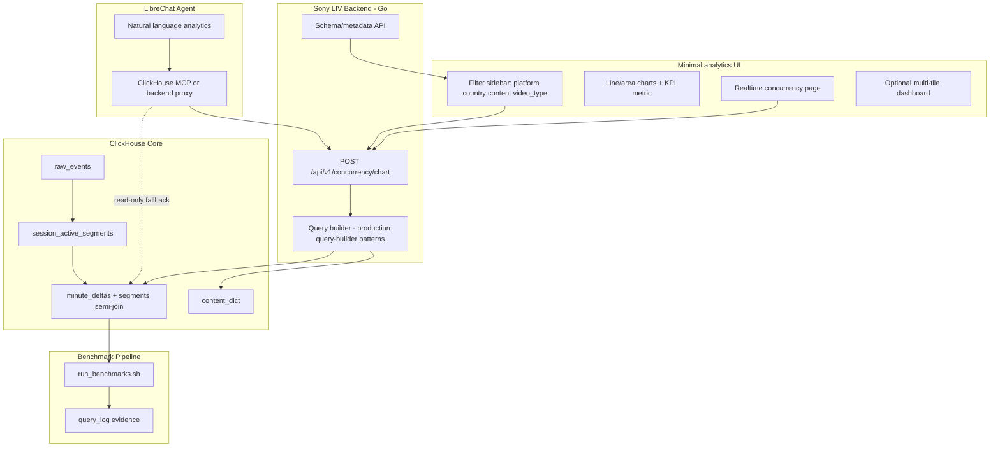
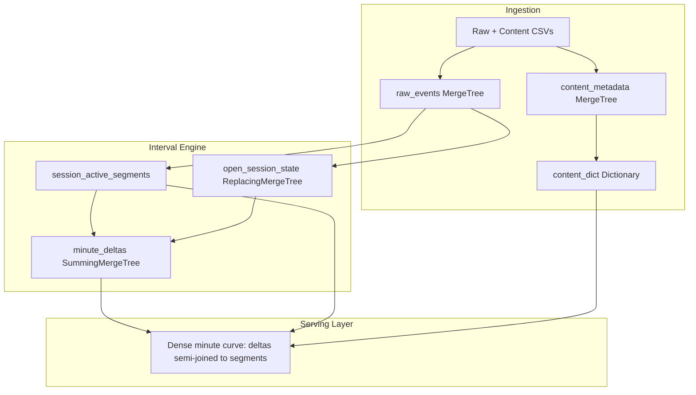

# Sony LIV Foreground-Only Concurrency — Implementation Plan

## Problem recap

Judges care about four things: **correct foreground-only concurrency**, **fast filtered queries at minute/hour/day grain**, **incremental absorption of open sessions and late heartbeats**, and **defensible design trade-offs**. The unseen-day dataset must run through the same pipeline with logged evidence.

**Where the competition is actually won.** The dataset holds 10,866 sessions producing ~52,000 active segments and ~10^5 delta rows — small enough that every team's queries will return in milliseconds regardless of design. **Measured latency cannot be the differentiator.** What can differentiate is the definition of "active" (paused, backgrounded, and buffering playback are each a percent-scale swing in every answer), the arithmetic that turns deltas into peak and average, and the quality of the 100x reasoning. This plan is therefore weighted toward semantics and correctness evidence, with performance argued through *what the queries read* rather than how fast they run.

**Semantics are frozen and govern every other doc.** Decisions and rationale: [SEMANTICS_SPEC.md](SEMANTICS_SPEC.md). Complete locked rule set, written to be built from: [FINAL_PLAN.md](FINAL_PLAN.md) §1.

Stack choices: **ClickHouse SQL core**, plus a minimal visualization. Whether to build the minimal UI, Go backend, and LibreChat agent is [open question Q4](FINAL_PLAN.md#16-open-questions) — the problem statement puts polished frontends explicitly out of scope.

---

## Product vision (UI + Backend + LibreChat)



**Why this is a strong hackathon product:** complete analytics loop — modeled data in ClickHouse, backend that compiles safe queries, exploratory UI for ops/business users, agent for ad-hoc questions.

**Scope guardrails (critical):** do NOT fork an entire analytics product.

| Layer | Reuse from reference UI | Skip |
|-------|------------------------|------|
| UI | `realtime.tsx`, line/area charts, time picker, filter chips, dashboard grid | Cohorts, funnels, experiments, profiles, full report editor |
| Backend | `querybuilder`, `dictGet` lexicon, PREWHERE patterns, chart response shape | Multi-tenant Postgres, blue/green, Redis IC, sampling |
| Agent | LibreChat + MCP with serving-table guardrails | LLM in core concurrency path |

**Priority order:**
1. Frozen semantics spec + micro-fixtures (everything downstream inherits it)
2. ClickHouse correctness + benchmark runner (wins the unseen day)
3. ClickStack on the pipeline — the cheapest way to make a required integration meaningful, and it doubles as evidence for the separately-scored query-performance criterion
4. Minimal concurrency chart (explicitly sufficient per the problem statement)
5. Thin backend API, minimal UI, and LibreChat — only if items 1–4 are complete; see [Q10](SEMANTICS_SPEC.md#7-still-open)

---

## Recommended architecture (ClickHouse core)



**Core modeling bet:** interval-to-delta (sweep-line), not per-minute session explosion.

`minute_deltas` is **narrow and dimension-agnostic** — `(minute, segment_id, delta)`. Dimensions live on `session_active_segments` and are applied by **semi-join** (`segment_id IN (SELECT …)`), never `INNER JOIN`. That keeps the delta write shape permanent across dimension changes and makes duplicate segment rows incapable of multiplying concurrency.

Each foreground-active segment `[start, end)` emits one delta pair under the **any-overlap** convention — a segment counts in every minute it touches:

```sql
toStartOfMinute(segment_start)                                                AS plus_minute,
toStartOfMinute(segment_end - toIntervalMillisecond(1)) + toIntervalMinute(1) AS minus_minute
```

**The convention is decided, not open.** The naive `−1` at `toStartOfMinute(end)` puts both boundaries in the same minute whenever a segment is shorter than a minute; `SummingMergeTree` sums them to zero and the viewer disappears. With background windows at a 35-second median and pauses at 21 seconds, that is the common case here, not the tail.

Concurrency at minute `t` is the cumulative sum of deltas up to `t`, **seeded with an opening balance** for sessions already in flight at the window start.

`concurrency_minute_serving` is documented as the 100x answer and **not built**: at ~10^5 delta rows the semi-join is a cache-resident full scan.

---

## Active interval definition

> **Summary only.** Rationale in [SEMANTICS_SPEC.md](SEMANTICS_SPEC.md); the full rule set in [FINAL_PLAN.md](FINAL_PLAN.md) §1 governs.

Classification is on **`(event_type, event)`**, not `event_type` alone — playback state rides in the `event` column inside `event_type='VideoHeartbeat'`.

| Signal | Rule |
|--------|------|
| `VideoSessionStart` | Session opens; wait for playback evidence |
| `VideoPlay` | Enter active if foreground |
| `VideoHeartbeat` (keepalive) | Extend active **only if foreground AND playing** |
| **`event IN ('pause','speed-pause','AdPause')`** | **Close active segment — paused playback is not active (D2)** |
| **`event IN ('resume','speed-resume','AdResume')`** | **Open a new segment; no-op if already playing** |
| **`BufferStart` / `BufferEnd`** | **Keepalive — buffering counts as active (D3)** |
| `AppBackgrounded` | Exit active immediately |
| `AppForegrounded` | Re-enter active if playback continues |
| Keepalive gap > 90s | Close active segment |
| `VideoSessionEnd` / `VideoError` | Close session; finalize segments |
| Session still active at end of data | Segment ends at `least(last_keepalive + grace, watermark)` |

**Three things to note.** The keepalive rule is **gated on foreground and playing** — 3,799 heartbeats are emitted while backgrounded and 42,273 while paused, so an ungated rule resurrects explicitly inactive sessions. The heartbeat gap is **not** the mechanism that excludes inactive time; only 0.87% of gaps exceed 90 seconds, so pause and background markers do that work. And the open-segment end is **clamped to the watermark**, or every curve grows a phantom tail.

**Average concurrency** is the mean over all clock minutes in the window with empty minutes gap-filled by the carried-forward value (D4). See the [benchmark query pattern](#benchmark-query-pattern).

---

## Schema design decision: typed columns everywhere

**Every dimension is a typed column. There is no JSON column anywhere** (D1). Every field in `dataset_details.md` is known and fixed, and extensibility is already provided by the narrow-delta model: a new dimension is one `ALTER` on a ~52,000-row segments table plus a rebuild, with `minute_deltas` and its write statement untouched.

**This is not a performance argument.** On ClickHouse 25.3+ the native `JSON` type is columnar per path, supports `PREWHERE` and skip indexes on paths, and offers type hints that make a hinted path perform identically to a typed column. The old "JSON is slow" reasoning is obsolete and is explicitly *not* why we rejected it. We rejected it because a fixed 13-column CSV does not justify an extensibility mechanism that carries its own failure modes — `max_dynamic_paths` overflow, mutation-triggering type hints, and the trap where putting a path in the primary key blocks `ALTER` on that column, forfeiting the extensibility the column existed for.

| Factor | Typed columns (chosen) | JSON on segments (rejected) |
|--------|------------------------|------------------------------|
| Sony LIV dataset | Fixed CSV schema, 13 known fields | No dynamic surface to model |
| Benchmark filters | Direct predicates on `LowCardinality` | Equivalent on hinted paths |
| Sort keys | Native types, freely alterable | A path in the PK blocks `ALTER` on the column |
| New dimension | `ALTER` a 52,000-row table, rebuild | Zero DDL for unhinted paths only |
| Judge story | Direct expression of a known schema | A good answer to "what if dimensions grow?" — kept as prose, not shipped |

**Where a multi-tenant analytics platform uses JSON, and why we differ:** such a platform carries arbitrary per-customer event properties — genuinely unknown paths. Sony LIV is fixed-schema streaming, so typed ingest, typed dimensions, and a dictionary for content attributes express the schema directly.

The full design, the accurate technical notes on the modern JSON type, and the caveats are preserved in [SCHEMA_AND_DDL.md — Considered and rejected](SCHEMA_AND_DDL.md#considered-and-rejected-properties-json-on-segments) as the answer to the 100x extensibility question.

**Column typing guide for `raw_events`:**

| Column | Type | Notes |
|--------|------|-------|
| `video_session_id` | `String` | Session grain |
| `user_id` | `String` | Validation path |
| `content_id` | `UInt64` | Dict key + filter |
| `event_type` | `LowCardinality(String)` | State machine |
| `event` | `String` | Raw event name |
| `event_timestamp` | `DateTime64(3)` | All time logic |
| `platform`, `country` | `LowCardinality(String)` | High-cardinality filters |
| `app_version`, `player_version` | `LowCardinality(String)` | Optional filters |
| `audio_language`, `subtitle_language` | `LowCardinality(String)` | Optional filters |
| `session_start_epoch` | `DateTime64(3)` or `UInt64` | Normalize on ingest |

Every table is **fully typed**. No JSON anywhere (D1) — see [SCHEMA_AND_DDL.md — Considered and rejected](SCHEMA_AND_DDL.md#considered-and-rejected-properties-json-on-segments).

Note that `event` is `String`, not dropped or collapsed: it carries the pause and resume markers the state machine depends on.

---

## Ingestion: do we need streaming?

**Short answer: you need ingestion into ClickHouse, but not a full Kafka/Flink streaming stack.** Bulk CSV load + incremental MVs on `INSERT` is enough to win; a replay script makes the demo feel real-time.

### What the problem requires

| Requirement | Source | Minimum solution |
|-------------|--------|------------------|
| Ingestion lives in ClickHouse | Problem statement | `INSERT` / `clickhouse-client` from CSV |
| Update-friendly open sessions | Evaluation criteria | MVs trigger on new rows in `raw_events` |
| Unseen day | Problem statement | Same load script on new CSV — one command |
| Near-real-time demo (suggested) | Suggested demo | **Simulated** stream replay — optional but strong |

The problem says *"ingestion, modeling, and all concurrency computation live in ClickHouse"* — that means data lands in ClickHouse tables, not that you must run Kafka.

### Recommended tiers

| Tier | Approach | Priority |
|------|----------|----------|
| **P0** | `load_data.sh`: bulk insert CSV into `raw_events` | Required |
| **P1** | Truncate-and-replay harness + `reconcile_session` corrections | Required (proves incremental updates) |
| **P2** | `replay_stream.sh`: insert in time-ordered micro-batches with sleep | Optional demo polish |
| **P3** | Kafka Engine, Flink, external stream processor | Skip for hackathon |

### How incremental updates work without Kafka

1. **Initial load:** bulk insert into `raw_events`
2. **Late heartbeats or unseen day:** insert new rows for the affected sessions
3. **`reconcile_session`** re-runs the state machine for those sessions and emits delta corrections against the **published** edges read back from `minute_deltas`
4. **No full rebuild** — the minute curve reflects the new events on the next query

Content CSV (~33K rows) is a **one-time bulk load** plus dictionary reload — no streaming.

### The training data has no open sessions

**Zero sessions lack `VideoSessionEnd`**, so the incremental path cannot be demonstrated on the training CSV as loaded. The demo is a **truncate-and-replay harness**: load only events before a chosen watermark `T`, run the pipeline, then replay the tail and show the curve absorbing it without a rebuild. This is the only way to exercise the path, and it is a stronger judge demo than waiting for the unseen day. See [VALIDATION.md](VALIDATION.md) Layer 8.

### What to show judges

- **Ingestion:** `load_data.sh` + row counts in `raw_events`
- **Incremental:** truncate-and-replay showing the curve updating without a rebuild
- **Idempotency:** re-run the whole pipeline and show every benchmark answer unchanged
- **Unseen day:** `unseen_day_runner.sh` emitting `answers.json`, latencies, and `system.query_log` evidence
- **Demo (optional):** replay script with the chart refreshing as batches land

**Do not block core modeling on streaming infrastructure.** Spec, segments, deltas, benchmark template, then evidence; replay polish last.

---

## Dedup strategy

Sony's README says *"deduplicate late or repeated events"*. **Dedup is not load-bearing for concurrency correctness, and an earlier version of this plan got it backwards.** Heartbeats only *extend* segments, so repeated heartbeats are idempotent by construction — one segment either way. The burst pattern the old design was built around does not exist as described: the median gap between consecutive distinct heartbeat timestamps is **1 second, not 0**, so sub-event types are spread across nearby timestamps rather than stacked on one instant.

**The old dedup key was actively harmful.** Collapsing to `(video_session_id, event_timestamp, event_type)` and keeping `any(event)` discarded the 27,340 `pause` and 31,780 `resume` markers **before the state machine could see them** — destroying the signal D2 depends on. If dedup is applied at all, the key must be:

```sql
(video_session_id, event_timestamp, event_type, event)
```

What is genuinely worth defending against is **exact row re-ingest** on a pipeline retry or unseen-day re-run. That is handled by making the segment rebuild idempotent — `ReplacingMergeTree(version)` on `session_active_segments` plus a semi-join read path — not by a dedup layer over `raw_events`. See [SCHEMA_AND_DDL.md — Idempotency](SCHEMA_AND_DDL.md#idempotency-and-the-read-path).

**Late or new events** for an open session are not a dedup problem at all; they are a merge problem, handled by `reconcile_session(video_session_id)` driving corrections from published delta edges.

**No Flink.** For a batch CSV load, Flink adds ops complexity with no correctness benefit: `ORDER BY event_timestamp` per session gives event-time ordering, and `reconcile_session` handles late arrivals. It would be a reasonable choice in a production pipeline reading live from Kafka, which is not this problem.

The `logical_events` intermediate table proposed in an earlier draft is **cut** — it existed to serve the dedup layer that turned out to be unnecessary.

---

## ClickHouse schema

> **Full DDLs:** see [SCHEMA_AND_DDL.md](SCHEMA_AND_DDL.md) for complete `CREATE TABLE`, dictionary, MV skeletons, and migration file map.

### Repo layout

```
sony-liv-concurrency/
├── docs/
├── clickhouse/migrations/
├── clickhouse/queries/benchmark/
├── clickhouse/scripts/
├── backend/
├── frontend/
└── librechat/
```

### Layer 1 — Raw + dimensions

**`raw_events`** — MergeTree, partition `toYYYYMMDD(event_timestamp)`, order `(video_session_id, event_timestamp, event_type)`

**`content_metadata`** — keyed by `content_id`

**`content_dict`** — dictionary for join-free enrichment:

```sql
CREATE DICTIONARY content_dict (
  content_id UInt64,
  title String,
  video_type LowCardinality(String),
  category LowCardinality(String)
)
PRIMARY KEY content_id
SOURCE(CLICKHOUSE(TABLE 'content_metadata' ...))
LAYOUT(HASHED())
LIFETIME(MIN 300 MAX 600);
```

Use `dictGet` / `dictGetOrNull` at query time — a production analytics backend pattern.

### Layer 2 — Active segments (all dimensions live here)

**`session_active_segments`** — `ReplacingMergeTree(version) ORDER BY (segment_id)`, one row per contiguous active interval, carrying every dimension as a typed column snapshotted deterministically at segment start

**`open_session_state`** — ReplacingMergeTree for the latest partial segment per open session

### Layer 3 — Narrow deltas

**`minute_deltas`** — SummingMergeTree, grain `(minute, segment_id)`, column `delta Int64`. **No dimensions.** Roughly 10^5 rows.

Dimensions are applied at read time by semi-join to `session_active_segments`; content attributes come from `content_dict` via `dictGet`.

### Layer 4 — Materialized views

| MV | Purpose |
|----|---------|
| `mv_open_session_refresh` | Upsert open session state |
| Delta write (batch `INSERT … SELECT … FINAL`) | Emit `(minute, segment_id, ±1)` — three columns, shape never changes. Deliberately not a materialized view: an MV fires on the inserted block and so cannot observe `ReplacingMergeTree` replacement |

**MV-light rule:** batch scripts (`build_segments.sql`, `backfill_deltas.sql`) are the source of truth for backfill and the unseen day. MVs exist for the incremental-INSERT demo. Because the MV projects no dimension, a new dimension never requires dropping or recreating it — see [SCHEMA_AND_DDL.md — Schema evolution](SCHEMA_AND_DDL.md#schema-evolution-without-recreating-mvs).

---

## Benchmark query pattern

**Full normative template, with parameter explanations: [SCHEMA_AND_DDL.md — Benchmark query template](SCHEMA_AND_DDL.md#benchmark-query-template-normative).** Every windowed query must use that shape. Its structure in brief:

```sql
WITH
  -- Filters resolve to a segment set. FINAL so the filter sees current dimension
  -- values; semi-join, never INNER JOIN, so duplicates cannot fan out.
  -- The two R9 bounds keep cost proportional to the window, not to total history.
  sel     AS (SELECT segment_id FROM session_active_segments FINAL
              WHERE …
                AND segment_start < range_end AND segment_end > range_start
                AND segment_start >= range_start - INTERVAL {max_span:UInt32} HOUR),
  -- Concurrency carried in from before the window. Without this every answer is understated.
  opening AS (SELECT sum(delta) AS c0 FROM minute_deltas
              WHERE minute >= range_start - INTERVAL {max_span:UInt32} HOUR
                AND minute < range_start
                AND segment_id IN (SELECT segment_id FROM sel)),
  -- Sparse per-minute net change, in range.
  net     AS (SELECT minute, sum(delta) AS net FROM minute_deltas
              WHERE minute >= range_start AND minute < range_end
                AND segment_id IN (SELECT segment_id FROM sel) GROUP BY minute),
  -- Dense clock-minute grid, so avg() averages over clock-minutes not event-minutes.
  grid    AS (SELECT range_start + toIntervalMinute(number) AS minute
              FROM numbers(dateDiff('minute', range_start, range_end))),
  curve   AS (SELECT g.minute,
                     (SELECT c0 FROM opening)
                       + sum(ifNull(n.net, 0)) OVER (ORDER BY g.minute) AS concurrency
              FROM grid g LEFT JOIN net n ON g.minute = n.minute)
SELECT max(concurrency) AS peak, avg(concurrency) AS avg FROM curve;
```

**Four pieces, each closing a wrong answer or an unbounded cost.** The **opening balance** matters because sessions run up to 43.6 hours, so every benchmark window opens mid-flight; seeding the cumulative sum at zero understates every filtered answer and can drive the curve negative. The **dense grid** matters because `GROUP BY minute` emits rows only for minutes containing a delta, so `avg()` would otherwise average over event-minutes rather than clock-minutes (D4). The **semi-join plus `FINAL`** matter for two different reasons: an `INNER JOIN` against duplicate segment rows silently doubles all concurrency, while a stale pre-replacement row would let a filter match dimension values that no longer apply.

The **R9 bounds** matter because without them `sel` and the opening-balance scan both grow with total history rather than with the query window. The overlap predicate is provably answer-preserving — a segment outside the window contributes either a cancelling pair or nothing — while the lookback predicate is an asserted precondition on `MAX_SEGMENT_SPAN_HOURS`. What must never be written instead is `segment_start >= range_start`, which looks like the same optimisation and silently drops every session already in flight.

Hour and day grain reuse the identical `curve` and bucket only at the end. Range-level averages come from `curve` directly, **never** as `avg(avg_in_hour)`.

**Merge state is handled per table, not uniformly.** On `minute_deltas`, `sum(delta) GROUP BY minute` aggregates across all unmerged parts, so `FINAL` there would be pure cost and is never used. On `session_active_segments`, `FINAL` **is** used and is semantically necessary: the semi-join stops duplicate rows from *multiplying* deltas, but only `FINAL` stops a stale pre-replacement row carrying old dimension values from *matching a filter it should not match*. Those are two different failure modes and they need two different defences. See [SCHEMA_AND_DDL.md — Eventual consistency](SCHEMA_AND_DDL.md#eventual-consistency--querying-before-merges-complete) and [FINAL_PLAN.md §11](FINAL_PLAN.md#11-eventual-consistency).

---

## Backend API (Go, production query-builder patterns)

**`POST /api/v1/concurrency/chart`**
- Input: `{ start, end, interval, filters, metric: peak|avg|timeseries }`
- Output: time series + peak/avg summary
- Always reads serving layer, never `raw_events`

**`GET /api/v1/schema/dimensions`** — filterable dimensions for UI

Reuse from a production analytics backend: `pkg/querybuilder/`, `pkg/filters/`, `service/lexicon/`, `pkg/lookups/`

---

## Minimal analytics UI

| Component | Source | Use |
|-----------|--------|-----|
| Realtime page | `apps/start/src/routes/...realtime.tsx` | Live concurrency curve |
| Line/area chart | `components/report-chart/line/`, `area/` | Time series |
| Metric KPI | `components/report-chart/metric/` | Peak concurrency |
| Time picker | `components/time-window-picker.tsx` | Range selection |
| Filter chips | `components/ui/filter-chip.tsx` | Dimensions |

Wire to `POST /api/v1/concurrency/chart`.

---

## Required integration: ClickStack first, LibreChat second

The problem statement requires meaningfully integrating at least one of ClickStack, Langfuse, or LibreChat. An earlier version of this plan picked LibreChat only.

**ClickStack should be primary.** It is cheaper to make genuinely *meaningful* here — instrument ingestion lag, query latency, rows read, and active part counts on the real pipeline — and it doubles as evidence for the separately-scored query-performance criterion. A LibreChat integration, by contrast, sits beside the correctness path rather than inside it.

**Langfuse is rejected** by both plans: there is no LLM in the correctness path for it to observe.

### LibreChat (secondary, if time remains)

- Prefer **backend proxy mode** (same guardrails as the UI)
- Fallback: read-only MCP over the benchmark query templates and dictionaries
- System prompt: schema map, exemplar questions, and a hard constraint against reading `raw_events`

---

## Implementation phases

**Phase 0 comes before everything, and this ordering is deliberate.** The problem is scored on semantics, so the definition of "active" is frozen and hand-verified before any serving table exists. Everything downstream inherits it, and changing it later invalidates all prior validation work.

| Phase | Work | Priority |
|-------|------|----------|
| **0** | **Freeze [SEMANTICS_SPEC.md](SEMANTICS_SPEC.md); write hand-computed micro-fixtures covering pause, background, buffering, and sub-minute segments** | **P0** |
| 1 | Repo + raw load + dictionary | P0 |
| 2 | Segment builder implementing the `(event_type, event)` classifier, deterministic dimension snapshots, watermark clamp | P0 |
| 3 | Narrow deltas with any-overlap boundaries + normative benchmark template (opening balance, dense grid, semi-join) | P0 |
| 4 | Independent Python reference over the raw CSV; parameter sensitivity table | P1 |
| 5 | Truncate-and-replay harness for open sessions + `reconcile_session` corrections | P1 |
| 6 | Unseen-day one-command runner emitting `answers.json`, latencies, and `evidence/` | P1 |
| 7 | ClickStack on the pipeline (ingestion lag, query latency, part counts) | P2 |
| 8 | Minimal concurrency chart | P2 |
| 9 | Backend API + minimal UI + LibreChat | **See Q10** |

**On phases 8–9.** The problem statement puts polished frontends explicitly out of scope: *"A minimal visualization of concurrency over time is enough to demo; judges reward the model and the serving layer."* An earlier version of this plan devoted three of seven phases to that work while the semantic defects above were unfixed. Whether to build the full UI, Go backend, and LibreChat integration at all is [open question Q4](FINAL_PLAN.md#16-open-questions); nothing in phases 0–7 depends on the answer.

---

## Success criteria

- [ ] Semantics spec frozen and micro-fixtures passing before serving tables exist
- [ ] Pause excluded, buffering included, and both demonstrably exercised by fixtures
- [ ] Every windowed query carries an opening balance and a dense minute grid
- [ ] Segment rebuild is genuinely idempotent — re-running the pipeline changes no answer
- [ ] No segment collapses to net zero; no segment extends past the watermark
- [ ] Independent Python reference agrees with the SQL on the training data
- [ ] Parameter sensitivity table published for pause, buffering, attribution, average denominator, and timezone
- [ ] Open-session path demonstrated via truncate-and-replay
- [ ] Unseen-day one-command runner emits `answers.json`, latencies, and query-log evidence
- [ ] Design doc explains representation, keys, incremental strategy, and 100x scaling
