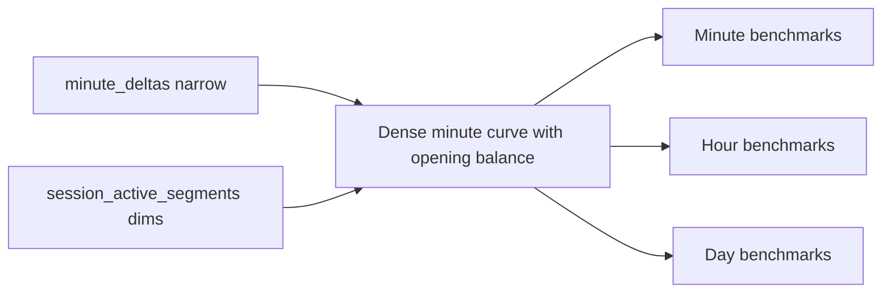
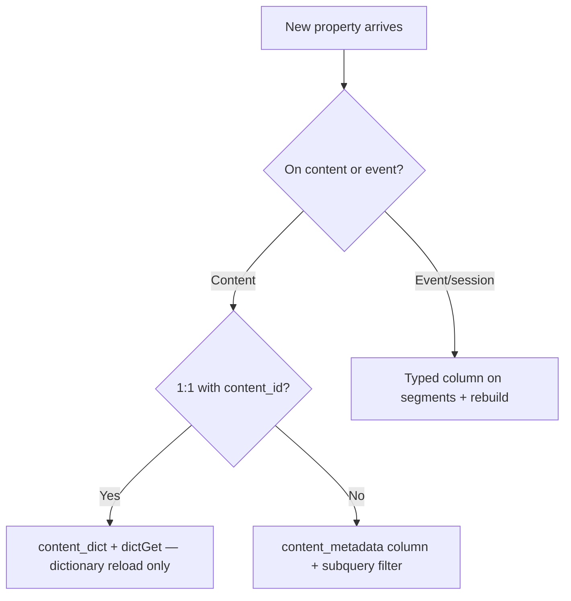
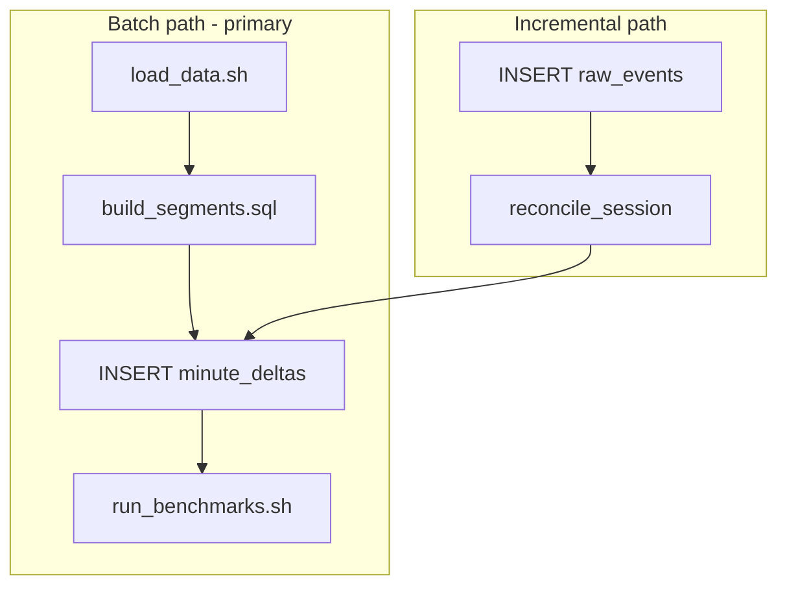
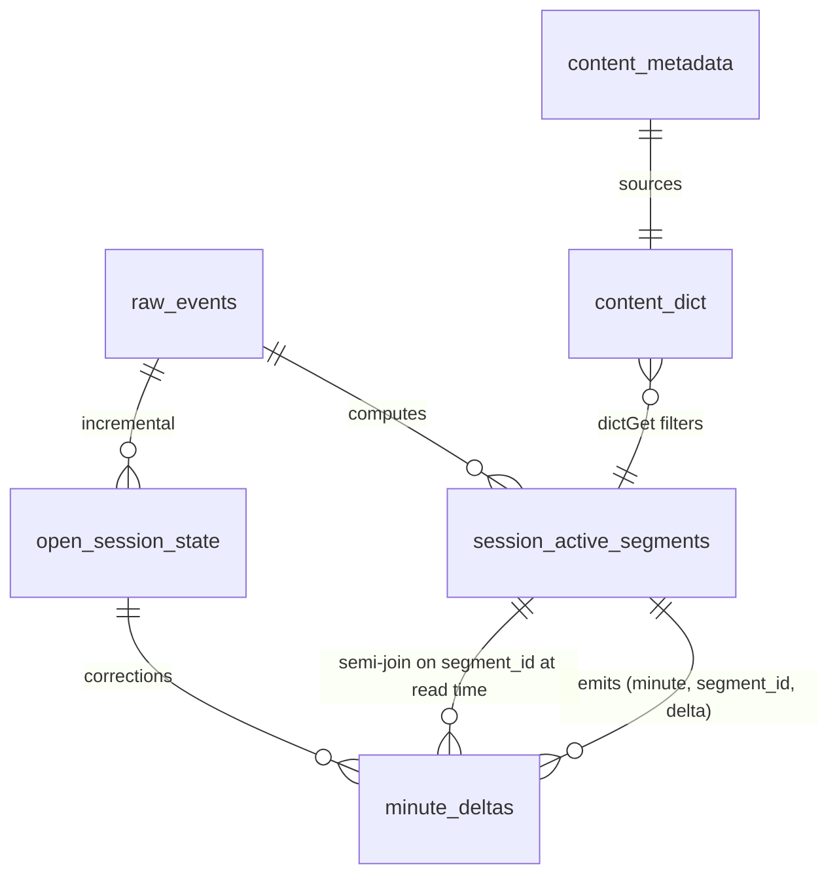

# ClickHouse Schema & DDL Reference

Full table definitions for the Sony LIV concurrency pipeline. Migration files will mirror these under `clickhouse/migrations/`.

**Database:** `sony_liv`

---

## Table inventory

> **Semantics live elsewhere and govern this document.** The binding decisions and their rationale are in [SEMANTICS_SPEC.md](SEMANTICS_SPEC.md); the complete locked rule set is [FINAL_PLAN.md](FINAL_PLAN.md) §1. This document covers physical design only. Paused playback is not active (D2), buffering is active (D3), average is over all clock minutes (D4), and there is no JSON column anywhere (D1).

| # | Object | Engine | Purpose |
|---|--------|--------|---------|
| 1 | `raw_events` | MergeTree | Ingested playback events from CSV |
| 2 | `content_metadata` | MergeTree | Content dimension (~33K titles) |
| 3 | `content_dict` | Dictionary (HASHED) | Join-free content enrichment at query time |
| 4 | `session_active_segments` | **ReplacingMergeTree(version)** | Foreground-only active intervals + **all dimensions**, typed columns only |
| 5 | `open_session_state` | ReplacingMergeTree | Latest partial segment for open sessions |
| 6 | `minute_deltas` | SummingMergeTree | **Narrow** `(minute, segment_id, delta)` sweep-line deltas — dimension-agnostic |
| 7 | `concurrency_minute_serving` | SummingMergeTree | **Documented, not built.** The 100x answer; unearned at ~10^5 delta rows |

**Architecture: narrow deltas + dimension semi-join.** Dimensions live on `session_active_segments`; `minute_deltas` carries only `(minute, segment_id, delta)`. Benchmarks filter segments and reference deltas with `segment_id IN (SELECT …)`. This keeps the MV shape fixed forever — new dimensions never require MV recreation or a serving-table ORDER BY change. See [Schema evolution](#schema-evolution-without-recreating-mvs).

**Semi-join, never `INNER JOIN`.** A set-valued `IN` cannot fan out even if `session_active_segments` transiently holds duplicate `segment_id` rows before a `ReplacingMergeTree` merge. An `INNER JOIN` would multiply every delta by the duplicate factor, silently doubling all concurrency with no error and no change in `minute_deltas` row count. See [Idempotency](#idempotency-and-the-read-path).

**No precomputed hour/day stats tables.** They cannot be precomputed per arbitrary dimension combination without the full cube, which this design deliberately rejects. Hour and day answers are bucketed from the minute curve. See [§009](#009--hour--day-grain-problem-requirement).

**Materialized views (planned):**

| MV | Target | Shape |
|----|--------|-------|
| `mv_raw_events_to_open_state` | Refresh `open_session_state` on insert (optional incremental path) | Fixed |
| Delta write (batch `INSERT … SELECT`, not an MV) | Segment boundaries → `minute_deltas` | `(minute, segment_id, ±1)` — **never changes** |

Segment backfill may initially run as batch `INSERT … SELECT` before MVs are wired.

---

## Engine choice: SummingMergeTree vs AggregatingMergeTree

**Uniqueness is solved when building `session_active_segments`, not by the serving engine.** One segment per contiguous active period per `video_session_id`, then exactly one `+1` and one `−1` per segment. No engine can recover that structure if the segment builder gets it wrong.

Given that, `SummingMergeTree` on `minute_deltas` is correct because the metric *is* a sum of signed deltas:

```sql
-- Concurrency at minute t = cumulative sum of deltas (sweep-line)
sum(delta) OVER (ORDER BY minute)
```

`AggregatingMergeTree` would not help. With `sumState(delta)` it behaves identically to `SummingMergeTree`. With `uniqExactState(video_session_id)` it expresses a *different and wrong* model — distinct sessions per minute bucket rather than sweep-line overlap — which requires knowing who is active in each minute and so needs either per-minute explosion or a heartbeat-counting shortcut that ignores pause and background state.

| Table | Engine | Why |
|-------|--------|-----|
| `raw_events` | MergeTree | Append-only event log |
| `session_active_segments` | **ReplacingMergeTree(version)** | Idempotent rebuilds — see [Idempotency](#idempotency-and-the-read-path) |
| `open_session_state` | **ReplacingMergeTree(computed_at)** | Latest trailing segment per session |
| `minute_deltas` | **SummingMergeTree** | Sums `+1`/`−1`, and collapses correction pairs to zero |

`CollapsingMergeTree` was considered for corrections and is unnecessary: a `+1` cancelling a stale `−1` already shares the sort key, so `SummingMergeTree` collapses the pair without a separate `sign` column.

---

## 001 — Database

```sql
CREATE DATABASE IF NOT EXISTS sony_liv;
```

---

## 002 — raw_events

Ingestion landing table. All event-time logic uses `event_timestamp`.

```sql
CREATE TABLE IF NOT EXISTS sony_liv.raw_events
(
    video_session_id String,
    user_id String,
    content_id UInt64,
    event_type LowCardinality(String),
    event String,
    event_timestamp DateTime64(3, 'UTC'),
    platform LowCardinality(String),
    app_version LowCardinality(String),
    country LowCardinality(String),
    audio_language LowCardinality(String),
    subtitle_language LowCardinality(String),
    player_version LowCardinality(String),
    session_start_epoch DateTime64(3, 'UTC'),

    -- ingest lineage (optional, useful for dedup / unseen-day reruns)
    ingest_batch_id UUID DEFAULT generateUUIDv4(),
    ingested_at DateTime64(3, 'UTC') DEFAULT now64(3)
)
ENGINE = MergeTree
PARTITION BY toYYYYMMDD(event_timestamp)
ORDER BY (video_session_id, event_timestamp, event_type, event)
SETTINGS index_granularity = 8192;
```

**CSV load note:** cast `content_id` and normalize `session_start_epoch` on insert if CSV uses string/epoch formats.

---

## 003 — content_metadata

```sql
CREATE TABLE IF NOT EXISTS sony_liv.content_metadata
(
    content_id UInt64,
    title String,
    video_type LowCardinality(String),
    category LowCardinality(String),
    loaded_at DateTime DEFAULT now()
)
ENGINE = MergeTree
ORDER BY content_id
SETTINGS index_granularity = 8192;
```

---

## 004 — content_dict

Dictionary for `dictGet` / `dictGetOrNull` — no JOIN at query time.

```sql
CREATE DICTIONARY IF NOT EXISTS sony_liv.content_dict
(
    content_id UInt64,
    title String,
    video_type String,
    category String
)
PRIMARY KEY content_id
SOURCE(CLICKHOUSE(
    DB 'sony_liv'
    TABLE 'content_metadata'
    USER 'default'
    PASSWORD ''
))
LAYOUT(HASHED())
LIFETIME(MIN 300 MAX 600);
```

Reload after content load:

```sql
SYSTEM RELOAD DICTIONARY sony_liv.content_dict;
```

---

## 005 — session_active_segments

Computed foreground-active intervals **and the dimension table for all benchmark filters**. Built via batch SQL or incremental pipeline.

```sql
CREATE TABLE IF NOT EXISTS sony_liv.session_active_segments
(
    segment_id UInt64,                  -- cityHash64(video_session_id, segment_start); referenced by minute_deltas
    video_session_id String,
    user_id String,

    -- All benchmark dimensions: typed columns only (D1 — no JSON)
    content_id UInt64,
    platform LowCardinality(String),
    country LowCardinality(String),
    app_version LowCardinality(String),
    audio_language LowCardinality(String),
    subtitle_language LowCardinality(String),
    player_version LowCardinality(String),

    segment_start DateTime64(3, 'UTC'),
    segment_end DateTime64(3, 'UTC'),   -- exclusive; open segments clamped to least(last_hb + grace, watermark)

    is_final UInt8 DEFAULT 0,           -- 1 when session closed (VideoSessionEnd / VideoError)
    -- pause | background | heartbeat_gap | session_end | open_at_watermark
    close_reason LowCardinality(String) DEFAULT '',

    computed_at DateTime64(3, 'UTC') DEFAULT now64(3),
    version UInt64 DEFAULT 1            -- rebuild run number; drives ReplacingMergeTree
)
ENGINE = ReplacingMergeTree(version)
PARTITION BY toYYYYMMDD(segment_start)
ORDER BY (segment_id)
SETTINGS index_granularity = 8192;
```

**Engine:** `ReplacingMergeTree(version)` keyed on `segment_id`, so re-running the segment builder **replaces** rows instead of appending them. See [Idempotency](#idempotency-and-the-read-path) — this is a correctness requirement, not a tidiness preference.

**Sort key is `segment_id` alone, deliberately.** At ~52,000 rows a dimension filter is a linear scan taking single-digit milliseconds, so a dimension-leading sort key buys nothing measurable. Ordering by `segment_id` instead makes `reconcile_session` lookups and delta-correction lookups point reads, and it is what `ReplacingMergeTree` needs to deduplicate on.

**`segment_id`:** `UInt64` (not `UUID`) — 8 bytes rather than 16 in the key of the table referenced by every query. Derived deterministically as `cityHash64(video_session_id, toUnixTimestamp64Milli(segment_start))` so a rebuild reproduces the same IDs and corrections can target the exact prior rows.

**Do not add a `segment_start` filter to "help" time-range queries.** Sessions run up to 43.6 hours, so a query for day *N* legitimately involves segments that started on day *N−1*. The partition key exists for rebuild-by-partition, not for query pruning; the time filter belongs on `minute_deltas`. Filtering segments by `segment_start` would silently drop long-running sessions.

**Dimension values** are snapshotted deterministically at segment start with `argMin(col, (event_timestamp, event_type, event))`. Dimensions vary within sessions and `any()` is non-deterministic — see [SEMANTICS_SPEC.md §6](SEMANTICS_SPEC.md#6-dimension-attribution--deterministic-snapshot-at-segment-start).

**Segment rules:** see [ACTIVE_INTERVAL_LOGIC.md](ACTIVE_INTERVAL_LOGIC.md) for the full build pipeline.

**How data is built:** batch `INSERT … SELECT` (or Python/Go builder) from `raw_events` → classify each event on `(event_type, event)` → per-session state machine → one row per contiguous active interval. Not an MV on first pass.

**Expected size:** ~31,000 segments from background and heartbeat-gap splits, rising to ~52,000 once pause splitting is applied (10,866 distinct sessions).

---

## Idempotency and the read path

Three mechanisms, all required. None alone is sufficient, and they defend different tables — this is the part that is easy to get wrong, because fixing the segments table does nothing for the deltas table.

### Deterministic IDs are not idempotency

An earlier draft claimed that a deterministic `segment_id` made segment rebuilds idempotent. **It does not.** Deterministic IDs make duplicates *detectable*, not *absent*. On a plain `MergeTree`, re-running `build_segments.sql` inserts a second row with the same `segment_id`, and the `version` column would sit inert because no engine reads it.

The consequence was specific to the narrow-delta model and severe: with `minute_deltas d INNER JOIN session_active_segments s ON d.segment_id = s.segment_id`, two rows per `segment_id` make every delta match twice, so **all concurrency doubles** — no error, no warning, and an unchanged row count in `minute_deltas`. A partial re-run covering one day would double only that day.

### Mechanism 1 — `ReplacingMergeTree(version)` on segments

Keyed on `segment_id`, so a rebuild with a higher `version` replaces rather than appends. For a full reload, the builder may additionally `DROP PARTITION` before inserting; partition drop is atomic, unlike `ALTER … DELETE` mutations, which are asynchronous and unordered with respect to delta writes.

### Mechanism 2 — semi-join in every query

```sql
-- CORRECT: set-valued, cannot fan out. FINAL additionally ensures the filter is
-- evaluated against current dimension values, not a stale pre-replacement row.
WHERE segment_id IN (
    SELECT segment_id FROM sony_liv.session_active_segments FINAL WHERE …
)

-- WRONG: multiplies deltas by the duplicate factor before merges complete
FROM minute_deltas d INNER JOIN session_active_segments s ON d.segment_id = s.segment_id
```

This is the load-bearing half on the segments side. `ReplacingMergeTree` deduplicates *eventually*; the semi-join makes duplicates harmless *immediately*, which matters because benchmarks may run before merges complete. It converts a silent-wrong-answer failure class into a no-op.

### Mechanism 3 — `DROP PARTITION` before every delta write

**Mechanisms 1 and 2 protect `session_active_segments` and do nothing for `minute_deltas`.** This is the trap. Re-running the segment build re-runs the delta emission, and because `minute_deltas` is a `SummingMergeTree` whose rows are *supposed* to add up, the second set of `+1`/`−1` rows is indistinguishable from a genuine second viewer. `sum(delta)` doubles the curve. `ReplacingMergeTree` on segments cannot help: it deduplicates segment rows after the fact and has no way to retract delta rows already derived from them.

So the delta write must be made replaceable rather than additive:

```sql
ALTER TABLE sony_liv.minute_deltas DROP PARTITION {day:String};
-- then insert the day's deltas
```

Partition drop is atomic and synchronous, unlike `ALTER … DELETE` mutations. Because `minute_deltas` is partitioned by `toYYYYMMDD(minute)` and the builder runs a day at a time, drop-then-insert makes each day's delta write idempotent at the granularity the pipeline actually operates on.

The **incremental** path cannot use this, because it corrects individual segments rather than rebuilding days. It relies instead on published-edge tracking: a correction reads the previously published edge back out of `minute_deltas` and cancels exactly that, so re-running the correction is a no-op. See [Delta corrections without waiting for merge](#delta-corrections-without-waiting-for-merge).

---

## 006 — open_session_state

Latest trailing segment per open session — supports incremental heartbeat updates.

```sql
CREATE TABLE IF NOT EXISTS sony_liv.open_session_state
(
    video_session_id String,
    user_id String,
    content_id UInt64,
    platform LowCardinality(String),
    country LowCardinality(String),
    app_version LowCardinality(String),
    audio_language LowCardinality(String),
    subtitle_language LowCardinality(String),
    player_version LowCardinality(String),

    segment_start DateTime64(3, 'UTC'),
    segment_end DateTime64(3, 'UTC'),   -- extends with each heartbeat (+ grace)

    last_event_type LowCardinality(String),
    last_event_timestamp DateTime64(3, 'UTC'),
    is_session_closed UInt8 DEFAULT 0,

    computed_at DateTime64(3, 'UTC')
)
ENGINE = ReplacingMergeTree(computed_at)
ORDER BY video_session_id
SETTINGS index_granularity = 8192;
```

Query latest state: `SELECT * FROM open_session_state FINAL WHERE video_session_id = '…'`

---

## 007 — minute_deltas (narrow)

Interval-to-delta representation. Each active segment `[start, end)` emits exactly two rows.

**Dimension-agnostic by design.** Dimensions live on `session_active_segments` and are applied by semi-join on `segment_id`. This is what makes the MV shape permanent.

```sql
CREATE TABLE IF NOT EXISTS sony_liv.minute_deltas
(
    minute DateTime('UTC'),
    segment_id UInt64,
    delta Int64
)
ENGINE = SummingMergeTree
PARTITION BY toYYYYMMDD(minute)
ORDER BY (minute, segment_id)
SETTINGS index_granularity = 8192;
```

**Expected size:** ~10^5 rows (two per segment). The whole table fits in cache.

### Boundary convention — any-overlap

```sql
toStartOfMinute(segment_start)                                                AS plus_minute,
toStartOfMinute(segment_end - toIntervalMillisecond(1)) + toIntervalMinute(1) AS minus_minute
```

**The naive convention silently deletes viewers.** Emitting `−1` at `toStartOfMinute(segment_end)` puts both boundaries in the same row group whenever a segment starts and ends inside one minute; `SummingMergeTree` sums them to zero and drops the row entirely. Background windows have a **35-second median** and pauses 21 seconds, so sub-minute segments are one of the most common shapes in this dataset once pause and background splitting are implemented. The loss was systematic and always downward.

Any-overlap attribution guarantees `minus_minute > plus_minute` for every segment. It slightly over-counts relative to a "occupied for the whole minute" reading; `MINUTE_ATTRIBUTION` is therefore a config constant with a published sensitivity. See [SEMANTICS_SPEC.md §5](SEMANTICS_SPEC.md#5-minute-attribution--any-overlap).

**Invariant:** no segment may produce `plus_minute >= minus_minute`.

### Why SummingMergeTree when `(minute, segment_id)` is near-unique

Not for compaction — for **correction collapse**. When an open segment's end moves, a `+1` inserted at the stale end minute shares the sort key with the previous `−1` and the pair merges to zero.

**Corrections must target the *published* edge, not the recomputed one.** `open_session_state` cannot supply it (a `ReplacingMergeTree` keyed on `video_session_id` has already overwritten the old value by the time the correction runs), so the published edge is read back from `minute_deltas` itself:

```sql
SELECT minute, sum(delta) AS d
FROM sony_liv.minute_deltas
WHERE segment_id = {segment_id:UInt64}
GROUP BY minute
HAVING d <> 0;
```

This needs no extra state and is merge-independent. Without it, running `reconcile_session` twice — or concurrently with an MV firing on the same insert — emits the cancellation twice and permanently corrupts the curve. Full protocol in [ACTIVE_INTERVAL_LOGIC.md](ACTIVE_INTERVAL_LOGIC.md#delta-corrections-must-target-the-published-edge).

---

## 008 — concurrency_minute_serving (built, opt-in accelerator)

**Now implemented as an opt-in engine (migration 008), while the narrow model stays the default.** The source of truth remains `minute_deltas` semi-joined to `session_active_segments`; at ~10^5 delta rows every query is a cache-resident scan returning in low-double-digit ms, so the rollup is not *needed* at hackathon scale. It is built anyway to demonstrate the 100× serving shape: the same pipeline populates it (wide any-overlap deltas, idempotent staging swap), and `POST /api/v1/concurrency/chart {"engine":"rollup"}` serves from it — filtering directly on denormalized dimensions with no segment semi-join. Verified to return identical answers to the narrow path; requests whose filters aren't rollup dimensions (e.g. `video_type`) auto-fall back to narrow.

This DDL is kept as the **100x scaling answer**: at a scale where the semi-join stops being free, this is the shape a hot-dimension rollup would take.

```sql
CREATE TABLE IF NOT EXISTS sony_liv.concurrency_minute_serving
(
    minute DateTime('UTC'),
    platform LowCardinality(String),
    country LowCardinality(String),
    content_id UInt64,
    app_version LowCardinality(String),
    audio_language LowCardinality(String),
    subtitle_language LowCardinality(String),
    player_version LowCardinality(String),
    delta Int64
)
ENGINE = SummingMergeTree
PARTITION BY toYYYYMMDD(minute)
ORDER BY (minute, platform, country, content_id, app_version, audio_language, subtitle_language, player_version)
SETTINGS index_granularity = 8192;
```

**Cost if it were built:** a new hot dimension means widening this ORDER BY via [shadow table + `EXCHANGE`](#if-the-unbuilt-rollup-were-ever-built-100x-only), plus a full backfill. That coupling is the reason it stays unbuilt at this scale and would only be earned by measured latency pressure.

**Filter on video_type:** `dictGet('sony_liv.content_dict', 'video_type', content_id) = 'Live'`

---

## Serving layer dimension strategy

### Which dimensions must be filterable

`dataset_details.md` marks nearly every column as *"Used as a filter dimension"*:

| Dataset | Filter dimensions (per data dictionary) |
|---------|----------------------------------------|
| **Raw events** | `content_id`, `platform`, `app_version`, `country`, `audio_language`, `subtitle_language`, `player_version` |
| **Content metadata** | `title`, `video_type`, `category` (via `content_id`) |
| **Not filter dims** | `video_session_id`, `user_id` (derivation IDs), `event_type`, `event`, `event_timestamp`, `session_start_epoch` |

> *"The solution should work even if the **number of dimensions increases**."*

The problem statement lists *"common business dimensions: platform, country, content, video type, time grain"* as examples, and separately suggests a *"limited-dimension, concurrency-optimized table."* Read together with the data dictionary, that means the **grain** of any rollup is a deliberate choice, not permission to drop columns the dictionary marks as filterable. So the read path must support every filter dimension in `dataset_details.md`, not just platform, country, and `content_id` — which is precisely what the semi-join gives for free, since the filter runs against segments where all of them already live.

### Where each dimension lives

| Dimension class | Storage | Filter mechanism |
|-----------------|---------|------------------|
| **Event dims** — `platform`, `country`, `content_id`, `app_version`, languages, `player_version` | Typed columns on `session_active_segments` | Predicate inside the `segment_id IN (…)` subquery |
| **Content dims** — `video_type`, `category`, `title` | `content_dict` (HASHED dictionary) | `dictGet('content_dict', 'video_type', content_id)` in the same subquery |
| **Time** | `minute` on `minute_deltas` | `WHERE minute >= … AND minute < …` |
| **Future dims** | New typed column on segments, or a new dictionary attribute | No change to `minute_deltas` or its MV |

Dictionary works for content attrs because they are **functionally dependent on `content_id`**. Event attrs are not — they are snapshotted onto the segment at segment start.

**On `PREWHERE`:** it is not used on `minute_deltas` and would not help. `minute` is both the partition key and the leading `ORDER BY` column of a three-column table, so a plain `WHERE` already gets full partition and primary-index pruning; `PREWHERE` exists to avoid reading *other* columns and there are only two. Earlier drafts advertised `PREWHERE` here as an optimization, which would read as cargo-cult to a ClickHouse-literate judge.

### Dimension snapshot rule

Snapshot deterministically at **segment start** with `argMin(col, (event_timestamp, event_type, event))`. Dimensions genuinely vary within sessions — `subtitle_language` in 99.96% of them — and `any()` is non-deterministic, so an `any()` snapshot can return different benchmark answers on re-run. See [SEMANTICS_SPEC.md §6](SEMANTICS_SPEC.md#6-dimension-attribution--deterministic-snapshot-at-segment-start).

### Trade-off (for judges)

| Model | Filter latency | Cost of a new dimension |
|-------|----------------|-------------------------|
| Wide denormalized deltas (rejected) | Marginally best — single-table scan | Widen the delta sort key via shadow table, full backfill |
| **Narrow deltas + segment semi-join (chosen)** | Sub-query over ~52,000 rows, then a set lookup | `ALTER` one small table, or one dictionary attribute — delta path untouched |
| Hot-dim rollup on top | Best at scale | Only earned once the semi-join stops being free |

The problem statement's "limited-dimension, concurrency-optimized table" is satisfied by `minute_deltas` being the narrowest possible concurrency structure — three columns — with dimensionality supplied by the semi-join rather than by widening the fact table.

---

## Benchmark query template (normative)

**Every windowed benchmark query must use this shape.** The three pieces below are not optimizations; each one fixes a wrong answer.

```sql
WITH
    {start:DateTime} AS range_start,
    {end:DateTime}   AS range_end,

    -- 1. Resolve filters to a segment set. Semi-join, never INNER JOIN: cannot fan out
    --    even if session_active_segments transiently holds duplicate segment_id rows.
    --    FINAL is separate and also required: it makes the filter see the CURRENT
    --    version of each row, so a stale pre-replacement row carrying old dimension
    --    values cannot admit a segment that should be excluded.
    sel AS (
        SELECT segment_id
        FROM sony_liv.session_active_segments FINAL
        WHERE platform = {platform:String}
          AND country  = {country:String}
          AND dictGet('sony_liv.content_dict', 'video_type', content_id) = {video_type:String}
          -- Overlap bound (R9): non-overlapping segments contribute exactly zero,
          -- so this is answer-preserving by construction, not an approximation.
          AND segment_start <  range_end
          AND segment_end   >  range_start
          -- Lookback bound (R9): an asserted precondition, not a theorem. Valid only
          -- while no segment exceeds MAX_SEGMENT_SPAN_HOURS, which the invariant
          -- suite asserts on every run. This is what prunes partitions.
          AND segment_start >= range_start - INTERVAL {max_segment_span_hours:UInt32} HOUR
    ),

    -- 2. Opening balance: how many were already watching at range_start.
    --    Omitting this understates every windowed answer and can drive the curve negative.
    --    Bounded below for the same reason: a straddling segment's +1 must lie within
    --    MAX_SEGMENT_SPAN before range_start, so scanning further back is pointless.
    opening AS (
        SELECT sum(delta) AS c0
        FROM sony_liv.minute_deltas
        WHERE minute >= range_start - INTERVAL {max_segment_span_hours:UInt32} HOUR
          AND minute <  range_start
          AND segment_id IN (SELECT segment_id FROM sel)
    ),

    -- 3. Net change per minute, in range. Sparse by nature.
    net AS (
        SELECT minute, sum(delta) AS net
        FROM sony_liv.minute_deltas
        WHERE minute >= range_start AND minute < range_end
          AND segment_id IN (SELECT segment_id FROM sel)
        GROUP BY minute
    ),

    -- 4. Dense clock-minute grid (D4). Without it, avg() averages over event-minutes.
    grid AS (
        SELECT range_start + toIntervalMinute(number) AS minute
        FROM numbers(dateDiff('minute', range_start, range_end))
    ),

    -- 5. Carry concurrency forward across minutes with no delta.
    curve AS (
        SELECT
            g.minute AS minute,
            (SELECT c0 FROM opening)
                + sum(ifNull(n.net, 0)) OVER (ORDER BY g.minute) AS concurrency
        FROM grid AS g
        LEFT JOIN net AS n ON g.minute = n.minute
    )

SELECT
    max(concurrency) AS peak_concurrency,
    avg(concurrency) AS avg_concurrency     -- over ALL clock minutes in range (D4)
FROM curve;
```

### Why each piece exists

**Opening balance.** A cumulative sum seeded at zero asserts that nobody was watching at `range_start`. Sessions run up to **43.6 hours** and p90 is around 33 minutes, so every realistic benchmark window opens with sessions already in flight. Worse, a session that started before the window and ends inside it contributes only its `−1`, so the curve **goes negative** and `max()` is taken over a curve offset by an arbitrary negative constant. This was a guaranteed wrong answer on every filtered benchmark.

**Dense minute grid.** `sum(delta) GROUP BY minute` emits rows only for minutes containing a delta. A minute where concurrency sits flat at 50 with nobody joining or leaving produces no row and is silently excluded from `avg()`. The grid plus carry-forward makes the denominator every clock minute in the window, per D4.

**Semi-join.** See [Idempotency and the read path](#idempotency-and-the-read-path).

**The R9 bounds.** Without them, both `sel` and the opening-balance scan are unbounded in time, so query cost becomes a function of total history rather than of query scope. The two bounds have different epistemic status and it is worth keeping them apart: the overlap predicate is a **theorem** — a segment outside the window contributes either a cancelling `+1`/`−1` pair or nothing, so restricting to overlapping segments provably changes no answer — while the lookback predicate is an **asserted precondition** that holds only while no segment exceeds `MAX_SEGMENT_SPAN_HOURS`. The full case analysis is in [FINAL_PLAN.md R9](FINAL_PLAN.md#15-the-rules-with-rationale) and the cost figures are in its §15.4.

### Why the bounds ship now rather than as a scaling fix

At ~10⁵ delta rows the unbounded form is free, so there is a real temptation to ship it and bound it later. We ship bounded anyway, for two reasons that have nothing to do with current latency.

First, the predicate changes no answer, so there is no correctness risk to weigh against it and nothing to re-validate later. Second, and more importantly, leaving the query unbounded leaves the *next* engineer with a slow query and an obvious-looking fix — adding `segment_start >= range_start` — which silently drops every session already in flight at the window boundary. Shipping the correct bound removes the incentive to invent the wrong one.

A **periodic checkpoint table** holding cumulative concurrency at day boundaries was considered as the scaling answer and rejected. It would make the opening balance a point lookup, but at the cost of a second stored source of truth for concurrency, which is exactly what the single-primitive rule exists to prevent. The bounded scan achieves the same asymptotics with no new table, no new write path, and nothing to keep in sync.

---

## 009 — Hour & day grain (problem requirement)

### Is it in the problem statement?

**Yes.** Benchmarks explicitly include:

> *"peak and average concurrency at **minute/hour/day grain**, with dimension filters"*

You must answer hour- and day-grain questions from the **serving layer**, fast enough for judges.

### Critical: do NOT sum deltas into hour buckets

Summing minute `delta` values into hour rows **breaks** the sweep-line model when sessions cross hour boundaries:

```
Session starts 10:50 (+1), ends 11:10 (−1)
Hour 10 net delta = +1,  Hour 11 net delta = −1
Cumulative sum by hour alone → wrong global curve
```

Concurrency at 10:55 depends on deltas **before** 10:00 too. You need the **minute-level cumulative sum first**, then aggregate to hour/day.

### Recommended architecture



| Grain | Path |
|-------|------|
| **Minute** | The `curve` CTE from the [normative template](#benchmark-query-template-normative) |
| **Hour** | Same `curve`, bucketed with `toStartOfHour` at the very end |
| **Day** | Same `curve`, bucketed with `toStartOfDay` at the very end |

**One curve, bucketed late.** All three grains reuse the identical minute curve — including its opening balance and dense grid — and differ only in the final bucketing expression. This is what guarantees minute, hour, and day answers are mutually consistent.

### Query pattern — hour grain

Reuses `curve` verbatim from the [normative template](#benchmark-query-template-normative):

```sql
SELECT
    toStartOfHour(minute) AS hour,
    max(concurrency)      AS peak_in_hour,
    avg(concurrency)      AS avg_in_hour
FROM curve
GROUP BY hour
ORDER BY hour;
```

**Day grain:** replace `toStartOfHour` with `toStartOfDay`.

### Range-level average must not be an average of hourly averages

```sql
-- WRONG: unweighted mean of means. Correct only if every hour contributes
-- an equal number of minute samples, which a filtered curve never does.
SELECT avg(avg_in_hour) FROM hour_stats;

-- CORRECT: straight from the dense minute curve
SELECT avg(concurrency) FROM curve;
```

An earlier draft used `avg(avg_in_hour)` for the range average. With a dense grid every hour does contribute 60 samples, so the two now agree for full hours — but they still diverge on partial hours at the window edges, and the direct form is the one that means what D4 says. Always compute range-level statistics from `curve`.

### No precomputed hour/day stats tables

Earlier drafts proposed `concurrency_hour_stats` and `concurrency_day_stats` holding peak and average per hour per dimension combination. **Both are dropped.** Peak and average are not additive, so they cannot be precomputed for an *arbitrary* dimension combination without materialising the full cube — which this design deliberately rejects. Precomputing only a few fixed combinations would answer some benchmark filters and silently miss others.

### Hackathon priority

| Priority | Action |
|----------|--------|
| **P0** | Frozen semantics spec + hand-computed micro-fixtures ([SEMANTICS_SPEC.md](SEMANTICS_SPEC.md), [VALIDATION.md](VALIDATION.md) Layer 2) |
| **P0** | Segment builder implementing the `(event_type, event)` classifier with deterministic dimension snapshots |
| **P0** | Normative benchmark template — opening balance, dense grid, semi-join |
| **P1** | Independent Python reference over the raw CSV; parameter sensitivity table |
| **P1** | Truncate-and-replay harness for open sessions; watermark clamp |
| **Not built** | `concurrency_minute_serving`, hour/day stats tables |

**Why no rollups.** ~10,866 sessions produce ~52,000 segments and ~10^5 delta rows over ~17,000 minutes. Every query is a full scan of a table that fits in cache. The strategic consequence is worth stating plainly: **you cannot win on measured latency, because every team's queries will be fast.** Query performance will be judged on what the queries *read* and on the 100x reasoning, so effort saved by not building rollups goes into correctness and the scaling write-up.

---

## Adding more properties / dimensions

The problem and `dataset_details.md` say the solution **should work if dimensions increase**. With narrow deltas, both paths below leave `minute_deltas` and its write statement untouched — which is the whole extensibility answer, and why no JSON column is needed (D1).

### Two extension types

| Type | Example | How to add |
|------|---------|------------|
| **Event-level filter dim** | `device_type`, `cdn` | Typed column on `raw_events` + `session_active_segments`, rebuild segments |
| **Content metadata dim** | `studio`, `rating` | Column on `content_metadata` + reload `content_dict`, filter via `dictGet` |

### Event-level property

1. Add column to `raw_events` DDL + CSV ingest
2. Snapshot on `session_active_segments` with `argMin(new_col, (event_timestamp, event_type, event))`
3. Re-run segment builder
4. Update benchmark SQL + `schema/dimensions` API

```sql
-- Migration: add cdn as a typed dim
ALTER TABLE sony_liv.raw_events ADD COLUMN cdn LowCardinality(String) DEFAULT '';
ALTER TABLE sony_liv.session_active_segments ADD COLUMN cdn LowCardinality(String) DEFAULT '';
-- Rebuild segments. minute_deltas and the delta write statement are untouched.
```

`session_active_segments` holds ~52,000 rows, so this `ALTER` plus rebuild is a seconds-scale operation. That cheapness is exactly what makes typed columns sufficient and an extensibility mechanism unnecessary.

### Content-level property (cheap extension)

1. Add column to `content_metadata`
2. Extend `content_dict` definition + `SYSTEM RELOAD DICTIONARY`
3. Filter at query time — **no serving table migration**

```sql
ALTER TABLE sony_liv.content_metadata ADD COLUMN studio String DEFAULT '';
-- Update dictionary DDL to include studio, reload
-- Query: dictGet('content_dict', 'studio', content_id) = 'Sony Pictures'
```

Prefer this whenever the property is **1:1 with `content_id`**.

### Decision tree



### What we still avoid

| Approach | Why not |
|----------|---------|
| JSON anywhere | No sparse or unknown dimensions exist to justify it (D1) |
| Dimensions denormalized into `minute_deltas` | Recreates the MV and ORDER BY coupling the narrow model removes |
| Recompute from `raw_events` on every query | Defeats the delta model |
| Pre-add typed columns "just in case" | A later `ALTER` on a 52,000-row table costs seconds |

### Extensibility drill (validation)

Add a synthetic dimension, rebuild segments, and answer a filtered benchmark query **without touching `minute_deltas` or its MV**. This demonstrates the "dimensions may increase" requirement rather than merely asserting it, and it is cheap enough to run in CI.

### Incremental rollout checklist

- [ ] Document new dim in `DATA_AND_PROBLEM_UNDERSTANDING.md`
- [ ] Event dim: `ALTER` raw + segments; content dim: dictionary reload only
- [ ] Add deterministic `argMin` snapshot for the new column
- [ ] Re-run `build_segments.sql` (deltas and MV unchanged)
- [ ] Expose in `GET /api/v1/schema/dimensions` with its source (typed column or dictionary)
- [ ] Add benchmark query template variant
- [ ] Confirm filtered peak differs from unfiltered peak in the expected direction (see VALIDATION.md)

---

## Schema evolution without touching the delta path

Adding a column to a MergeTree table is easy (`ALTER TABLE … ADD COLUMN`). The expensive things are **SummingMergeTree sort keys**, which cannot be widened in place and force a shadow table plus a full backfill, and **materialized views**, whose `SELECT` is fixed at creation. The narrow-delta model is chosen precisely so that a dimension change touches neither.

### Why the delta write never changes

The delta statement emits only `(minute, segment_id, ±1)`. **No dimension appears in it at all**, so no dimension change can invalidate it and no dimension change can require widening `minute_deltas`' sort key:

```sql
INSERT INTO sony_liv.minute_deltas
SELECT
    toStartOfMinute(segment_start) AS minute,
    segment_id,
    toInt64(1) AS delta
FROM sony_liv.session_active_segments FINAL
/* UNION ALL the any-overlap −1 boundary — same three-column shape */
;
```

This is a batch statement rather than a materialized view, for the idempotency reason given in [The delta write is a batch statement](#the-delta-write-is-a-batch-statement-not-a-materialized-view). The extensibility property is unaffected: it comes from the narrow *schema*, not from the write mechanism.

### The two live paths

| Dimension class | Change required | Delta path touched? |
|---|---|---|
| Event-level | `ALTER` `raw_events` + `session_active_segments`, rebuild segments (~52,000 rows) | No |
| Content-level | `ALTER content_metadata`, extend dictionary, `SYSTEM RELOAD DICTIONARY` | No |

```sql
-- Content-level example
ALTER TABLE sony_liv.content_metadata ADD COLUMN studio LowCardinality(String) DEFAULT '';
-- Extend content_dict DDL, then:
SYSTEM RELOAD DICTIONARY sony_liv.content_dict;
-- Query: dictGet('sony_liv.content_dict', 'studio', content_id) = 'Sony Pictures'
```

### Batch scripts are the canonical transform

MVs exist for the incremental-INSERT demo. Backfill, the unseen day, and any full reprocess run through batch SQL:

```
clickhouse/scripts/
  build_segments.sql      -- raw → session_active_segments
  backfill_deltas.sql     -- segments → minute_deltas
  reconcile_session.sql   -- one session, incremental correction
```

Because the batch path owns correctness, a semantics change means editing one SQL file and re-running — not a coordinated MV migration.

### If the unbuilt rollup were ever built (100x only)

`concurrency_minute_serving` is documented but [not built](#008--concurrency_minute_serving-documented-not-built). At a scale that justified it, adding a dimension to its sort key would need a shadow table and an atomic swap, because a `SummingMergeTree` ORDER BY cannot be widened in place:

```sql
CREATE TABLE sony_liv.concurrency_minute_serving_v2 (…) ENGINE = SummingMergeTree
ORDER BY (minute, platform, country, content_id, cdn, …);

INSERT INTO sony_liv.concurrency_minute_serving_v2 SELECT … ;

EXCHANGE TABLES sony_liv.concurrency_minute_serving
    AND sony_liv.concurrency_minute_serving_v2;
```

This is the cost the narrow model avoids, and the reason it is the primary design rather than an accelerator.

### Considered and rejected: `properties JSON` on segments

A `properties JSON` column on `session_active_segments` was designed in detail and then **cut** (D1). It is recorded here because "what if the dimensions grow arbitrarily?" is a fair question and this is the honest answer to it — but a good answer does not have to be shipped.

**Why rejected:** the CSV has 13 fixed columns and no sparse, experimental, or unknown dimensions. Extensibility is already covered — and covered better — by the narrow-delta model: a new dimension is one `ALTER` on a 52,000-row table plus a rebuild, with `minute_deltas` and its write statement untouched. Adding a JSON column would import a page of failure modes to solve a problem this dataset does not have.

**Not rejected for performance.** On ClickHouse 25.3+ the native `JSON` type stores each path as its own columnar subcolumn, supports `PREWHERE` and data-skipping indexes on paths, allows a path in the sort key (since 24.12), and offers per-path type hints that make a hinted path perform identically to a typed column. `properties.cdn = 'akamai'` on a hinted path is not meaningfully slower than a typed `cdn LowCardinality(String)`. The old "JSON is slow, use columns" argument does not apply and is not the reason for this decision.

**The caveats that would matter if it were adopted:**

| Caveat | Consequence |
|--------|-------------|
| `max_dynamic_paths` (default 1024) | Paths beyond the limit spill into shared data with slower reads; keep it small and explicit |
| Unhinted paths infer type from first values | Mixed `"10"` vs `10` creates a discriminator column and slows reads |
| Adding a type hint is `ALTER TABLE … MODIFY COLUMN` | A heavy mutation rewriting all parts — **hints are not free schema evolution**; only unhinted paths are zero-DDL |
| **A JSON subcolumn in the primary key blocks `ALTER` on that column** | The trap: putting a path in the sort key for pruning forfeits the extensibility the column exists for. Sort keys must stay on typed columns |
| No per-subcolumn codecs | Minor |

**Where it would go if the dataset ever changed:** `session_active_segments` only. Never `raw_events` (nothing dynamic at ingest, and the state machine wants typed `event_type` / timestamps), never `minute_deltas` (the three-column grain is the point), never `content_metadata` (a dictionary is the right tool for something 1:1 with `content_id`).

**Also rejected on the same grounds:** a `session_dim_kv(session_id, key, value)` EAV table. It is an extensibility mechanism the dataset does not need, and a worse version of the JSON column already rejected above.

---

## Eventual consistency — querying before merges complete

ClickHouse background merges are asynchronous, so benchmarks must return **correct** numbers on unmerged parts. The rule is per table rather than uniform, which looks inconsistent until the reason is spelled out.

### Engine-by-engine behavior

| Table | Engine | Query rule | Why |
|-------|--------|-----------|-----|
| `raw_events` | MergeTree | Plain | Append-only; classification happens in the segment build |
| `session_active_segments` | ReplacingMergeTree | **`FINAL`**, plus semi-join | Two distinct failure modes, two defences — see below |
| `open_session_state` | ReplacingMergeTree | **`FINAL`** | A few thousand rows; `FINAL` beats `argMax` gymnastics |
| `minute_deltas` | SummingMergeTree | **Never `FINAL`** | Always `sum(delta) GROUP BY …`, which is merge-independent by construction |

**Why the segments table needs both `FINAL` and the semi-join.** They defend against different things, and using either alone leaves a real hole.

The semi-join defends against **fan-out**. If duplicate rows for one `segment_id` survive unmerged, an `INNER JOIN` matches every delta once per duplicate and all concurrency doubles. A set-valued `IN` cannot fan out, so duplicates become harmless immediately rather than eventually.

`FINAL` defends against **stale dimension values**, which the semi-join cannot touch. Suppose a rebuild corrects a segment's `platform` from `ANDROID` to `IOS`. Until the merge runs, both rows exist. A query filtering `platform = 'ANDROID'` matches the *old* row, admits that `segment_id` into the set, and counts a segment that should have been excluded — a wrong answer, not a doubled one, and one no amount of set-valued deduplication prevents. `FINAL` makes the filter see current state.

`FINAL` is affordable here only because the table is small (~52,000 rows). It is rejected on `minute_deltas` for the opposite reason: that table is larger and `sum(delta) GROUP BY` already gives merge-independence, so `FINAL` there would be cost for no benefit. The principle is to use `FINAL` where it is semantically necessary *and* cheap, and to avoid it where it is neither. This matches [FINAL_PLAN.md §11](FINAL_PLAN.md#11-eventual-consistency).

### Why SummingMergeTree does NOT need FINAL for correctness

Unmerged parts may hold **multiple rows** with the same `(minute, segment_id)` key. This is the normal state right after a correction is written, because a correction is a second row that cancels the first:

```
Part 1: (10:05, seg=771…, delta = +1)   ← original edge
Part 2: (10:05, seg=771…, delta = -1)   ← correction, not merged yet
```

Reading rows without aggregating shows two contradictory facts. Aggregating with `sum(delta)` reads them as the net zero they represent, which is the right answer whether or not the merge has run:

```sql
-- Correct (merge-independent)
SELECT minute, sum(delta) AS net
FROM sony_liv.minute_deltas
WHERE minute >= … AND minute < …
GROUP BY minute;

-- WRONG: FINAL on SummingMergeTree buys nothing that sum() has not already done,
-- and forces a merge-on-read the aggregation makes unnecessary
SELECT * FROM sony_liv.minute_deltas FINAL;
```

This is why the benchmark template aggregates before the cumulative sum rather than after: `sum(delta) GROUP BY minute` collapses parts and corrections in one step, so the delta side of the curve is correct on unmerged data with no `OPTIMIZE` and no `FINAL` on this table.

### ReplacingMergeTree (`open_session_state`) — the one place to be explicit

Only **one row per `video_session_id`** should matter, but merges may lag:

**Option A — `FINAL` (acceptable here):** table is tiny (open sessions only):

```sql
SELECT * FROM sony_liv.open_session_state FINAL WHERE video_session_id = '…'
```

**Option B — `argMax` without FINAL (argMax-based):**

```sql
SELECT
    video_session_id,
    argMax(segment_end, computed_at) AS segment_end,
    argMax(is_session_closed, computed_at) AS is_session_closed
FROM sony_liv.open_session_state
WHERE video_session_id = '…'
GROUP BY video_session_id
```

Segment **backfill** reads from deduped `raw_events`, not from `open_session_state FINAL` — open state is for incremental path only.

### Pipeline consistency guarantees



| Stage | Consistency rule |
|-------|------------------|
| **After backfill** | Benchmarks run only after segment + delta INSERT completes |
| **Optional** | `OPTIMIZE TABLE … FINAL` post-backfill. At ~10⁵ delta rows this is instant, but it must never be load-bearing: the point of the aggregate read path is that answers are already correct without it |
| **Incremental** | `reconcile_session(id)` deletes/rebuilds that session's segments + delta corrections atomically from application view |
| **Unseen day** | Full pipeline script; benchmarks at end when INSERTs finish — log `system.parts` / row counts as evidence |

### Delta corrections without waiting for merge

When an open segment extends, insert **correction rows** into `minute_deltas`:

```
Old published end 10:30 → insert +1 at 10:30 (cancels the previous −1)
New end 10:45           → insert −1 at 10:45
```

`sum(delta) GROUP BY minute` picks up corrections immediately on unmerged parts.

**The old end must be the *published* edge, read back from `minute_deltas`** — not recomputed from `open_session_state`, which has already been overwritten by the time the correction runs. Without that, a second `reconcile_session` run emits the cancellation twice and permanently corrupts the curve. See [§007](#why-summingmergetree-when-minute-segment_id-is-near-unique) and [ACTIVE_INTERVAL_LOGIC.md](ACTIVE_INTERVAL_LOGIC.md#delta-corrections-must-target-the-published-edge). The simpler alternative — keeping open segments out of `minute_deltas` and overlaying them at query time — is idempotent by construction and worth preferring if time is short.

### What we never do at query time

| Anti-pattern | Why |
|--------------|-----|
| `FINAL` on `minute_deltas` | Unnecessary with `sum(delta) GROUP BY`, and it stops scaling the moment the table does |
| `INNER JOIN` to `session_active_segments` | Fans out on unmerged duplicates and doubles concurrency; use `segment_id IN (…)` |
| Assume one physical row per key | Parts may duplicate keys until merge |
| Read `raw_events` for concurrency | Bypasses the segment and delta consistency model |
| Block a dashboard on `OPTIMIZE FINAL` | Aggregate instead; correctness must not depend on merge state |

### Hackathon / judge evidence

Include in benchmark runner output:

```sql
SELECT table, sum(rows) AS rows, count() AS parts
FROM system.parts
WHERE database = 'sony_liv' AND active
GROUP BY table;
```

Shows queries ran against real pipeline state (possibly multi-part) — proves eventual consistency handling, not hand-waved merged state.

---

## 010 — Materialized views (skeleton)

Full logic lives in `clickhouse/migrations/008_mvs.sql` during implementation. Skeleton:

### The delta write is a batch statement, not a materialized view

Earlier drafts specified a materialized view on `session_active_segments` feeding `minute_deltas`. **That is unsound here, and the reason is worth understanding rather than just avoiding.** A materialized view fires on the *inserted block* — it sees the rows as written, before any `ReplacingMergeTree` deduplication. So on a rebuild the view emits a full second set of `+1`/`−1` rows regardless of how correctly the segments table replaces its own rows, and those rows land in a `SummingMergeTree` that adds them up as though they were a second viewer. The segments table would be perfectly deduplicated and the curve would still be doubled.

The delta write is therefore an explicit batch statement that reads replaced state with `FINAL`, preceded by a partition drop:

```sql
-- Idempotency: makes the write replaceable rather than additive (Mechanism 3).
ALTER TABLE sony_liv.minute_deltas DROP PARTITION {day:String};

INSERT INTO sony_liv.minute_deltas
SELECT
    toStartOfMinute(segment_start) AS minute,
    segment_id,
    toInt64(1) AS delta
FROM sony_liv.session_active_segments FINAL

UNION ALL

SELECT
    -- Any-overlap: a segment counts in every minute it touches, so a sub-minute
    -- segment cannot collapse to net zero and vanish.
    toStartOfMinute(segment_end - toIntervalMillisecond(1)) + toIntervalMinute(1) AS minute,
    segment_id,
    toInt64(-1) AS delta
FROM sony_liv.session_active_segments FINAL;
```

**Three columns, no dimensions, forever.** That shape is what makes dimension changes free: nothing in this statement references a dimension, so nothing here can be invalidated by adding one. The property earlier drafts attributed to the materialized view is really a property of the *narrow schema*, and it survives the move to a batch write intact.

The incremental path writes corrections through `reconcile_session` instead, which is idempotent by deriving the published edge rather than by dropping partitions. See [FINAL_PLAN.md §8.2](FINAL_PLAN.md#82-correction-protocol--published-edges-derived-not-cached).

---

## Entity relationship



---

## Migration file map

| File | Contents |
|------|----------|
| `clickhouse/migrations/001_database.sql` | `CREATE DATABASE` |
| `clickhouse/migrations/002_raw_events.sql` | Table 002 |
| `clickhouse/migrations/003_content_metadata.sql` | Table 003 |
| `clickhouse/migrations/004_content_dict.sql` | Dictionary 004 |
| `clickhouse/migrations/005_session_active_segments.sql` | Table 005 |
| `clickhouse/migrations/006_open_session_state.sql` | Table 006 |
| `clickhouse/migrations/007_minute_deltas.sql` | Table 007 |
| `clickhouse/migrations/008_mvs.sql` | Materialized views |
| `clickhouse/queries/build_segments.sql` | Batch segment computation |
| `clickhouse/queries/build_deltas.sql` | Batch delta backfill |
| `clickhouse/queries/reconcile_session.sql` | Incremental correction for one session |

`concurrency_minute_serving` is built via `008_concurrency_minute_serving.sql` as an **opt-in** accelerator (default serving stays narrow). The hour/day *stats* tables remain unbuilt — peak/avg aren't additive, so they can't be precomputed per arbitrary dimension combo without the full cube.

---

## Constants (tunable)

Semantics constants are defined normatively in [SEMANTICS_SPEC.md §3](SEMANTICS_SPEC.md#3-locked-parameters). Repeated here for the physical layer:

| Constant | Default | Used in |
|----------|---------|---------|
| `DATABASE` | `sony_liv` | All objects |
| `HEARTBEAT_GRACE_SEC` | 90 | Segment close on keepalive gap (near-inert — 0.87% of gaps exceed it) |
| `MINUTE_ATTRIBUTION` | `any_overlap` | The `−1` boundary expression in delta emission |
| `AVERAGE_DENOMINATOR` | `all_clock_minutes` | Dense grid in the benchmark template |
| `PAUSE_COUNTS_AS_ACTIVE` | `false` | Segment builder classifier |
| `BUFFERING_COUNTS_AS_ACTIVE` | `true` | Segment builder classifier |
| `TIMEZONE` | `UTC` | **Locked.** Enforced by the column type (`DateTime('UTC')`), not by convention, so `toStartOf*` cannot pick up a server timezone. Switching to IST later is a query-layer bucketing change, not a migration |

Store in `clickhouse/scripts/config.env` for scripts and SQL parameterization, so a flip is a one-line change and each has a measured sensitivity in [VALIDATION.md](VALIDATION.md).
