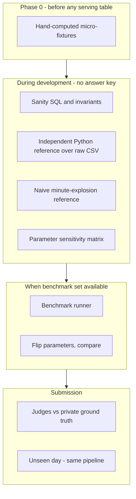

# Correctness & Validation Strategy

How we know concurrency results are right — during development and at judge evaluation.

> Semantics under test are defined in [SEMANTICS_SPEC.md](SEMANTICS_SPEC.md). Every layer below validates an implementation *against that spec*; only Layer 3 attempts to validate the spec itself.

---

## The hard truth about "correct all the time"

**We cannot prove benchmark correctness during the hackathon.** The ground-truth answer key is **private**. Judges compare our submitted answers and latencies against that key on training and **unseen-day** data.

Our job is to:
1. Build a **defensible model** with testable internal checks
2. **Measure the sensitivity** of every semantic parameter, so a wrong assumption is a one-line flip rather than a rebuild
3. **Document** assumptions so wrong answers are explainable, not mysterious

### The gap the earlier strategy had

Every layer of the previous plan shared one assumption — the definition of "active" — and that assumption was wrong. The dual-model cross-check compared two expressions of the *same* semantic model, so both were wrong identically and the check passed. The naive reference exploded active segments to minutes, so it sat downstream of the same state machine.

That plumbing validation is genuinely useful — it would have caught the missing opening balance and the collapsing sub-minute segments — but it is not semantic validation. **Layer 3 and the sensitivity matrix now carry that load.**

---

## Validation layers



---

## Layer 1 — Sanity checks (always)

Run after every pipeline change.

| Check | SQL / action | Expected |
|-------|--------------|----------|
| Row counts | `count()` on `raw_events`, `content_metadata` | **905,558** / ~33K |
| Distinct sessions | `uniqExact(video_session_id)` | **10,866** |
| Event type distribution | `GROUP BY event_type` | All 7 types; `VideoHeartbeat` ≈ 843,600 (93%) |
| **Pause markers survive** | `countIf(event_type='VideoHeartbeat' AND event='pause')` | **27,340** (0 means the classifier or dedup destroyed them) |
| **Pause produces segments** | `countIf(close_reason='pause')` on segments | Roughly 20,922 — not zero |
| Segment count | `count()` on `session_active_segments` | ~52,000 (~31,000 without pause splits) |
| **Open sessions** | sessions without `VideoSessionEnd` | **Zero** — the training set contains no open sessions |
| Dictionary coverage | `dictGet` null rate on `content_id` | ~0% for known content |
| Deltas non-empty | `count()` on `minute_deltas` | ~10^5 after backfill |
| Delta balance (global) | `sum(delta)` over full table | **0** on training data |
| No negative concurrency | dense curve minimum | Never negative for an unfiltered query |

**The open-session check is inverted from the earlier version of this doc**, which expected a non-zero count "because the problem confirms open sessions exist". The problem statement says open sessions *will* occur; the training CSV happens to contain none. An implementer chasing that expectation would be hunting a non-bug.

**Delta balance:**

```sql
SELECT sum(delta) AS net_delta FROM sony_liv.minute_deltas;
-- Expected: 0 on the training set, because every session closes.
-- On the unseen day it should equal the number of still-open segments, NOT zero.
```

---

## Layer 2 — Micro fixtures (Phase 0, before anything else)

**Written before the serving tables exist.** Hand-computed minute-by-minute expected timelines are the only real ground truth available during development, and everything downstream inherits the spec they encode.

Each fixture is a small synthetic event sequence plus a hand-written expected curve.

| Fixture | What it pins down |
|---------|-------------------|
| Clean play + keepalives + `VideoSessionEnd` | One segment; concurrency 1 across exactly the active minutes |
| **`pause` mid-session, then `resume`** | **Two segments; paused minutes excluded (D2)** |
| **`pause` with keepalives flowing during the pause** | Keepalives must not resurrect the segment — the 42,273-heartbeat case |
| **`BufferStart` / `BufferEnd` mid-playback** | **One segment, unbroken; buffering counts as active (D3)** |
| `AppBackgrounded` then `AppForegrounded` | Two segments; background minutes excluded |
| Keepalives while backgrounded | Must not resurrect — the 3,799-heartbeat case |
| Keepalive gap > 90s | Two segments; gap minutes excluded |
| **Segment entirely inside one minute** (start 10:00:10, end 10:00:50) | **Must contribute 1 to minute 10:00, not vanish** |
| **Session spanning the window start** | **Opening balance non-zero; curve never negative** |
| **Window with a long flat stretch and no deltas** | **Average counts those minutes at the carried-forward value (D4)** |
| `resume` with no preceding `pause` | No-op, no error |
| Events after `VideoSessionEnd`; duplicate `VideoSessionStart` | **Ignored — `close` is terminal (R5).** Affects ~0.1% of sessions and buys a simpler state machine |
| `VideoError` followed by `play` | Error ends the segment only; the `play` opens a new one (R5) |
| Session still active at the watermark | End clamped to the watermark, no phantom tail (R8) |
| Dimension changing mid-session | Deterministic snapshot; identical result on re-run (R10) |
| **Same window, bounded vs unbounded `sel`** | **Byte-identical answers — turns R9's overlap theorem into a test** |

**Process:** write the fixture, hand-draw the expected minute curve, then run the builder and the benchmark template against it. Document in `docs/validation/session_examples.md`.

---

## Layer 3 — Independent semantic reference

**This is the layer that validates the spec rather than the plumbing.** A standalone Python script reads the raw CSV and computes minute occupancy directly from the same written spec, with no shared code with the SQL path. At 10,866 sessions it runs in seconds.

| Model | Description |
|-------|-------------|
| **A — SQL pipeline (primary)** | Segments → narrow deltas → dense curve |
| **B — Python reference** | Raw CSV → classifier → intervals → minute occupancy dictionary |

**Why this is different from the earlier "dual model" check.** The previous model B counted "distinct sessions with foreground and heartbeat evidence per minute", which is the same semantic model expressed differently — it could not detect a wrong definition of active. Model B here re-implements the *spec* independently, so a disagreement means one of the two implementations misread the spec, and agreement means the spec is at least implemented consistently.

**It still cannot tell us the spec matches the private ground truth.** Nothing available can. That is what the sensitivity matrix hedges.

**Acceptance:** exact match on unfiltered minute curves for the full training range; exact match on filtered curves for a sample of dimension combinations.

---

## Layer 4 — Naive minute-explosion reference

For a **1-hour window** and a single dimension filter, compute concurrency by exploding active segments into minute buckets and counting. O(segments × minutes), fine at this scale.

This validates the **delta-and-cumsum arithmetic** — it would have caught both the missing opening balance and the collapsing sub-minute segments — but it consumes the same segments, so it says nothing about whether "active" is defined correctly. That is Layer 3's job.

Must match the serving query exactly. Automate in `clickhouse/scripts/validate_sample.sh`.

---

## Layer 5 — Invariant checks (automated)

| Invariant | Rule |
|-----------|------|
| Peak >= average | Always, for the same range |
| Unfiltered peak >= any filtered peak | Global concurrency dominates slices |
| Monotonic segments | `segment_start < segment_end` |
| **No collapsing segments** | `plus_minute < minus_minute` for every segment |
| **No phantom tail** | `segment_end <= watermark` for every segment |
| No overlapping segments per session | Consecutive segments do not overlap |
| **Dense curve length** | Row count of `curve` equals `dateDiff('minute', start, end)` |
| **Curve non-negative unfiltered** | With the opening balance applied, min >= 0 |
| **Idempotent rebuild** | Re-run the full pipeline; every benchmark answer is byte-identical |
| **Idempotent delta write** | Re-run the pipeline; `count()` and `sum(abs(delta))` on `minute_deltas` are unchanged |
| **Deterministic dimensions** | Re-run the segment builder; all dimension values identical |
| Serving query reads serving only | `system.query_log.tables` excludes `raw_events` |

The idempotency and determinism invariants are new and non-negotiable: both were previously *asserted* by the docs without a mechanism, and both were false.

The two idempotency checks are separate on purpose and must both run. The delta check is the one that catches the failure the segments table cannot: `ReplacingMergeTree` protects `session_active_segments`, but a second segment build re-runs the delta emission and appends a second set of `+1`/`−1` rows to a `SummingMergeTree` designed to add them up, silently doubling the curve. Comparing benchmark answers alone would catch that here, but `sum(abs(delta))` localises it to the write path instead of leaving someone to bisect the whole pipeline. See [SCHEMA_AND_DDL.md — Mechanism 3](SCHEMA_AND_DDL.md#mechanism-3--drop-partition-before-every-delta-write).

**Query log evidence (required for judges):**

```sql
SELECT query_id, query_duration_ms, read_rows, tables
FROM system.query_log
WHERE query_id = {benchmark_query_id} AND type = 'QueryFinish';
```

---

## Layer 6 — Parameter sensitivity matrix

**This is the primary hedge against a wrong semantic assumption, and one of the strongest design-quality artifacts we can hand a judge.** For each parameter, publish peak and average with the parameter flipped, on a fixed set of windows and filters.

| Parameter | Default | Alternative | Expected magnitude |
|-----------|---------|-------------|--------------------|
| **Pause counts as active** (D2) | **No** | Yes | 20,922 windows, median 21s — percent scale |
| **Buffering counts as active** (D3) | **Yes** | No | 66,641 windows — the largest single swing |
| **Minute attribution** | Any-overlap | Whole-minute occupancy; sampled at minute start | Sampling would undercount sub-minute segments, which are common here |
| **Average denominator** (D4) | All clock minutes | Only minutes with a delta | Large for narrow filters with idle stretches |
| `HEARTBEAT_GRACE_SEC` | 90 | 60 / 120 / 180 | **Near zero** — see below |

**Timezone is not in this table** because it is locked to UTC and enforced by the column type. It is worth one line in the submission rather than a rebuild: a UTC day boundary cuts at 05:30 IST, so day-grain peaks will not match an Indian business day, and switching is a query-layer bucketing change (`toStartOfDay(minute, 'Asia/Kolkata')`) rather than a schema migration. Reporting the IST variant costs nothing if a reviewer asks.

### The earlier matrix tuned the wrong knob

The previous version listed `HEARTBEAT_GRACE_SEC` as the primary tuning parameter. The measured gap distribution says otherwise: only **0.87%** of inter-heartbeat gaps exceed 90 seconds and **0.72%** exceed 120 seconds, so the entire 60↔120 second range moves about **0.15%** of gaps. Tuning it cannot fix a wrong answer. Meanwhile pause handling, buffering, minute attribution, and the average denominator each move the answer at percent scale and appeared nowhere in the matrix.

Every parameter above lives in `clickhouse/scripts/config.env` so a flip is one line.

---

## Layer 7 — Benchmark set tuning (when available)

When SonyLIV releases the **benchmark query set** (not the answer key):

1. Run all queries through `run_benchmarks.sh`
2. Record answers, latency, and `read_rows`
3. If results look implausible (peak exceeding concurrent session count, negative concurrency, average above peak), work down the sensitivity matrix from largest expected swing to smallest — not down the grace-window range
4. Re-run until internally consistent and all fixtures still pass

**We still won't know if answers match ground truth until judges score.**

---

## Layer 8 — Incremental correctness via truncate-and-replay

**The training data contains zero open sessions**, so the update path has nothing to run against as loaded. Construct the case:

1. Choose a watermark `T` inside the data range
2. Load only events with `event_timestamp < T`; run the full pipeline. Sessions straddling `T` are now genuinely open, with ends clamped to `T`
3. Record peak and average for a fixed filter
4. Replay the tail (`event_timestamp >= T`) in batches
5. Run `reconcile_session` for affected sessions; re-query
6. Assert the final answers **exactly equal** those from a single full-load run

Step 6 is the real test: it proves the incremental path converges on the batch result. Also run `reconcile_session` twice for the same session and assert nothing changes — that is the check the published-edge mechanism exists to pass, and which the earlier read-modify-write scheme would have failed.

---

## Evidence artifact contract

*"No pipeline evidence, no credit."* The earlier version of this doc showed a `query_log` SELECT but never defined the deliverable. One runner produces:

| Artifact | Contents |
|----------|----------|
| `answers.json` | One record per benchmark query: query id, parameters, peak, average, and the parameter set used |
| `latencies.json` | `query_duration_ms` and `read_rows` per query from `system.query_log` |
| `evidence/` | Raw `system.query_log` rows, `system.parts` snapshot, row counts per table, pipeline stdout |
| `sensitivity.md` | The Layer 6 matrix with measured deltas |


**`system.parts` matters** as evidence that queries ran against real multi-part pipeline state rather than a hand-optimized merged snapshot:

```sql
SELECT table, sum(rows) AS rows, count() AS parts
FROM system.parts WHERE database = 'sony_liv' AND active
GROUP BY table;
```

---

## Layer 9 — Unseen day (final validation)

| Requirement | How |
|-------------|-----|
| Same pipeline | `unseen_day_runner.sh` — no manual edits |
| Evidence | The full artifact set above |
| No hand-computed answers | All from the automated runner |
| Latency recorded | Per-query timing in `latencies.json` |

**Note:** on the unseen day, `sum(delta)` will **not** be zero — it should equal the number of still-open segments. The global balance invariant holds on training data only because every session there closes.

---

## What we tell judges

1. **Model:** interval-to-delta over foreground-only active segments; missing heartbeat ends the *segment*, not the session
2. **Semantics:** pause excluded, buffering included, any-overlap minute attribution, average over all clock minutes — each decided explicitly, each with a measured sensitivity
3. **Internal validation:** hand-computed fixtures written before the pipeline, an independent Python reference, arithmetic cross-check, and automated invariants including idempotency
4. **Benchmark evidence:** `answers.json`, latencies, query logs showing serving-layer-only reads, and a `system.parts` snapshot
5. **Unseen day:** one-command pipeline output bundle
6. **Known trade-offs:** dimension snapshot at segment start rather than segment splitting; UTC bucketing; any-overlap over whole-minute occupancy

---

## Checklist before submission

- [ ] Micro fixtures written **before** the serving tables, all passing
- [ ] Pause and buffering fixtures both present and asserting opposite outcomes
- [ ] Sub-minute-segment fixture proves no collapse
- [ ] Opening-balance fixture proves no negative curve
- [ ] Independent Python reference matches the SQL on the full training range
- [ ] Naive reference matches on a 1-hour filtered sample
- [ ] `sum(delta) = 0` on training data; documented as non-zero for the unseen day
- [ ] Idempotency invariant passes — full re-run changes no answer
- [ ] Determinism invariant passes — dimension snapshots stable across runs
- [ ] Sensitivity matrix published for all six parameters
- [ ] Truncate-and-replay demo converges on the batch result
- [ ] `reconcile_session` run twice is a no-op
- [ ] Runner emits `answers.json`, `latencies.json`, `evidence/`, `sensitivity.md`
- [ ] Unseen-day runner tested on a mock second CSV
